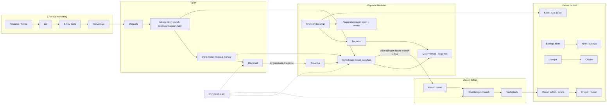
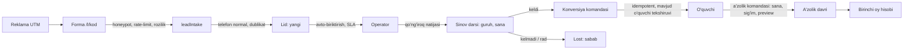
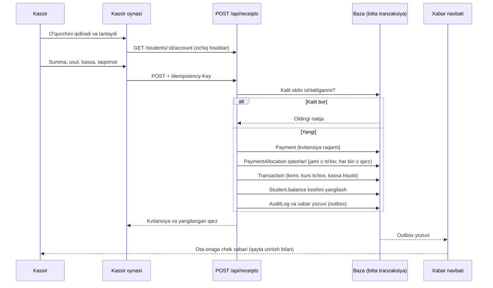
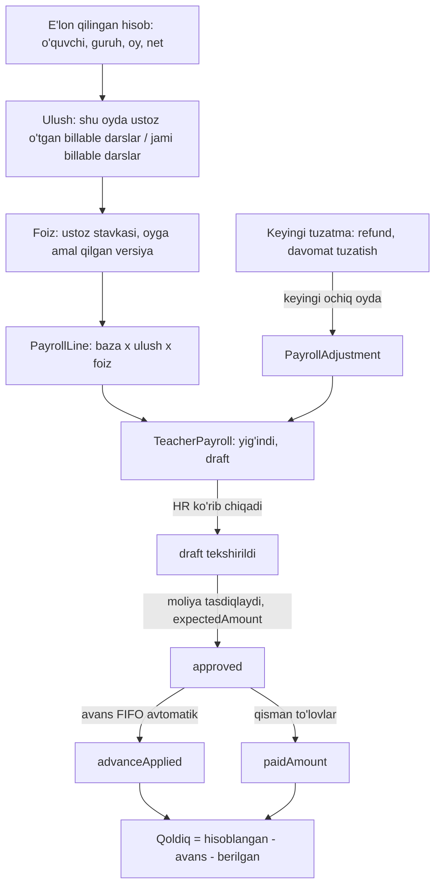
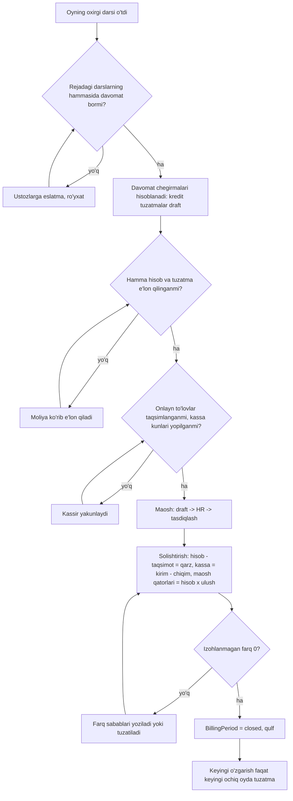
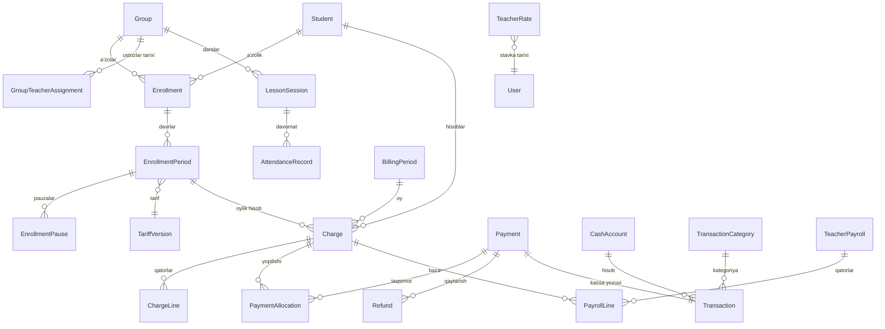
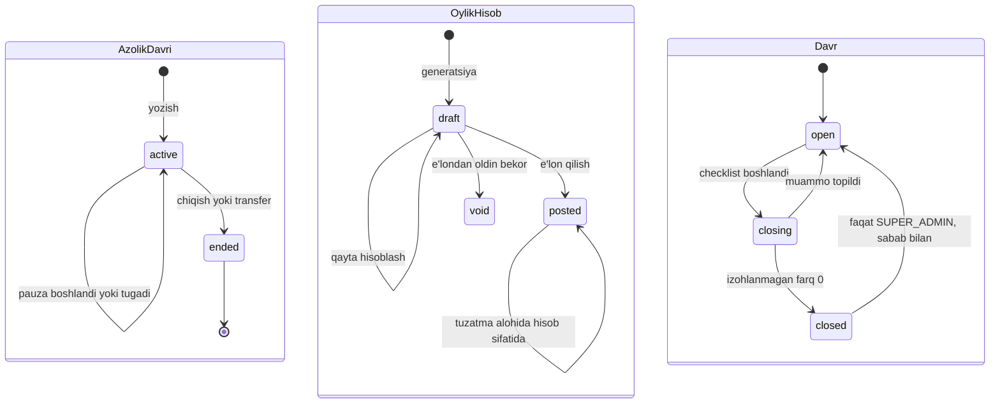
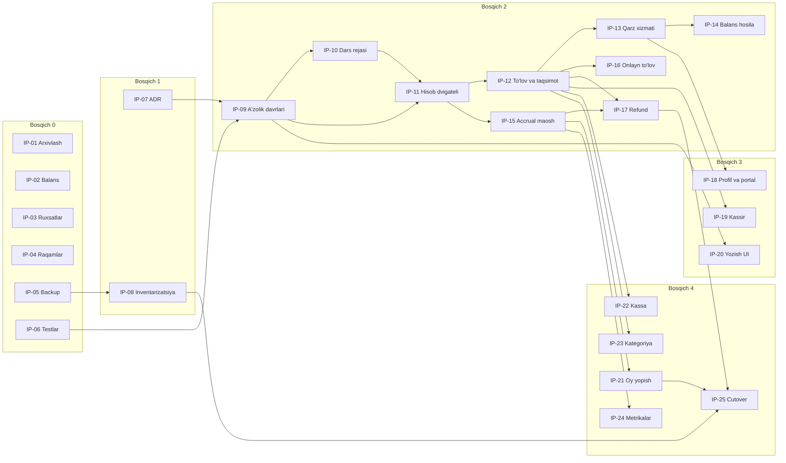

# Tayyorlov Markazi — yagona audit va rivojlantirish rejasi

| | |
|---|---|
| **Sana** | 2026-09-25 |
| **Tekshirilgan kod** | lokal `master`, HEAD `e97a60e` ("Moliya P24 — Payroll/Salary yozuvini butunlay o'chirish + Avans alohida kategoriya") |
| **Ishchi papka** | Faqat 2 ta kuzatilmagan hujjat bor: `docs/CRM_REAUDIT_FINANCE_TEACHER_PAYROLL_PLAN_2026-09-15.md`, `docs/FINANCE_TEACHER_PAYROLL_IMPLEMENTATION_PLAN_2026-09-15.md`. Ularga tegilmadi. Boshqa worktree'lar (`agent/antigravity` `86a5bc7`, `agent/antigravity-2` `fcf0dc5`, `agent/codex` va `agent/codex-2` `18ec01d`, `.claude/worktrees/*` 2 ta detached) ham o'zgartirilmadi. |
| **Hujjat maqomi** | Tahlil va reja. Kod, baza, sxema, production va deploy o'zgartirilmadi. |
| **Asosiy manba** | Codex auditi `CRM_AUDIT_VA_RIVOJLANTIRISH_REJASI_2026-09-25.md` (bu hujjatda **CX** deb belgilanadi), mustaqil qayta tekshirildi. |
| **Qo'shimcha manbalar** | `docs/FINANCE_PAYROLL_TRACKING_2026-09-16.md` (**TR**), `docs/CRM_FULL_AUDIT_AND_AI_PLAN_2026-09-14.md` (**FA**), `docs/AGENT_COORDINATION.md`, `CLAUDE.md`, `AGENTS.md`, loyiha xotirasi. |
| **Bu hujjatning roli** | Ijro uchun **yagona asosiy reja**. CX/TR/FA'dagi ochiq bandlar shu yerga ko'chirildi va yangi ID oldi. Keyingi ish shu hujjatdagi ID'lar bilan yuritiladi. |

> **O'qish tartibi.** Rahbar uchun: A, L, M bo'limlari (15 daqiqa). Ijrochi uchun: D → G → H → I → J → K. Kod bilan tekshirish uchun: har topilmada `fayl:satr` havolasi bor.

## Mundarija

- [A. Rahbar uchun asosiy xulosalar](#a-rahbar-uchun-asosiy-xulosalar)
- [B. Audit qamrovi va bajarilmagan tekshiruvlar](#b-audit-qamrovi-va-bajarilmagan-tekshiruvlar)
- [C. Mavjud reja bo'yicha: saqlandi / tuzatildi / chiqarildi / qo'shildi](#c-mavjud-reja-boyicha-saqlandi--tuzatildi--chiqarildi--qoshildi)
- [D. Dalilli muammolar reyestri](#d-dalilli-muammolar-reyestri)
- [E. Har bo'lim va funksiya uchun maqsad holat](#e-har-bolim-va-funksiya-uchun-maqsad-holat)
- [F. Bo'limlararo jarayonlar va ma'lumot oqimi](#f-bolimlararo-jarayonlar-va-malumot-oqimi)
- [G. Biznes qoidalari, formulalar va raqamli misollar](#g-biznes-qoidalari-formulalar-va-raqamli-misollar)
- [H. Ma'lumot modeli, API va ruxsat arxitekturasi](#h-malumot-modeli-api-va-ruxsat-arxitekturasi)
- [I. Implementatsiya backlog'i](#i-implementatsiya-backlogi)
- [J. Ma'lumotlarni ko'chirish, solishtirish, pilot va rollback](#j-malumotlarni-kochirish-solishtirish-pilot-va-rollback)
- [K. Qabul, regressiya, xavfsizlik, parallel va yuklama sinovlari](#k-qabul-regressiya-xavfsizlik-parallel-va-yuklama-sinovlari)
- [L. Ochiq biznes qarorlari](#l-ochiq-biznes-qarorlari)
- [M. Professional holat mezonlari](#m-professional-holat-mezonlari)
- [N. Rejaning o'z-o'zini tanqidiy tekshiruvi va izlanuvchanlik matritsasi](#n-rejaning-oz-ozini-tanqidiy-tekshiruvi-va-izlanuvchanlik-matritsasi)
- [Ilova: atamalar lug'ati va manbalar](#ilova-atamalar-lugati-va-manbalar)

### ID tizimi

Codex auditi (CX) va 2026-09-16 kuzatuv hujjati (TR) bir xil `F01`, `F02`... ID'larni **turli ma'noda** ishlatgan (masalan CX:F01 — kurs to'lovi formasi, TR:F01 — qo'lda to'lov Payment yaratishi). Chalkashlik bo'lmasligi uchun eski ID'lar doim manba prefiksi bilan yoziladi, yangi reja esa o'z ID'larini ishlatadi:

| Prefiks | Ma'nosi | Misol |
|---|---|---|
| `CX:` | Codex 2026-09-25 auditi topilmasi/paketi | `CX:E01`, `CX:W05` |
| `TR:` | 2026-09-16 moliya kuzatuv hujjati | `TR:F16`, `TR:O08` |
| `FA:` | 2026-09-14 to'liq audit | `FA:DATA-01` |
| `ML`, `TL`, `RX`, `HB`, `LD`, `HR`, `AL`, `PL`, `SY` | **Yangi** muammo ID'lari: Moliya, Ta'lim, Ruxsat, Hisobot, Lid/CRM, HR/maosh, Aloqa/portal, Platforma, Sayt | `ML-01`, `TL-14` |
| `TQ-A…F` | Foydalanuvchi **tasdiqlagan** biznes qoidalari | `TQ-A` (oy o'rtasida qo'shilish) |
| `OQ-xx` | Hali qaror qilinmagan biznes masalasi | `OQ-01` (maxraj N) |
| `IP-xx` | Ish paketi (backlog) | `IP-11` (hisob dvigateli) |
| `QT-xx` | Qabul/regressiya sinovi | `QT-01` |

### Topilma sinflari va darajalari

| Belgi | Sinf |
|---|---|
| **K** | Kod bilan tasdiqlangan xato — satrgacha dalil va ssenariy bor |
| **X** | Tasdiqlanishi kerak bo'lgan xavf — kod ehtimolni ko'rsatadi, lekin real ma'lumot/muhit bilan o'lchanmagan |
| **T** | Mahsulot imkoniyatini kengaytirish taklifi — bug emas |
| **Q** | Biznes qarori talab qiladi — kod qoidasiz ishlayapti yoki qoida tanlovga bog'liq |
| **E** | Allaqachon bajarilgan yoki eskirgan topilma |

| Daraja | Ma'nosi |
|---|---|
| **P0** | Pul/tarix yo'qolishi, pulni noto'g'ri ko'rsatish yoki ruxsatsiz kirish. Birinchi navbatda (Bosqich 0). |
| **P1** | Asosiy biznes hisobining noto'g'riligi yoki asosiy jarayonning uzilishi. |
| **P2** | Operatsion sifat, tezlik, foydalanish qulayligi. |
| **P3** | O'sish bilan kerak bo'ladigan kengaytma. |

P0 real zarar sodir bo'lganini anglatmaydi — kodda ochiq yo'l borligini va tuzatish ustuvorligini bildiradi. Zarar hajmi IP-08 (ma'lumot inventarizatsiyasi) orqali o'lchanadi.

---

## A. Rahbar uchun asosiy xulosalar

### A.1. Umumiy holat

Platforma keng: 47 ta CRM sahifasi, 2 ta Telegram Mini App, 11 ta ommaviy sahifa, 44 ta backend route fayli (316 endpoint), 83 ta ma'lumot modeli. So'nggi 3 haftada moliya/maosh bo'limi jiddiy mustahkamlangan: qo'lda to'lov atomar, invoice net summa, Payme/Click qattiqlashtirilgan, ikki bazali o'qituvchi maoshi, avans va qisman to'lash, audit jurnali, DB asosidagi rollar (TR hujjati, 18 commit). Bu ishlar saqlanadi va ustiga quriladi.

Lekin platformaning **markaziy moliyaviy tushunchasi yo'q**: o'quvchiga har oy hisoblanadigan summa (majburiyat, "hisob") hech qayerda yozilmaydi. U faqat kerak bo'lganda qayta hisoblanadi (`server/services/billing.ts`), `Student.balance` esa faqat to'lov kelganda oshadi va hech qachon oylik hisob bilan kamaymaydi. Natijada "qarzdorlik" tizimda 5 xil manbadan, 5 xil qoidada ko'rsatiladi va ularning hech biri to'g'ri emas. Bu — boshqa moliyaviy muammolarning ildizi.

### A.2. Eng muhim xulosalar

1. **Qarzdorlik tizimli noto'g'ri (ML-01, ML-02, P0).** Qarzdorlar ro'yxati, Telegram eslatmalari, ota-ona portalidagi "jami qarz", "qarzdorlarga xabar" — barchasi oylik hisob bilan bog'lanmagan. Ota-ona portalida jami qarz amalda doim 0 (`server/routes/portal.ts:219-240` yaratilmaydigan `pending/overdue` Payment'larga tayanadi).
2. **Tarix yo'qolishi (TL-14, P0) — darhol.** O'quvchi, guruh, kurs yoki xodimni "O'chirish" tugmasi bazadan jismonan o'chiradi va kaskad bilan to'lovlar, invoice'lar, davomat, baholar va oyliklarni ham o'chiradi (`server/routes/crud.ts:1007-1008`, `prisma/schema.prisma:387,997,274,205,1261`). FA:DATA-01 buni umumiy aytgan, CX tushirib qoldirgan, hali tuzatilmagan.
3. **O'quvchi formasi pulni qayta yozadi (ML-03, P0) — darhol.** O'quvchining ismini tahrirlash ham eski `balance` qiymatini qayta yuboradi; guruh almashtirilsa balans `-narx` bilan ustidan yoziladi. Parallel qabul qilingan to'lov "yo'qolib" ketishi mumkin (`src/pages/crm/education/CrmStudents.tsx:151,834-841`, `server/routes/students.ts:66-72`).
4. **Ruxsat teshiklari (RX-01…RX-03, P0).** 8 ta analitika endpointi o'qituvchiga markaz moliyasi va barcha qarzdorlarning telefonlarini beradi; `bulk` API ruxsat kalitisiz o'quvchi balansini va to'lov holatini o'zgartira oladi; `PUT /api/students/:id` `students` ruxsatini tekshirmaydi.
5. **Tasdiqlangan qoidalar (TQ-A…F) hozirgi kodda:**
   - **TQ-A** (oy o'rtasida qo'shilish — qolgan darslar bo'yicha) — **bajarilmaydi**: a'zolik sanasi yo'q, to'liq oy narxi olinadi.
   - **TQ-B** (accrual maosh) — **qisman**: accrual bazasi bor, lekin ketgan o'quvchi va yakunlangan guruh ham hisoblanadi, o'qituvchi/foiz tarixi yo'q.
   - **TQ-C** (har guruh alohida) — hisoblash guruhbay, lekin to'langan summa va qarz guruhbay yuritilmaydi.
   - **TQ-D** (qidirib tanlash, guruh/davrga biriktirish) — **yo'q**: oddiy ro'yxat, guruh/davr tanlanmaydi.
   - **TQ-E** (boshqa kirim o'quvchi/maoshga ta'sir qilmaydi) — faqat UI darajasida; server kafolatlamaydi.
   - **TQ-F** (tushunchalar ajratilgan) — maosh tomonida yaxshi (TR:P13), o'quvchi tomonida yo'q.
6. **Codex rejasi yo'nalishi to'g'ri** (a'zolik davrlari, hisob yozuvi, to'lov taqsimoti, accrual maosh). Qayta tekshiruvda: 11 ta yangi topilma guruhi qo'shildi (eng og'irlari — TL-14, ML-03, ML-01/02), 5 ta topilma darajasi tuzatildi, 2 tasi biznes qaroriga ko'chirildi, birinchi paket o'zgartirildi (sxemasiz "Bosqich 0" — 2–3 hafta ichida xavfni to'xtatadi). Batafsil — C bo'limi.
7. **Arxitektura: murakkablashtirmaslik.** Mikroservis, yangi baza, to'liq ikki yoqlama buxgalteriya kerak emas. Mavjud monolit ichida 3 ta kichik hisob daftari: **o'quvchi hisoblari** (hisob → taqsimot → qarz), **kassa daftari** (barcha pul harakati), **maosh daftari** (hisoblangan → avans → berilgan). Production SQLite saqlanadi; barcha sxema o'zgarishi faqat qo'shimcha (additive).
8. **Hal qilinmagan 6 ta biznes masalasi** Bosqich 2 boshlanishidan oldin yozma qaror bo'lishi kerak: maxraj N, bayram/bekor dars, chegirmalar ustuvorligi va o'qituvchi bazasiga ta'siri, muzlatish/chiqish/refund, yopilgan davrga tuzatish, o'tish (cutover) sanasi. Tavsiyalar va raqamli ta'siri — L bo'limida.

### A.3. Bosqichlar (taxmin, kafolat emas)

Jamoa taxmini: **1 ta to'liq stack dasturchi + AI agentlar** (Claude — sxema/CRUD/auth/deploy, frontend agent — sahifalar), yarim stavka moliya/QA mas'uli. 2 dasturchi bo'lsa kalendar muddat taxminan 35–40% qisqaradi.

| Bosqich | Maqsad | Paketlar | Kalendar taxmini | Foydalanuvchi ko'radigan natija |
|---|---|---|---|---|
| **0. Xavfni to'xtatish** | Tarix yo'qolishi, pulni qayta yozish, ruxsat teshiklari, yolg'on raqamlar, backup | IP-01…IP-06 | 2–3 hafta | "O'chirish" arxivlaydi; balansni forma buzmaydi; o'qituvchi moliyani ko'rmaydi; hisobotlar ikki marta sanamaydi; kunlik izchil backup |
| **1. Qarorlar va referens** | Ochiq qoidalar bo'yicha yozma qaror, 25 ssenariyli referens jadval, real ma'lumot inventarizatsiyasi | IP-07, IP-08 | 1 hafta (0 bilan parallel) | Hisob qoidalari hujjati imzolangan |
| **2. Hisob yadrosi** | A'zolik davrlari, dars rejasi, oylik hisob, to'lov taqsimoti, yagona qarz, accrual maosh | IP-09…IP-17 | 6–9 hafta | Oy o'rtasi hisobi, guruhbay qarz, "nima uchun shu summa" izohi, qidirib to'lov qabul qilish |
| **3. Foydalanuvchi oqimlari** | Profil 2.0, kassir oynasi, yozish/transfer oqimi, ota-ona portali | IP-18…IP-20 | 2–3 hafta (2 bilan qisman parallel) | Har rol uchun sodda kundalik oqim |
| **4. Oy yopish va boshqaruv** | Davr qulfi, kassa/bank, kategoriya ID, yagona metrikalar, ko'chirish va cutover | IP-21…IP-25 | 3–5 hafta (1 oylik shadow bilan) | Bir to'liq oy yopiladi, hisobotlar bir xil raqam beradi |
| **5. Platformani mustahkamlash** | RBAC 2.0, HR, CRM, aloqa navbati, baholash, jadval, sayt, kuzatuv, tezlik | IP-26…IP-34 | 5–8 hafta (ko'p qismi parallel) | Barcha bo'limlar professional standartda |
| **6. O'sish (ixtiyoriy)** | Filial moliyasi/SaaS, inventar/sertifikat kengaytmasi, UI tizimi | IP-35…IP-37 | Alohida baho | Faqat biznes ehtiyoji tasdiqlanganda |

**Asosiy natija (Bosqich 0–4): ~14–22 kalendar hafta** (batafsil hisob — I.9). Eng muhim foydalanuvchi natijasi (TQ-A…F ishlashi) Bosqich 2 oxirida shadow rejimda, Bosqich 4'da jonli. Bosqich 0 natijalari esa 2–3 hafta ichida production'da bo'ladi.

### A.4. Rahbardan hozir kerak bo'ladigan qarorlar

1. Bosqich 0'ni boshlashga ruxsat (sxema o'zgarishisiz, production'ga odatdagi deploy bilan chiqadi).
2. L bo'limidagi OQ-01…OQ-06 bo'yicha tanlov (tavsiyalar berilgan; 1 soatlik uchrashuv yetarli).
3. O'tish sanasi (tavsiya: yangi hisob tizimi keyingi oyning 1-sanasidan, oldingi oy eski tizimda yopiladi).
4. Boshlang'ich qoldiqlarni (har o'quvchi va guruh bo'yicha qarz/avans) kim tasdiqlaydi.
5. Production sxema o'zgarishlari uchun J.6'dagi "avval sxema, keyin kod" tartibi — foydalanuvchi bajaradigan qadam.

---

## B. Audit qamrovi va bajarilmagan tekshiruvlar

### B.1. Tekshiruv usuli

- **Statik kod tahlili:** Prisma sxemasi to'liq (1655 satr, 83 model) o'qildi; generic CRUD, auth/authorize middleware, billing va teacher payroll xizmatlari, moliya, o'quvchi, bulk, transfer, import, backup, analytics, reports, leads, davomat (CRM va Telegram yo'llari), portal, to'lov provayderlari, scheduler, aloqa, upload, progress, tests, leave, salary route'lari satrma-satr yoki kerakli bo'lagi o'qildi. Frontend'da CrmStudents, CrmFinance, CrmStudentDetail, CrmGroupDetail, CrmGroups/CrmCourses/CrmStaff o'chirish oqimi, `useFirestore`, `navModules.ts`, `App.tsx` marshrutlari, LeadForm, Layout, ommaviy Teachers sahifasi o'qildi.
- **Endpoint inventari:** 44 ta route faylidagi 316 ta endpoint middleware darajasida (qaysi `requireAuth/requireMinRole/requirePermission` bilan) ro'yxatga olindi — RX topilmalari shu jadvaldan tekshirildi.
- **Buyruqlar:** `git status`, `git log`, `git worktree list`; `npx tsc --noEmit` — **exit 0, xato yo'q**. `git status` tekshiruvdan keyin ham o'zgarmagan.
- **Oldingi hujjatlar:** CX to'liq; TR to'liq; FA topilmalar ro'yxati va 3–6 bo'limlari; AGENT_COORDINATION.
- **Tashqi manbalar:** Frappe Education/HR, Odoo 18 buxgalteriya/payroll, Stripe (idempotency, proration), SQLite backup, OWASP API Security 2023, Telegram Bot FAQ, microservices.io (outbox), O'zbekiston shaxsiy ma'lumotlar qonuni bo'yicha manbalar. Havolalar — H.10 va Ilovada.

### B.2. Modullar bo'yicha tekshiruv chuqurligi

**Chuqur** — kod satrma-satr, ssenariy bilan. **O'rta** — route/asosiy funksiya va ruxsatlar. **Yuzaki** — faqat inventar (sahifa/route mavjudligi).

| Modul | Chuqurlik | Nima tekshirildi |
|---|---|---|
| Enrollment, billing, o'quvchi CRUD/o'chirish | Chuqur | `crud.ts`, `billing.ts`, `students.ts`, `CrmStudents.tsx`, `CrmGroupDetail.tsx`, sxema kaskadlari |
| Moliya: tranzaksiya, invoice, xarajat, byudjet, qarzdorlar | Chuqur | `finance.ts` to'liq, `CrmFinance.tsx` asosiy qismlari |
| O'qituvchi maoshi, xodim oyligi, avans | O'rta–chuqur | `services/teacherPayroll.ts` to'liq, `salary.ts` asosiy route'lar, TR'dagi bajarilgan ishlar (brauzerda qayta tekshirilmadi) |
| Ruxsat va xavfsizlik | Chuqur (route darajasi) | `auth.ts`, `authorize.ts`, `crud.ts` darajalar, 316 endpoint jadvali, `bulk.ts`, `import.ts`, `upload.ts` |
| Davomat (CRM + Telegram), LessonSession | O'rta–chuqur | `studentAttendance.ts` to'liq, `staffPortal.ts` davomat va check-in qismi |
| Analitika/hisobotlar | O'rta | `analytics.ts` to'liq, `reports.ts` executive, `goals.ts` auto-sync, `CrmBI.tsx` ma'lumot manbalari |
| Lidlar/CRM | O'rta | `leads.ts` yozish yo'llari, `leadIntake.ts` boshi, `constants/leads.ts` |
| Portal va botlar | O'rta | `portal.ts` auth/to'lov/baho, `bot/index.ts` kontakt bog'lash, `scheduler.ts` job'lari, `communication.ts` ommaviy xabar |
| Payme/Click | Yuzaki–o'rta | `payments.ts` tuzilmasi va CheckPerformTransaction; TR:F07–F09 bajarilganlari qayta sinalmadi |
| Testlar/Quiz/Imtihon | O'rta | `tests.ts` yozish yo'llari, frontend chaqiruvlari |
| HR: xodimlar, ta'til, lavozim, ish joyi, Face ID | Yuzaki–o'rta | `leave.ts` to'liq, `staffPortal.ts` check-in; lavozim/ish joyi faqat inventar |
| Inventar, sertifikat, materiallar, AI kontent, avtomatlar, sozlamalar, filiallar | Yuzaki | Route/middleware va sahifa inventari |
| Ommaviy sayt, SEO, lid formasi | O'rta | `LeadForm.tsx`, `Layout.tsx`, `index.html`, `robots.txt`, ommaviy ustozlar manbasi |
| Backup/deploy/ops | O'rta | `backup.ts`, `auth.ts` backup, `dbBackup.ts`, `deploy.sh`, `ecosystem.config.cjs`, realtime ishga tushishi |

### B.3. Bajarilmagan tekshiruvlar

| Tekshiruv | Nega bajarilmadi | Qaysi paket bajaradi |
|---|---|---|
| Brauzerda E2E ssenariylar (yozish bilan) | Vazifa shartida bazaga yozish taqiqlangan | IP-06 (test muhiti), har paketning qabul sinovi |
| Real ma'lumotda zarar hajmi (nechta o'quvchi balansi noto'g'ri, nechta o'chirilgan o'quvchining tranzaksiyasi yetim) | Production'ga faqat deploy vakolati bor; o'qish so'rovi ham ruxsat etilmagan | IP-08 (backup nusxasida faqat o'qish skriptlari) |
| Production holati (kirim kategoriyalari faolmi, WAL rejimi, backup'lar soni, PM2 env) | Xuddi shu | IP-05, IP-08 |
| Payme/Click sandbox sinovi | Merchant kabinetiga kirish kerak (TR:F03) | IP-16 |
| Telefonda Telegram Mini App, Face ID, GPS | Qurilma kerak | IP-27, IP-18 |
| Yuklama, Lighthouse/axe, Web Vitals | O'lchov muhiti yo'q | IP-34, IP-37 |
| Backup'dan tiklash mashqi | Production nusxasi kerak | IP-05 |
| TR'dagi bajarilgan paketlarni brauzerda qayta sinash | Vaqt va yozish taqiqi; TR o'zi jonli sinov dalilini keltirgan | Regressiya to'plami (K.3) |

**Muhim:** bu hujjatdagi har bir "K" topilma kod bilan tasdiqlangan, lekin real ma'lumotdagi ta'siri hali o'lchanmagan. "X" topilmalar alohida belgilangan.

### B.4. Raqamlar (inventar)

| Ko'rsatkich | Qiymat |
|---|---|
| CRM sahifalari (`src/pages/crm/**`) | 47 (login bilan) |
| Portal sahifalari | 2 (`TelegramPortal`, `StaffPortal`) |
| Ommaviy sahifalar | 11 |
| Umumiy komponentlar | 58 |
| Backend route fayllari / endpointlar | 44 / 316 |
| Xizmatlar (`server/services`) | 12 |
| Prisma modellari | 83 |
| Cron job'lar | 10 (8 tasi `Workflow` jadvali orqali yoqiladi va standart holatda o'chiq; xodim botining 2 ta eslatmasi alohida — ularning yoqilish sharti tekshirilmadi) |
| Avtomatik testlar / CI | Yo'q (`.github` yo'q; `scripts/verify_*` qo'lda ishlatiladigan skriptlar) |

---

## C. Mavjud reja bo'yicha: saqlandi / tuzatildi / chiqarildi / qo'shildi

### C.1. Umumiy baho

CX auditi kod asosida yozilgan va ko'p xulosasi joriy kodda tasdiqlandi. Uning kuchli tomonlari: a'zolik davrlari, yakunlanadigan oylik hisob, to'lov taqsimoti, accrual maosh, "o'chirish o'rniga tuzatma", ikki bazada sinash va ma'lumotni taxmin bilan taqsimlamaslik talablari. Bular saqlanadi.

Qayta tekshiruvda topilgan kamchiliklar:

1. **Eng og'ir xavflar tushib qolgan:** jismoniy o'chirish kaskadi (TL-14), o'quvchi formasining balansni qayta yozishi (ML-03), balans hech qachon oylik hisob bilan kamaymasligi va buning oqibatida qarzdorlikning 5 manbaga bo'linishi (ML-01, ML-02), portal qarzi va to'lov eslatmalarining amalda ishlamasligi (AL-01, AL-02).
2. **Ba'zi darajalar noaniq:** CX:F02/F03 (P0) faqat `finance` ruxsatli xodim API orqali qila oladigan ish — P1; CX:S05 (P1) tor holat — P3; CX:E07 atomarlik qismi — P2.
3. **Birinchi paket noto'g'ri tanlangan:** CX "W01 + W03 + W04" dan boshlashni taklif qiladi. W01 ichida sxema va domen servislari aralash. Yangi rejada birinchi 2–3 hafta **sxemasiz** va production'ga odatdagi deploy bilan chiqadigan "Bosqich 0" — tarix yo'qolishi, pulni qayta yozish va ruxsat teshiklarini darhol yopadi.
4. **ID to'qnashuvi:** CX va TR bir xil `F01…F12` ID'larni boshqa ma'noda ishlatgan (yuqoridagi "ID tizimi"ga qarang).
5. **Ba'zi yechimlar aniqlashtirildi:** pul uchun Decimal SQLite'da aniq emas — tavsiya: butun so'm (C.2, ML-12); Float ustunlarni turini o'zgartirish shart emas, faqat "faqat butun son" invariantini qo'yish yetarli (IEEE double 2⁵³ gacha butun sonni aniq saqlaydi) — xavfli ustun migratsiyasidan qochiladi.

### C.2. CX topilmalari bo'yicha qaror jadvali

| CX ID | Qisqacha | Qaror | Yangi ID | Izoh (nima o'zgardi va nega) |
|---|---|---|---|---|
| CX:E01 | Enrollment faqat `createdAt` | **Saqlandi** | TL-01 | Tasdiqlandi: `prisma/schema.prisma:231-242`, `crud.ts:489-501` |
| CX:E02 | Billing joriy a'zolik/narx bilan | **Saqlandi, kengaytirildi** | TL-02 | Qo'shildi: o'quvchi holati (`left`, muzlatilgan) va guruh holati (`completed`, `paused`) ham e'tiborsiz — ketgan o'quvchiga hisob va o'qituvchiga maosh davom etadi (`billing.ts:81-100`, `services/teacherPayroll.ts:68-71`) |
| CX:E03 | Guruhdan chiqarish yozuvni o'chiradi | **Saqlandi** | TL-03 | Tasdiqlandi: `crud.ts:523-531` |
| CX:E04 | Nomga asoslangan guruh almashtirish | **Saqlandi, ajratildi** | TL-04, ML-03 | Eng xavfli qismi alohida P0 bo'ldi: forma balansni qayta yozadi (ML-03) |
| CX:E05 | Profil moliya xatosini bo'sh qiladi | **Saqlandi, kengaytirildi** | TL-06 | Qo'shildi: `/finance?studentId=` filtri ishlamaydi — butun markaz tranzaksiyalari brauzerga yuklanadi (`CrmStudentDetail.tsx:90-117`, `crud.ts:583-640`) |
| CX:E06 | LessonSession billingda yo'q | **Saqlandi, qarorga bog'landi** | TL-09, OQ-03 | Qo'shimcha dars pullik yoki bepulligi — biznes qarori |
| CX:E07 | Davomat `Promise.all` | **Tuzatildi (daraja)** | TL-07 | Atomarlik qismi P2 (upsert takrorlansa bir xil natija). P1 qismi qo'shildi: sana/qulf/muallif nazorati yo'q, o'qituvchi o'z maoshiga ta'sir qiluvchi davomatni cheklovsiz o'zgartiradi |
| CX:F01 | Kurs to'lovi formasi | **Saqlandi, kengaytirildi** | ML-05 | Qo'shildi: o'quvchi tanlovi faqat kategoriya nomi aynan "Kurs to'lovi" va u faol bo'lsagina chiqadi (`CrmFinance.tsx:1590`) |
| CX:F02 | Har qanday income+studentId → Payment | **Tuzatildi (P0→P1)** | ML-06 | UI bu yo'lni bermaydi; faqat `finance` ruxsatli xodim API orqali. Server qoidasi baribir kerak |
| CX:F03 | Generic POST transaction bypass | **Tuzatildi (P0→P1)** | ML-07 | Xuddi shu sabab; `crud.ts:686` faqat `payment`ni bloklaydi |
| CX:F04 | Payment/InvoiceItem allocation yo'q | **Saqlandi** | ML-08 | Tasdiqlandi |
| CX:F05 | Cash allocation to'lov sanasi oyi bo'yicha | **Saqlandi** | ML-09 | Tasdiqlandi `billing.ts:153-162` |
| CX:F06 | Yaxlitlash qoldig'i | **Saqlandi** | ML-09 | ML-09 ichiga birlashtirildi |
| CX:F07 | Charge ledger yo'q; balans qo'lda | **Kuchaytirildi (P1→P0)** | ML-01, ML-02, ML-04 | Asosiy topilma: balans faqat to'lovda oshadi, qarz 5 manbada; yaratishda boshlang'ich balans umuman saqlanmaydi |
| CX:F08 | Invoice validatsiya/holat | **Saqlandi, aniqlashtirildi** | ML-11 | "Paid" yo'li idempotent va "paid"dan chiqish bloklangan (TR:FIN-03). Ochiq: `cancelled→paid`, qator/summa mosligi, Payment `month`siz, invoice va oylik hisob bir majburiyatni ikki marta yaratishi mumkin |
| CX:F09 | Idempotency kaliti yo'q | **Saqlandi** | ML-10 | |
| CX:F10 | Payroll/Salary jismoniy o'chirish | **Biznes qaroriga ko'chirildi** | ML-14, OQ-12 | Foydalanuvchi so'rovi bilan atayin qo'shilgan (TR:P24). Tavsiya: ochiq davrda va to'lov bo'lmasa o'chirish; aks holda qarshi yozuv |
| CX:F11 | Float pul, kategoriya matn | **Saqlandi, yechim tuzatildi** | ML-12 | Decimal SQLite'da aniq emas ([SQLite datatypes](https://www.sqlite.org/datatype3.html)). Tavsiya: butun so'm; yangi jadvallar `Int`, eski `Float` ustunlar o'zgartirilmaydi, butun son invarianti qo'yiladi |
| CX:F12 | Ko'p yuklash, N+1 | **Saqlandi** | HB-06 | FA:PERF-01/02 bilan birlashtirildi |
| CX:S01 | Bulk API | **Saqlandi, kengaytirildi** | RX-02 | Qo'shildi: boshqa foydalanuvchilarning bildirishnomalarini o'chirish (`bulk.ts:108-120`) |
| CX:S02 | Student GET/PUT ruxsat | **Ajratildi** | RX-03 (P0), RX-04 (P1) | PUT balansni o'zgartira oladi → P0 |
| CX:S03 | Analytics ruxsatsiz | **Saqlandi, aniqlashtirildi** | RX-01 | Aniq 8 endpoint: `analytics.ts:204,225,316,413,441,465,482,525` |
| CX:S04 | Leave own-scope | **Saqlandi, kengaytirildi** | RX-05 | Qo'shildi: istalgan `staffId` nomidan so'rov yaratish |
| CX:S05 | Auth DB xatosida JWT roliga ishonish | **Tuzatildi (P1→P3)** | RX-09 | DB ishlamasa handler'ning o'z so'rovlari ham xato beradi; tor holat |
| CX:A01 | Expense ikki marta | **Saqlandi** | HB-01 | `analytics.ts:498-509` |
| CX:A02 | Eski Attendance jadvali | **Saqlandi** | HB-02 | = FA:EDU-03 |
| CX:A03 | Profitability/salary-sheet | **Saqlandi** | HB-03 | |
| CX:A04 | LTV status filtrsiz | **Saqlandi** | HB-04 | `pending` hech qachon yaratilmaydi; `refunded` va `deletedAt` muhim |
| CX:C01 | Convert idempotent emas | **Saqlandi, kengaytirildi** | LD-01, RX-06 | Qo'shildi: sig'im, mavjud o'quvchi (telefon) tekshiruvi yo'q; owner tekshiruvi assign/restore/delete/activities'da ham yo'q |
| CX:C02 | PUT stage=won | **Saqlandi** | LD-02 | `leads.ts:333-336` |
| CX:O01 | SQLite backup | **Saqlandi, kengaytirildi** | PL-01 | Qo'shildi: avtomatik jadval yo'q, zaxira shu serverda, deploy oldidan backup yo'q |
| CX:O02 | Filial/tenant | **Biznes qaroriga ko'chirildi** | PL-05, OQ-14 | Hozir bug emas; filiallar bitta yuridik shaxsmi — qaror kerak |
| CX §3 | "Saqlanadigan asoslar" jadvali | **Saqlandi** | E bo'limi | To'g'ri |
| CX §3 | "Navigatsiya manbasi `navModules.ts`, CLAUDE.md eskirgan" | **Saqlandi** | PL-06 | Tasdiqlandi |
| CX §5.1 | Birinchi oy formulasi | **Saqlandi, aniqlashtirildi** | G.3, OQ-01, OQ-02, OQ-04 | To'liq oy uchun P o'zgarmaydi; qisman oy `min(R,N)/N`; M qisman oyda ham bir xil (tavsiya) |
| CX §5.2 | To'lov kiritish oqimi | **Saqlandi** | IP-12, IP-19 | O'quvchi **kodi** ham qo'shildi (TQ-D talab qiladi, hozir `Student`da kod maydoni yo'q) |
| CX §5.4 | O'qituvchi maoshi | **Saqlandi, kengaytirildi** | IP-15 | `PayrollLine` (charge'ga bog'langan qator, takror hisoblashdan unique himoya) |
| CX §6 | Ma'lumot modeli | **Saqlandi, soddalashtirildi** | H.2 | Alohida "Receipt" jadvali o'rniga mavjud `Payment` kvitansiya sifatida kengaytiriladi; `StudentCredit` jadvali o'rniga hosila qiymat; "LedgerEntry" o'rniga mavjud `Transaction` kassa daftari sifatida |
| CX §8 | W01–W28 | **Qayta tuzildi** | C.3 | 37 ta IP; Bosqich 0 sxemasiz |
| CX §10 | 40 ta sinov | **Saqlandi, kengaytirildi** | K bo'limi | Hammasi QT'ga ko'chirildi, 30+ yangi |
| CX §12 | 8 ta ochiq siyosat | **Saqlandi, kengaytirildi** | L bo'limi | 19 ta OQ, har biriga tavsiya va raqamli ta'sir |

### C.3. CX paketlari → yangi ish paketlari

| CX paket | Yangi IP | Izoh |
|---|---|---|
| CX:W01 | IP-02, IP-03 | Sxemasiz qismi Bosqich 0'ga; domen servislari IP-12'ga |
| CX:W02 | IP-03, IP-26 | Tezkor teshiklar IP-03; rol/amal/obyekt/maydon modeli IP-26 |
| CX:W03 | IP-04 | |
| CX:W04 | IP-07 | Referens dataset qo'shildi |
| CX:W05 | IP-09 | |
| CX:W06 | IP-09 (API), IP-20 (UI) | |
| CX:W07 | IP-10 | |
| CX:W08 | IP-11 | |
| CX:W09 | IP-11 (pul siyosati), IP-12 (komandalar), IP-23 (kategoriya) | |
| CX:W10 | IP-12 | |
| CX:W11 | IP-12 (qidiruv API), IP-19 (kassir UI) | |
| CX:W12 | IP-15 | |
| CX:W13 | IP-18 | |
| CX:W14 | IP-17, IP-11 | Promo chegirma `ChargeLine` sifatida |
| CX:W15 | IP-16, IP-22 | |
| CX:W16 | IP-08, IP-25 | |
| CX:W17 | IP-05 | Bosqich 0'ga ko'tarildi |
| CX:W18 | IP-21, IP-22, IP-17 | |
| CX:W19 | IP-03 (tezkor), IP-20 | |
| CX:W20 | IP-28 | |
| CX:W21 | IP-27 | |
| CX:W22 | IP-29 | |
| CX:W23 | IP-24 | |
| CX:W24 | IP-34 | |
| CX:W25 | IP-37, IP-32 | |
| CX:W26 | IP-36, IP-31 | |
| CX:W27 | IP-06, IP-33 | Test poydevori Bosqich 0'ga ko'tarildi |
| CX:W28 | IP-35 | |

### C.4. Oldingi hujjatlardagi ochiq bandlar

| Eski ID | Holat | Yangi ID |
|---|---|---|
| FA:EDU-02 (davomat Promise.all) | Ochiq | TL-07 |
| FA:EDU-03 (Attendance/AttendanceRecord aralash) | Ochiq | HB-02 |
| FA:EDU-04 ("Muzlatilgan" → graduated) | Ochiq | TL-13 |
| FA:EDU-05 (enrollment tarixi) | Ochiq | TL-01, TL-03 |
| FA:FIN-04 (tarixiy billing) | Ochiq | TL-02 |
| FA:FIN-06 (pulning ko'p manbasi) | Ochiq | ML-01, ML-02, ML-14 |
| FA:DATA-01 (o'chirish siyosati) | Ochiq, endi aniq UI yo'li bilan tasdiqlandi | TL-14 |
| FA:DATA-02 (filial izolyatsiyasi) | Ochiq | PL-05 |
| FA:DATA-03 (import) | Ochiq | RX-07 |
| FA:DATA-04 (backup) | Ochiq | PL-01 |
| FA:PERF-01/02 | Ochiq | HB-06, IP-34 |
| FA:PERF-03 (realtime ulanmagan) | Ochiq: `initRealtime` hech qayerda chaqirilmaydi | AL-05 |
| FA:PERF-04 (strict TS, test) | Ochiq | PL-02 |
| TR:F03 (Payme invoice mapping) | Ochiq (tashqi bloker) | ML-13 |
| TR:F06 (balans tuzatish) | Ochiq; TR izohi qisman noto'g'ri (C.5) | ML-03, ML-04 |
| TR:F10, TR:F11 (snapshot/charge) | Ochiq | ML-01, TL-02 |
| TR:F12 (domen validatsiya) | Qisman | IP-03, IP-12 |
| TR:F18 (kategoriya ID) | Ongli qoldirilgan | ML-12 → IP-23 |
| TR:F20 (server pagination) | Ongli qoldirilgan | HB-06 → IP-34 |
| TR:F21 (to'liq idempotency) | Qisman (faqat UI "band") | ML-10 |
| TR:F22 (audit qamrovi) | Qisman | H.8, IP-12 |
| TR:P11 (granular payroll ruxsatlari) | Qisman | IP-26 |
| TR:P12 (kassa/reconciliation) | Ochiq | IP-22 |
| TR: `seed_payroll_review_permission.ts` production'da | Ochiq (foydalanuvchi qadami) | IP-26 oldi-sharti |

### C.5. Allaqachon bajarilgan yoki eskirgan (sinf E)

| Band | Holat | Dalil |
|---|---|---|
| TR:F01 qo'lda kirim Payment'ni atomar yaratadi | Bajarilgan | `finance.ts:392-429` |
| TR:F02 invoice net summasi | Bajarilgan | `finance.ts:24-30, 225` |
| TR:F04 Expense↔Transaction atomar | Bajarilgan | `finance.ts:472-488, 522-537, 551-554` |
| TR:F05 generic PUT transaction/payment yopilgan | Bajarilgan | `crud.ts:788-790` |
| TR:F13 salary route'larida `finance` ruxsati | Bajarilgan (P13'da `canReview/canManageMoney`ga ajratilgan) | `salary.ts:38-395` |
| TR:F07–F09 Payme/Click qattiqlashtirish | Bajarilgan (qayta sinalmadi) | TR |
| TR:F17, F19 promo atomar, byudjet fakt | Bajarilgan | `discounts.ts`, `finance.ts:569-604` |
| TR:O01–O14 payroll UI | Bajarilgan (brauzerda qayta sinalmadi) | TR |
| TR:P13 avans, qisman to'lash, HR ko'rib chiqish ruxsati | Bajarilgan | `staffAdvance.ts`, `teacherPayroll.ts` |
| TR:P23 tranzaksiya o'chirish manbani qaytaradi | Bajarilgan, lekin tarixni jismonan o'chiradi → ML-14 | `crud.ts:912-978` |
| TR:F16 qarzdor qoidasi faqat `balance<0` | **Qisman**: CrmFinance va DebtorsTable'da; `CrmDashboard.tsx:130`, `analytics.ts:325`, `reports.ts` executive hali `paymentStatus` bilan | ML-02 |
| TR:F06 izohi: "yangi o'quvchi yaratishda boshlang'ich qoldiq `balance` orqali belgilanadi" | **Eskirgan/noto'g'ri**: yaratish generic POST orqali o'tadi va `balance` whitelist'da yo'q — qiymat jimgina tashlanadi | `crud.ts:124`, `CrmStudents.tsx:154` → ML-04 |
| FA:EDU-01, EDU-06, EDU-07, EDU-08, SEC-01…12, FIN-01…03, FIN-05, TEST-01/02 | Bajarilgan (AGENT_COORDINATION) | `studentAttendance.ts:91-105` (EDU-01 CRM yo'li) — lekin Telegram yo'li ochiq → TL-08 |
| CX: "Lead SLA, lost reason, dublikat belgisi, atomar konversiya bor" | To'g'ri | `leads.ts`, `leadIntake.ts` |
| CLAUDE.md/AGENTS.md: "MODULES `CrmLayout.tsx` ichida" | Eskirgan | `src/components/layout/navModules.ts` → PL-06 |
| CLAUDE.md: "Billing: computed, not stored" | Hozir to'g'ri tavsif, lekin maqsad arxitekturada o'zgaradi | IP-11 bilan hujjat yangilanadi |

### C.6. CX'da yo'q, yangi qo'shilgan asosiy topilmalar

| ID | Qisqacha | Nega muhim |
|---|---|---|
| TL-14 | O'quvchi/guruh/kurs/xodim o'chirish kaskad bilan to'lov, davomat, oylikni o'chiradi | Qaytarib bo'lmaydigan tarix yo'qolishi |
| ML-03 | O'quvchi formasi balansni qayta yozadi | Kassir kiritgan to'lov ta'siri "yo'qoladi" |
| ML-01/ML-02 | Balans hech qachon oylik hisob bilan kamaymaydi; qarz 5 manbada | Qarzdorlik, eslatmalar, portal — hammasi noto'g'ri |
| ML-04 | Yaratishda kiritilgan boshlang'ich balans saqlanmaydi | Yangi o'quvchi birinchi tahrirgacha "qarzsiz" |
| AL-01/AL-02 | Portal "jami qarz" doim 0; to'lov eslatmalari yaratilmaydigan yozuvlarga tayanadi | Ota-onaga noto'g'ri ma'lumot; avtomatlashtirish o'lik |
| TL-02 (kengaytma) | Ketgan o'quvchi va yakunlangan guruh uchun hisob va maosh davom etadi | O'qituvchiga ortiqcha maosh xavfi |
| TL-08 | Telegram orqali davomatda a'zolik/holat tekshirilmaydi | EDU-01 tuzatishi faqat CRM yo'lida |
| TL-10/TL-11 | Imtihon moduli: o'quvchi topshiradigan UI yo'q; API mass-assignment va egalik tekshiruvisiz | Yarim qurilgan funksiya |
| RX-07, RX-08 | Import ruxsat kalitisiz va maydon whitelist'isiz; standart parol `123456` | Kirish xavfsizligi |
| SY-01, SY-02 | Ommaviy ustozlar eski manbadan; rozilik saqlanmaydi, maxfiylik siyosati sahifasi yo'q | Sayt sifati va huquqiy talab |
| AL-05 | Real-time (socket) server tomonda ishga tushirilmagan | Lid biriktirish bildirishnomalari ishlamaydi |

---

## D. Dalilli muammolar reyestri

Har bir qatorda: sinf (K/X/T/Q), daraja (P0–P3), dalil (`fayl:satr`), yuzaga kelish ssenariysi va hozirgi natija, kutilgan natija, eski ID va yopuvchi ish paketi. Jami **74 ta** muammo: P0 — 7, P1 — 38, P2 — 25, P3 — 4. Sinflar bo'yicha: K — 64, X — 4 (RX-10, HR-05, HR-06, PL-03), T — 4 (ML-16, LD-03, LD-04, SY-03), Q — 2 (ML-14, PL-05); TL-09 va ML-05 aralash (asosiy qismi K, bir qismi Q/X). E sinfi — C.5 bo'limida.

### D.1. Moliya (ML)

| ID | Sinf / daraja | Dalil | Ssenariy → hozirgi natija | Kutilgan natija | Eski ID | IP |
|---|---|---|---|---|---|---|
| **ML-01** | K / **P0** | `Student.balance` faqat to'lovda oshadi: `finance.ts:253, 418-421`, `payments.ts:287, 780, 887`; kamayish faqat qaytarishda: `crud.ts:926-929`, `payments.ts:430`. Oylik summa `billing.ts:72-123` faqat hisoblanadi, saqlanmaydi | Sentabr: o'quvchi guruhda (600 000), 300 000 to'laydi → balans +300 000 → qarzdorlar ro'yxatida yo'q, portalda qarz yo'q | Sentabr uchun shu guruh bo'yicha qarz 300 000 ko'rinadi, balans hisob − to'lov formulasidan chiqadi | CX:F07, FA:FIN-06, TR:F10/F11 | IP-11, IP-13, IP-14 (oraliq: IP-04) |
| **ML-02** | K / **P0** | Qarz 5 manbada: (1) `balance<0` — `CrmFinance.tsx:604-609`, `DebtorsTable`, `bot/index.ts:384`, `communication.ts:93`; (2) `balance<0 \|\| paymentStatus==='Qarzdorlik'` — `CrmDashboard.tsx:130`, `analytics.ts:64,183,325`, `reports.ts:334`; (3) `Payment.status in (pending, overdue)` — `portal.ts:219-240`, `scheduler.ts:50-66`, `staffPortal.ts:154,464`, `staffTelegram.ts:340` — bunday Payment **hech qayerda yaratilmaydi**; (4) `Invoice.status=pending`; (5) `billing.ts` joriy oy hisobi — profil, portal | Bitta o'quvchi Dashboard'da "qarzdor", Moliya'da "qarzsiz", portalda "qarz 0", profilda "bu oy 600 000" | Bitta xizmat (`receivables`) har joyga bir xil qarzni beradi | TR:F16 (qisman) | IP-13 (oraliq: IP-04) |
| **ML-03** | K / **P0** | `CrmStudents.tsx:151` tahrirda butun `formData`ni (jumladan `balance`) yuboradi; `CrmStudents.tsx:834-841` guruh tanlansa `balance = -price`; `students.ts:66-72` `balance`ni qabul qiladi | Administrator o'quvchini tahrirlash oynasini ochadi (balans −300 000). Shu vaqtda kassir 300 000 qabul qiladi (balans 0). Administrator telefonni tuzatib saqlaydi → balans yana −300 000. Guruh almashtirilsa — avans ham o'chib, −narx bo'ladi | Profil tahriri pul maydonlariga hech qachon tegmaydi; balans o'zgarishi faqat moliyaviy komanda orqali | CX:E04 (qisman), TR:F06 | IP-02 |
| **ML-04** | K / P1 | Yaratish generic POST orqali (`students.ts`da POST yo'q); `crud.ts:124` whitelist'da `balance` yo'q → `CrmStudents.tsx:154` yuborgan `-narx` tashlanadi | Yangi o'quvchi "−600 000" bilan yaratiladi → bazada 0 → birinchi tahrirgacha qarzdor emas | Boshlang'ich qoldiq alohida, sababli, audit qilinadigan amal | TR:F06 (izohi noto'g'ri) | IP-02, IP-14, IP-25 |
| **ML-05** | K / P1 | `CrmFinance.tsx:1590-1600` o'quvchi faqat kategoriya **nomi** `"Kurs to'lovi"` bo'lsa, oddiy `<select>` (qidiruvsiz, barcha o'quvchi) ko'rinadi; kategoriya ro'yxati `TransactionCategory`dan (`:128, :135-143`); guruh/davr tanlanmaydi | Kategoriya nomi o'zgartirilsa yoki faol bo'lmasa — o'quvchi tanlovi yo'qoladi, kirim o'quvchiga bog'lanmaydi. Bir xil ismli ikki o'quvchini ajratib bo'lmaydi. (Production'da kirim kategoriyalari holati — **X**, tekshirilmagan) | Ism/telefon/kod bo'yicha server qidiruvi, guruh va oy hisobini tanlash, o'quvchisiz kurs to'lovi server tomonidan rad | CX:F01 | IP-12, IP-19 |
| **ML-06** | K / P1 | `finance.ts:397, 417` — faqat `type==='income' && studentId` sharti; kategoriya tekshirilmaydi; "Kurs to'lovi" studentsiz ham qabul | API orqali "Boshqa kirim" + studentId → o'quvchi to'lovi va balansi oshadi, cash-maosh bazasiga kiradi (TQ-E buziladi) | Kategoriya turi (`kind`) serverda: TUITION — o'quvchi va taqsimot majburiy; OTHER_INCOME — o'quvchi taqiqlangan | CX:F02 | IP-12 |
| **ML-07** | K / P1 | `crud.ts:686` generic POST faqat `payment`ni bloklaydi; `finance`/`transactions` kolleksiyasi `transaction` modeliga to'g'ridan yozadi (`crud.ts:728`) | `POST /api/finance {type:'income', studentId, amount}` → Transaction bor, Payment/balans yo'q | Generic yozish moliyaviy modellarga yopiq | CX:F03 | IP-03 |
| **ML-08** | K / P1 | `Payment` (`schema.prisma:384-405`) — `groupId`, hisob havolasi yo'q, `month` ixtiyoriy; invoice to'lovi `month`siz (`finance.ts:227-236`) | Ikki guruhli o'quvchi 400 000 to'laydi — qaysi guruh/oy qarzi yopilgani noma'lum | Har to'lov bir yoki bir necha hisobga aniq summalar bilan taqsimlanadi | CX:F04 | IP-12 |
| **ML-09** | K / P1 | `billing.ts:153-156` to'lovlar **sana oyi** bo'yicha, `:159-162` narx nisbatida bo'linadi va har guruh alohida `Math.round` | Avgust qarzini 15-sentabrda to'lash sentabr "tushumi"ga qo'shiladi, avgust qarzi yopilmaydi. 3 teng guruhga 100 so'm → 33+33+33=99 | Taqsimot aniq hisobga; yaxlitlash qoldig'i eng katta qoldiq usulida | CX:F05, F06 | IP-12, IP-15 |
| **ML-10** | K / P1 | `finance.ts:374` (transactions), `:145` (invoice), `staffAdvance.ts:61`, payroll pay — so'rov kaliti yo'q; faqat UI "band" holati (TR:F21) | Tarmoq uzilib brauzer qayta yuborsa — ikki kirim, ikki avans | `Idempotency-Key` bilan bir xil so'rov bir xil natija qaytaradi | CX:F09, TR:F21 | IP-12 |
| **ML-11** | K / P1 | `finance.ts:145-195` item/summa mosligi tekshirilmaydi; `:285-291` faqat `paid`dan chiqish bloklangan (`cancelled → paid` mumkin); invoice raqami `count()` asosida (`:160-162`); invoice oylik hisobdan mustaqil majburiyat | Bir oy uchun invoice ham, oylik hisob ham — ikki majburiyat; bekor qilingan invoice "to'landi" bo'la oladi | Invoice — hisoblarni hujjatlashtiruvchi va to'lov havolasi beruvchi hujjat; holat mashinasi; qo'shimcha xizmatlar uchun `other_fee` hisobi | CX:F08, TR:P2 | IP-16, IP-17 |
| **ML-12** | K / P2 | Pul `Float` (`schema.prisma:62-69, 90-91, 364, 388, 998-1000, 1023, 1263-1273`); kategoriya matn (`:365, 1022, 1036`) | Kasr summa (masalan 600 000/7) saqlanadi, jamlar 1 so'mga farq qiladi; kategoriya nomini o'zgartirish tarixni ajratib yuboradi | Butun so'm invarianti; yangi jadvallar `Int`; `categoryId` + o'zgarmas `kind` | CX:F11, TR:F18 | IP-11, IP-23 |
| **ML-13** | K / P1 | `payments.ts:58-107` Payme faqat `student_id` va musbat summani tekshiradi; Click `merchant_trans_id = studentId` (`:700`); taqsimot yo'q | Ota-ona 1 000 000 to'laydi — qaysi guruh/oy uchunligi noma'lum; `deletedAt`/ketgan o'quvchiga ham to'lov qabul qilinadi | Standart qoida bilan (eng eski ochiq hisob) avtomatik taqsimot, qolgani avans; ixtiyoriy invoice/hisob ID bilan aniq bog'lash | TR:F03 | IP-16 |
| **ML-14** | Q / P1 | `crud.ts:935-966` qo'lda tranzaksiya o'chirilsa `Payment`, `Expense`, `StaffAdvance` jismonan o'chiriladi (TR:P23); payroll/salary to'liq o'chirish (TR:P24) | Yopilgan oy to'lovi o'chirilsa hisobot va maosh bazasi o'tmishda o'zgaradi, iz faqat AuditLog'da | Ochiq davrda va bog'liqliksiz — o'chirish; aks holda qarshi yozuv (reversal) | CX:F10, FA:FIN-06 | IP-17, OQ-12 |
| **ML-15** | K / P2 | Promo faqat invoice formasida (`CrmFinance.tsx:301-317`), `/discounts/apply` invoice yaratishdan alohida (TR:F17 cheklovi); o'quvchi/guruh bo'yicha doimiy chegirma (aka-uka, ijtimoiy) modeli yo'q; `billing.ts` chegirmani bilmaydi | Aka-uka chegirmasi har oy qo'lda invoice orqali — oylik hisob va o'qituvchi bazasi buni ko'rmaydi | Chegirmalar hisob qatori (`ChargeLine`) sifatida, ustuvorlik qoidasi bilan | TR:F17 | IP-11, OQ-05 |
| **ML-16** | T / P2 | Kassa/bank hisobi modeli yo'q; xarajat Transaction'i har doim `method:'Naqd'` (`finance.ts:483`) | Kun oxirida kassadagi pulni tizim bilan solishtirib bo'lmaydi; karta orqali to'langan xarajat "naqd" ko'rinadi | Hisoblar (kassa, terminal, bank, Payme, Click), kunlik kassa yopish, ichki o'tkazma | TR:P12, CX:W18 | IP-22, IP-19 |
| **ML-17** | K / P2 | Frontendda 44 joyda `new Date().toISOString().split('T')[0]` (UTC); masalan to'lov formasi `CrmFinance.tsx:421`; faqat 1 fayl `tashkentToday` ishlatadi | Toshkent vaqti 00:00–04:59 da kiritilgan to'lov oldingi kun (1-sanada — oldingi oy) bilan yoziladi | Barcha sana standartlari Toshkent vaqti bo'yicha (umumiy helper) | CLAUDE.md timezone qoidasi | IP-04 |
| **ML-18** | K / P2 | Server `new Date().getMonth()`: `portal.ts:248-249`, `finance.ts:80-82, 95-97`, `reports.ts:318-321` | Server vaqt zonasi Toshkent bo'lmasa oy chegarasida noto'g'ri oy | `server/utils/timezone.ts` orqali | CLAUDE.md | IP-04 |

### D.2. Ta'lim, a'zolik va davomat (TL)

| ID | Sinf / daraja | Dalil | Ssenariy → hozirgi natija | Kutilgan natija | Eski ID | IP |
|---|---|---|---|---|---|---|
| **TL-01** | K / P1 | `Enrollment` faqat `createdAt` (`schema.prisma:231-242`); `POST /enrollments` faqat `studentId, groupId` (`crud.ts:489-501`) | 16-sentabrda qo'shilgan o'quvchining boshlash sanasi saqlanmaydi | Majburiy boshlash sanasi (standart — bugun, Toshkent), manba belgisi | CX:E01, FA:EDU-05 | IP-09 |
| **TL-02** | K / P1 | `billing.ts:81-84` barcha enrollment'lar; o'quvchi `status`, guruh `status/deletedAt`, a'zolik sanasi tekshirilmaydi; narx joriy `Group.price ?? Course.price` (`:88`); `services/teacherPayroll.ts:69-71` joriy `teacherId` bo'yicha barcha guruhlar | (a) O'quvchi "Tark etgan", lekin guruhdan chiqarilmagan — har oy hisob va o'qituvchi maoshi. (b) Guruh `completed` — hisob davom etadi. (c) 20-sentabrda qo'shilgan — to'liq sentabr narxi (TQ-A buziladi). (d) Oktyabrda narx o'zgarsa, sentabr qayta hisoblanganda yangi narx | Hisob faqat a'zolik davri ichidagi rejadagi darslar bo'yicha; narx/foiz/ustoz — amal qilish sanasi bo'yicha; yopilgan oy o'zgarmaydi | CX:E02, FA:FIN-04 | IP-09, IP-11 |
| **TL-03** | K / P1 | `crud.ts:523-531` `enrollment.delete` | Guruhdan chiqarilgan o'quvchining o'tgan oylari billing/payroll preview'da yo'qoladi; qayta qo'shilsa tarix yo'q | A'zolik tugatiladi (sana, sabab); qayta kirish — yangi davr | CX:E03, FA:EDU-05 | IP-09 |
| **TL-04** | K / P1 | `CrmStudents.tsx:141-151` eski guruh `Student.group` **nomi** bo'yicha topiladi; o'chirish → qo'shish → yangilash 3 alohida so'rov; guruh sahifasidan qo'shilganda `Student.group/course` matni yangilanmaydi (`CrmGroupDetail.tsx:140`) | Ikki guruh bir xil nomda — noto'g'ri a'zolik o'chadi; 2-so'rov xato bersa o'quvchi guruhsiz qoladi; ko'p guruhli o'quvchi formada bitta guruh ko'rinadi | ID asosidagi atomar "transfer" komandasi; `Student.group/course` — faqat keshlangan ko'rinish yoki olib tashlanadi | CX:E04 | IP-09, IP-20 |
| **TL-05** | K / P1 | Sig'im faqat `CrmGroupDetail.tsx:131-134`da; `crud.ts:489-501`, `leads.ts:457-487`, `CrmStudents` yo'llari tekshirmaydi | Ikki administrator bir vaqtda oxirgi o'ringa qo'shadi yoki lid konversiyasi orqali — guruh `maxSize`dan oshadi | Serverda tranzaksiya ichida sig'im tekshiruvi (ixtiyoriy navbat) | — | IP-09 |
| **TL-06** | K / P1 | `CrmStudentDetail.tsx:90-93` `api.get('/finance?studentId=')` — generic GET query filtrni e'tiborsiz qoldiradi (`crud.ts:583-640`) → butun markaz tranzaksiyalari yuklanib brauzerda filtrlanadi (`:115-118`); xato `{data:[]}`ga aylantiriladi | `finance` ruxsati yo'q foydalanuvchida "To'lovlar tarixi bo'sh" (aslida 403); katta bazada profil sekin ochiladi; online to'lovlar Transaction bo'yicha ko'rinadi, `Payment` emas | Profil o'quvchining o'z hisobi endpointidan; "yuklanmadi/ruxsat yo'q/bo'sh" alohida | CX:E05 | IP-04, IP-18 |
| **TL-07** | K / P1 (atomarlik — P2) | `studentAttendance.ts:76-124` sana formati/kelajak/a'zolik davri/yopilgan oy tekshirilmaydi; muallif saqlanmaydi (`AttendanceRecord`da `markedById` yo'q); `Promise.all` upsert'lar | O'qituvchi o'tgan oyning davomatini maosh tasdiqlangandan keyin "keldi"ga o'zgartiradi — o'quvchi hisobi va maosh bazasi o'zgaradi, kim o'zgartirgani noma'lum. Davomat ham to'lovni, ham o'qituvchi maoshini belgilaydi — nazoratsiz manfaat to'qnashuvi | Muallif va vaqt; N kundan keyin tuzatish sabab bilan; yopilgan oyda faqat vakolatli tuzatma | CX:E07, FA:EDU-02 | IP-10, IP-21 |
| **TL-08** | K / P1 | `staffPortal.ts:344-390` Telegram yo'li a'zolikni ham, holat qiymatini ham tekshirmaydi (CRM yo'li `studentAttendance.ts:91-105` tekshiradi); MANAGER uchun guruh egaligi ham yo'q | Telegram Mini App orqali guruhga a'zo bo'lmagan o'quvchiga yoki `"absentt"` holati bilan yozuv | Ikkala yo'l bitta davomat xizmatidan foydalanadi | FA:EDU-01 (qisman bajarilgan) | IP-03, IP-10 |
| **TL-09** | K+Q / P2 | `LessonSession/LessonAttendance` billing, payroll, portalda o'qilmaydi; rejadagi dars, bayram, bekor/ko'chirilgan dars modeli yo'q | Qo'shimcha pullik dars hisobga tushmaydi; bekor qilingan dars uchun kompensatsiya qoidasi yo'q | Rejadagi darslar kalendari va har sessiyaning turi/holati/pulliklik belgisi | CX:E06 | IP-10, OQ-03 |
| **TL-10** | K / P2 | Baholash 5 joyda: `Assessment` (profil/portal), `Exam/GroupExam` (faqat guruh sahifasi), `Test/TestSubmission` (start/answer/submit endpointlarini hech bir sahifa chaqirmaydi), `Quiz` (ommaviy lid testi), `JournalEntry` (hech qayerda yozilmaydi, lekin `reports.ts:288` sanaydi) | "Imtihonlar" moduli testni nashr qiladi, lekin o'quvchi uni topshira olmaydi; ota-ona imtihon natijasini ko'rmaydi; hisobotdagi "jurnal yozuvlari" doim 0 | Bitta natija modeli (Assessment) va aniq topshirish kanali | — | IP-30 |
| **TL-11** | K / P1 | `tests.ts:86-121` `data: {...req.body}` (mass assignment), egalik tekshiruvi yo'q; baholash `:336` | `tests` ruxsatli istalgan o'qituvchi boshqa o'qituvchining testini tahrirlaydi, `createdBy`/`deletedAt`ni o'zgartiradi, boshqa guruh javoblarini baholaydi | Maydon whitelist'i, muallif/guruh egaligi | — | IP-03 |
| **TL-12** | K / P2 | `GroupSchedule.teacher/room` — nom matni (`schema.prisma:908-920`); konflikt faqat frontend va faqat xona bo'yicha (`CrmGroups.tsx:126-179`); eski `Schedule` modeli portal `/me`da hali o'qiladi (`portal.ts:104`); markaziy "Dars jadvali" sahifasi yo'q (`schedule` ruxsati bor, sahifa yo'q) | Xona nomi o'zgarsa konflikt aniqlanmaydi; bitta ustoz bir vaqtda ikki guruhga qo'yilishi mumkin | ID asosidagi jadval, serverda xona/ustoz konflikti, umumiy kalendar | — | IP-31 |
| **TL-13** | K / P2 | Yaratishda `"Muzlatilgan"→'graduated'` (`crud.ts:212-217`); tahrirda xom o'zbekcha matn saqlanadi (`students.ts:66-72` normalizatsiyasiz); bot/hisobotlar `'active'` bo'yicha sanaydi | Muzlatilgan o'quvchi "bitiruvchi" bo'lib qoladi; tahrirlangan o'quvchi statistikadan tushib qoladi | Yagona holat lug'ati: `active / frozen / left / graduated` | FA:EDU-04 | IP-04 |
| **TL-14** | K / **P0** | UI "O'chirish" → `deleteDocument` → `DELETE /api/:collection/:id` → `crud.ts:1007-1008` `prisma[model].delete`. Kaskadlar: Student → Payment (`schema.prisma:387`), Invoice (`:997`), AttendanceRecord (`:274`), Enrollment (`:235`), Assessment, Exam, Certificate, TestSubmission; Group → Enrollment, AttendanceRecord, LessonSession, Exam…; Course → Group (`:205`) → hammasi; StaffMember → Salary (`:1261`), StaffAttendance. Chaqiruvlar: `CrmStudents.tsx:179,196`, `CrmGroups.tsx:287`, `CrmCourses.tsx:190`, `CrmStaff.tsx:105` | Menejer eski kursni "tozalash" uchun o'chiradi → barcha guruhlar, davomat, to'lov yozuvlari (Payment) yo'qoladi; Transaction'lar yetim qoladi; o'tgan oylar maosh bazasi o'zgaradi. Qaytarib bo'lmaydi (faqat backup) | O'chirish o'rniga arxivlash; tarixi bor obyektni jismonan o'chirish rad etiladi; faqat bo'sh/test yozuv o'chiriladi | FA:DATA-01 | IP-01 |
| **TL-15** | K / P1 | `progress.ts:8` faqat `requireAuth` | O'qituvchi istalgan o'quvchining telefon, email, davomat va baholarini ID bilan oladi | Rol + ruxsat + guruh doirasi | — | IP-03 |

### D.3. Ruxsat va xavfsizlik (RX)

| ID | Sinf / daraja | Dalil | Ssenariy → hozirgi natija | Kutilgan natija | Eski ID | IP |
|---|---|---|---|---|---|---|
| **RX-01** | K / **P0** | `analytics.ts:204` lead-sources, `:225` manager-summary (tranzaksiya/xarajat), `:316` reports/debtors (barcha qarzdor telefonlari), `:413` attendance-journal, `:441` student-ltv, `:465` payment-methods, `:482` expense-breakdown, `:525` teacher-performance — faqat `requireAuth` | O'qituvchi tokeni bilan markazning oylik tushumi, xarajatlari, barcha qarzdorlar ro'yxati | `bi`/`reports`/`finance` ruxsati + MANAGER+; o'qituvchi faqat o'z guruhi | CX:S03 | IP-03 |
| **RX-02** | K / **P0** | `bulk.ts:10` faqat MANAGER; `:36-44` students `update` — ixtiyoriy `data` (balans, `parentTelegramId`…); `:48-60` payments holati balans/Transaction'siz; `:108-120` istalgan bildirishnomani o'chirish | Ruxsat kalitisiz menejer ommaviy ravishda balansni o'zgartiradi yoki to'lovni "refunded" qiladi | Bulk faqat whitelist'dagi xavfsiz maydonlar, modul ruxsati, moliya — faqat domen komandasi orqali | CX:S01 | IP-03 |
| **RX-03** | K / **P0** | `students.ts:64` `requireMinRole('MANAGER')`, `requirePermission('students')` yo'q; `balance` ruxsat etilgan | Marketing menejeri API orqali o'quvchi balansini o'zgartiradi | `students.edit` ruxsati; pul maydonlari umuman yo'q | CX:S02 | IP-02, IP-03 |
| **RX-04** | K / P1 | `students.ts:19-58` `students` ruxsati yo'q; o'qituvchi uchun egalik bor, lekin javob barcha guruhlar, to'lovlar, invoice'larni o'z ichiga oladi | Ikki guruhli o'quvchining boshqa guruh baholari va to'lovlarini o'qituvchi ko'radi | Maydon darajasidagi proyeksiya: o'qituvchi — o'z guruhi akademik ma'lumoti | CX:S02 | IP-03, IP-26 |
| **RX-05** | K / P1 | `leave.ts:9-96`: ro'yxat hammasi, `POST` ixtiyoriy `staffId`, `DELETE` holat/egalik tekshiruvisiz | Xodim boshqa xodim nomidan ta'til so'raydi yoki tasdiqlangan ta'tilni o'chiradi | O'z so'rovi (self-service) va HR boshqaruvi alohida; tasdiqlangan — faqat bekor qilish jarayoni | CX:S04 | IP-03, IP-27 |
| **RX-06** | K / P1 | `leads.ts:320-322` egalik faqat PUT'da; `:344` delete, `:364` restore, `:375` assign, `:405` activities, `:457` convert — yo'q | Menejer boshqa menejerning lidini o'ziga biriktiradi yoki o'chiradi | Egalik qoidasi barcha yozish amallarida; qayta biriktirish — rahbar | CX:C01 | IP-03, IP-28 |
| **RX-07** | K / P1 | `import.ts:60,130` MANAGER, ruxsat kalitisiz; mijoz yuborgan `mapping` bo'yicha ixtiyoriy maydon (`:169-174`); lidlar `leadIntake`ni chetlab `prisma.lead.create` (`:188`); dublikat/takror import himoyasi yo'q | Excel qayta yuklansa o'quvchilar ikki marta; lidlarda `phoneNorm` bo'lmagani uchun keyingi dublikat aniqlash ishlamaydi | Maydon whitelist'i, dry-run, import sessiyasi (takrorga himoya), lidlar intake orqali | FA:DATA-03 | IP-03, IP-28 |
| **RX-08** | K / P1 | Standart parol `'123456'`: `auth.ts:280`, `crud.ts:360` (xodim qo'shilganda avtomatik login); majburiy almashtirish yo'q; JWT 30 kun (`auth.ts:124`), `localStorage` (`src/api/client.ts:10`) | Telefon raqami ma'lum har bir xodim hisobiga `123456` bilan kirish mumkin (login rate-limit bor, lekin parol ma'lum) | Tasodifiy vaqtinchalik parol yoki Telegram orqali taklif, birinchi kirishda almashtirish, qisqaroq sessiya | FA:SEC-07 (qisman) | IP-27, IP-26 |
| **RX-09** | K / P3 | `middleware/auth.ts:38-45` DB xatosida JWT roliga ishonadi | DB vaqtinchalik ishlamay qolsa bloklangan foydalanuvchi 60s ichida o'tishi mumkin; lekin keyingi DB so'rovlari ham ishlamaydi | Muhim yozish amallarida "fail-closed" | CX:S05 | IP-26 |
| **RX-10** | X / P2 | `server/index.ts:121` `/uploads` autentifikatsiyasiz statik | Xodim hujjati yoki chek rasmi URL'i tarqalsa, har kim ochadi (fayl nomi tasodifiyligi tekshirilmagan) | Maxfiy fayllar alohida, ruxsat bilan beriladi | FA:SEC-08 (qisman) | IP-26 |
| **RX-11** | K / P2 | `App.tsx:155-161` ustozlar/xodimlar/lavozimlar/ish joylari — faqat `allowedRoles={['ADMIN']}`, ruxsat kalitisiz | HR mutaxassisiga admin huquqini bermasdan xodimlar bo'limini ochib bo'lmaydi | `hr.*` ruxsatlari | — | IP-26 |

### D.4. Hisobotlar va analitika (HB)

| ID | Sinf / daraja | Dalil | Ssenariy → hozirgi natija | Kutilgan natija | Eski ID | IP |
|---|---|---|---|---|---|---|
| **HB-01** | K / P1 | `analytics.ts:498-509` Transaction(expense) va Expense ikkalasi qo'shiladi; Expense yaratilganda juft Transaction (`finance.ts:479-486`) | 100 000 xarajat hisobotda 200 000 | Bitta kanonik manba | CX:A01 | IP-04 |
| **HB-02** | K / P1 | `analytics.ts:20-26, 525-560` eski `Attendance` JSON (2026-09-13 dan yozilmaydi); `g.teacher === teacher.name` eski maydon | O'qituvchi KPI'da davomat foizi 0 yoki eskirgan | `AttendanceRecord` | CX:A02, FA:EDU-03 | IP-04 |
| **HB-03** | K / P1 | `analytics.ts:344-380` `course.price × studentCount` (`Group.price`, chegirma, qisman oy yo'q); `:382-410` o'qituvchi `baseSalary: 0` | Guruh rentabelligi va maosh varag'i real hisobga mos emas | Hisob va maosh qatorlaridan | CX:A03 | IP-04, IP-24 |
| **HB-04** | K / P2 | `analytics.ts:441-462` barcha Payment'lar (`refunded` ham), `deletedAt` filtrsiz | Qaytarilgan to'lov LTV'ga kiradi | Faqat `paid`, qaytarishlar ayirilgan | CX:A04 | IP-04 |
| **HB-05** | K / P1 | "Daromad" turlicha: executive (`reports.ts:316-360`) va goals (`goals.ts:106-120`) — barcha `income` tranzaksiyalari (boshqa kirim ham); BI — brauzerda tranzaksiyalar; payroll — billing accrual; profitability — kurs narxi | Rahbar hisobotida bir oy tushumi 3 xil | Metrikalar lug'ati (H.9) va bitta server agregatsiyasi | — | IP-24 |
| **HB-06** | K / P2 | `CrmBI.tsx:88-91` students/leads/finance/attendanceRecords to'liq; `CrmFinance.tsx:122-127`; `useFirestore.ts:22` sahifalashsiz | 10 000 o'quvchi, 100 000 to'lovda sahifalar sekinlashadi (o'lchanmagan — X) | Server sahifalash va agregatlar | CX:F12, TR:F20, FA:PERF-01/02 | IP-34 |

### D.5. Lidlar va CRM (LD)

| ID | Sinf / daraja | Dalil | Ssenariy → hozirgi natija | Kutilgan natija | Eski ID | IP |
|---|---|---|---|---|---|---|
| **LD-01** | K / P1 | `leads.ts:457-487` — `lead.studentId` bor bo'lsa ham yangi o'quvchi; telefon bo'yicha mavjud o'quvchi tekshirilmaydi; sig'im yo'q; `joinedDate` ISO datetime; boshlash sanasi yo'q | Ikki marta bosish yoki qayta so'rov — ikkita o'quvchi; mavjud o'quvchining akasi/o'zi yangi yozuv bo'lib ketadi | Idempotent konversiya, dublikat taklifi, a'zolik komandasi orqali | CX:C01 | IP-03 (tezkor), IP-20 |
| **LD-02** | K / P1 | `leads.ts:333-336` PUT `stage:'won'` | O'quvchisiz "O'qishni boshladi" — ROI noto'g'ri | `won` faqat konversiya orqali | CX:C02 | IP-03 |
| **LD-03** | T / P2 | Bosqichlar `new, contacted, meeting, won, lost` (`constants/leads.ts:10`); sinov darsi modeli yo'q | Sinov darsiga kelgan/kelmagan, natija o'lchanmaydi | "Sinov darsi" bosqichi, sana va guruh, natija | CX:W20 | IP-28 |
| **LD-04** | T / P2 | `Campaign.spent` qo'lda; konversiya — `won` soni; tushum lid bilan bog'lanmagan | Kampaniya ROI'si haqiqiy to'lov/hisobga asoslanmagan | Lid → o'quvchi → hisob → to'lov zanjiri bo'yicha ROI | CX:W20 | IP-28, IP-24 |

### D.6. HR va maosh (HR)

| ID | Sinf / daraja | Dalil | Ssenariy → hozirgi natija | Kutilgan natija | Eski ID | IP |
|---|---|---|---|---|---|---|
| **HR-01** | K / P1 | `services/teacherPayroll.ts:69-71` guruhlar joriy `teacherId` bo'yicha; ustoz tarixi yo'q | 15-sentabrda ustoz A → B. Sentabr draft'i qayta hisoblansa butun oy B'ga, A'ga 0 | Guruh–ustoz tayinlash tarixi; darslar bo'yicha ulush | CX §5.4 | IP-09, IP-15 |
| **HR-02** | K / P1 | `User.salaryPercent` joriy qiymat (`schema.prisma:29`) | Oktyabrda foiz 40→45; sentabr draft'i qayta hisoblansa 45% | Foizning amal qilish sanasi | CX §5.4 | IP-09, IP-15 |
| **HR-03** | K / P1 | `TeacherPayroll.sourceSnapshot` JSON; hisob qatoriga unique bog'lanish yo'q | Tasdiqlangandan keyin o'quvchiga tuzatma/refund bo'lsa — maoshga qanday ta'sir qilishi aniqlanmagan; qayta tasdiqlashda ikki marta hisoblash xavfi | `PayrollLine` (hisobga bog'langan), `PayrollAdjustment` keyingi ochiq oyda | CX:W12 | IP-15 |
| **HR-04** | K / P2 | `Salary`da holat yo'q (faqat `paid`), `salary.ts:74-158` qo'lda summa; tabel (`StaffAttendance`) va ta'til (`LeaveRequest`) oylikka ulanmagan; `generate-month` joriy `StaffMember.salary` (`:330-366`) | Oy o'rtasida ishga kirgan xodimga to'liq oylik; to'lanmaydigan ta'til avtomatik ayirilmaydi | Hisoblash → tasdiqlash → to'lash; tabel xulosasi va ta'til taklif sifatida | CX:W21 | IP-27 |
| **HR-05** | X / P2 | O'qituvchi — `User`, boshqa xodim — `StaffMember`, telefon orqali bog'lanadi (`crud.ts:319-372`); `CrmFinance.tsx:464` `staffId` ikkala turdagi ID | O'qituvchi `StaffMember` sifatida ham bo'lsa — ikki xil oylik yozuvi (TeacherPayroll + Salary) mumkin | Bitta shaxs identifikatori, maosh turi (foiz/qat'iy/aralash) shartnomada | — | IP-27 |
| **HR-06** | X / P2 | Face ID descriptori va GPS mijozdan keladi (`staffPortal.ts:702-760`) | Qasddan soxtalashtirilgan mijoz (saqlangan descriptor + soxta GPS) | Face ID — yordamchi dalil; anomaliya va qo'lda tuzatish jarayoni, tabelni HR tasdiqlaydi | FA:SEC-09 | IP-27 |

### D.7. Aloqa, portal va botlar (AL)

| ID | Sinf / daraja | Dalil | Ssenariy → hozirgi natija | Kutilgan natija | Eski ID | IP |
|---|---|---|---|---|---|---|
| **AL-01** | K / P1 | `portal.ts:219-240` "jami qarz" — `pending/overdue` Payment'lar (yaratilmaydi) → doim 0; `:248-249` "bu oy" — joriy a'zolik/narx bilan, to'lovlar ayirilmaydi, server oyi | Ota-ona: "qarzingiz 0", shu bilan birga "bu oy 600 000" — tushunarsiz | Portal guruhbay hisob, to'langan, qarz, avansni CRM bilan bir xil manbadan | — | IP-13, IP-18 (oraliq: IP-04) |
| **AL-02** | K / P1 | `scheduler.ts:31-120` to'lov eslatmasi yaratilmaydigan `pending/overdue` Payment'larni qidiradi; har `overdue` uchun adminga alohida xabar; workflow standart o'chiq (`:563-620`) | Yoqilsa ham hech narsa yubormaydi — "avtomatlashtirish bor" degan noto'g'ri tasavvur | Eslatmalar qarz xizmatidan, navbat orqali | — | IP-29 |
| **AL-03** | K / P2 | `communication.ts:71-127` HTTP so'rov ichida sinxron yuborish; `chatId` bo'yicha dublikat olib tashlanmaydi (bir ota-onaga 2 farzand — 2 xabar); 429/`retry_after` yo'q (`telegramService.ts:135-150`); "qarzdorlar" — `balance<0` | 500 qabul qiluvchi — so'rov uzoq davom etadi, uzilsa holat noma'lum | Navbat (outbox), dedup, qayta urinish, yetkazish holati | — | IP-29 |
| **AL-04** | K / P2 | `portal.ts:277-316` faqat `Assessment` | Imtihon/test natijalari ota-onaga ko'rinmaydi | TL-10 bilan bitta natija modeli | — | IP-30, IP-18 |
| **AL-05** | K / P2 | `server/services/realtime.ts:18` `initRealtime` hech qayerda chaqirilmaydi (`server/index.ts`); `emitToUser/emitToAdmins` — `io` yo'q bo'lsa hech narsa qilmaydi (`:108, :119`) | Lid biriktirilganda menejerga jonli bildirishnoma kelmaydi; `useSocket` ulanolmaydi | Kanal avtorizatsiyasi bilan ulash yoki bu xususiyatni rasman olib tashlash | FA:PERF-03 | IP-29 |

### D.8. Platforma va ekspluatatsiya (PL)

| ID | Sinf / daraja | Dalil | Ssenariy → hozirgi natija | Kutilgan natija | Eski ID | IP |
|---|---|---|---|---|---|---|
| **PL-01** | K / P1 | `backup.ts:76` `copyFileSync` faol SQLite fayli; `auth.ts:527` faol faylni oqim bilan yuboradi; avtomatik jadval yo'q; zaxiralar shu serverda (`backups/`, 7 ta); `deploy.sh`da backup yo'q | Yozish paytida olingan nusxa buzilgan bo'lishi mumkin ([SQLite](https://www.sqlite.org/backup.html)); disk ishdan chiqsa hammasi yo'qoladi | `VACUUM INTO`/online backup, integrity check, kunlik jadval, server tashqarisiga nusxa, deploy oldidan backup, tiklash mashqi | CX:O01, FA:DATA-04 | IP-05 |
| **PL-02** | K / P1 | `.github` yo'q; avtomatik test yo'q; `tsconfig` strict emas (FA:PERF-04) | Moliyaviy formula o'zgarishi regressiyasi faqat qo'lda aniqlanadi | Formula unit testlari, ikki DB'da integratsiya testlari, route-ruxsat testi, CI | FA:PERF-04, CX:W27 | IP-06, IP-33 |
| **PL-03** | X / P2 | 2026-09-21 hodisasi: kod deploy va sxema push orasida mavjud modellar qulagan (xotira `feedback_schema_deploy_sequencing`) | Keyingi additive sxemada takrorlanishi mumkin | "Avval sxema, keyin kod" tartibi (J.6) | — | IP-25 |
| **PL-04** | K / P2 | `scheduler.ts:625-690` bitta jarayonda `node-cron`; `JobRun`/davr kaliti yo'q; restart paytida o'tkazib yuborilgan job qayta ishlamaydi | Server 09:00 da qayta ishga tushsa eslatma yuborilmaydi; ikki nusxa ishga tushsa — ikki marta | `JobRun (job, davr)` unique, qo'lda qayta ishga tushirish | — | IP-33 |
| **PL-05** | Q / P3 | `branchId` — FK'siz matn (`Student`, `Group`, `StaffMember`); `Transaction/Payment`da yo'q | Filial bo'yicha foyda va ruxsat doirasi yo'q | Biznes ehtiyoji tasdiqlansa | CX:O02, FA:DATA-02 | IP-35, OQ-14 |
| **PL-06** | K / P3 | CLAUDE.md/AGENTS.md "MODULES `CrmLayout.tsx`da" — aslida `navModules.ts`; TR:F06 izohi | Yangi agent noto'g'ri faylni o'zgartiradi | Hujjatlar kodga moslashtiriladi | CX §3 | IP-33 |

### D.9. Ommaviy sayt (SY)

| ID | Sinf / daraja | Dalil | Ssenariy → hozirgi natija | Kutilgan natija | Eski ID | IP |
|---|---|---|---|---|---|---|
| **SY-01** | K / P2 | `crud.ts:380-398` ommaviy ustozlar `permissions` ichidagi eski `meta`dan; CRM esa `User.subject/experience/bio`ga yozadi (`CrmTeachers.tsx:84-86, 128-130`); `isActive` filtrlanmaydi | Saytdagi ustozlar kartasida fan/tajriba/tavsif bo'sh; ishdan ketgan ustoz ham chiqadi | To'g'ri maydonlar, faqat faol va "saytda ko'rsatish" belgili ustozlar | — | IP-04 |
| **SY-02** | K / P2 (huquqiy — Q) | Rozilik belgisi faqat brauzerda `required` (`LeadForm.tsx:280-290`), serverga yuborilmaydi (`:94-106`); "Maxfiylik siyosati" va "Foydalanish shartlari" — oddiy matn, sahifa yo'q (`Layout.tsx:189`) | Rozilik berilganini keyin isbotlab bo'lmaydi | Rozilik vaqti va matn versiyasi lid bilan saqlanadi; siyosat sahifasi; qonun talablarini yurist bilan tekshirish (H.10) | — | IP-32 |
| **SY-03** | T / P3 | `index.html:5-7` barcha sahifa uchun bitta title/description; sitemap, OG, strukturali ma'lumot yo'q | Qidiruvda sahifalar ajralmaydi | Sahifa bo'yicha meta, sitemap, `EducationalOrganization` sxemasi | CX:W25 | IP-32 |

---

## E. Har bo'lim va funksiya uchun maqsad holat

Har jadvalda funksiya zanjiri shu tartibda yozilgan: **kim → nima kiritadi → qanday qoida → nima saqlanadi → qaysi bo'limga ta'sir qiladi → qanday xato bo'lishi mumkin**. "Hozir" ustunida: ✓ — ishlaydi, ⚠ — muammo bor (ID bilan), ✗ — yo'q, ◌ — faqat yuzaki tekshirilgan. Topilma ID'si ko'rsatilmagan maqsad talablari hozir buzilgan deb da'vo qilinmaydi — ular maqsad spetsifikatsiyasi va implementatsiyadan oldin qabul auditidan o'tadi.

### E.1. Ta'lim: o'quvchilar, kurslar, guruhlar

| Funksiya | Zanjir | Hozir | Maqsad va qabul mezoni | IP |
|---|---|---|---|---|
| O'quvchi yaratish | Administrator → ism, telefon, ota-ona, manba, (ixtiyoriy) guruh va boshlash sanasi → telefon bo'yicha dublikat ogohlantirish → `Student` (+ kod) va agar guruh tanlangan bo'lsa a'zolik davri → ro'yxat, portal bog'lash, hisob → xato: dublikat, noto'g'ri telefon | ⚠ ML-04, TL-04 | Pul maydoni formada yo'q; guruhga yozish alohida qadam (preview bilan); o'quvchi kodi avtomatik (`S-000123`); telefon normallashtiriladi | IP-02, IP-09, IP-20 |
| O'quvchi tahrirlash | Administrator → shaxsiy ma'lumot → holat lug'ati → `Student` → hech qanday moliyaviy ta'sir yo'q → xato: parallel tahrir | ⚠ ML-03, TL-13 | Profil tahriri pul, a'zolik va holatni o'zgartirmaydi; holat alohida komanda (muzlatish/chiqish) | IP-02, IP-04 |
| O'quvchini arxivlash | Rahbar/admin → sabab → faol a'zolik yo'qligi, qarz/avans ogohlantirishi → `deletedAt/status` → ro'yxatlardan yashiriladi, tarix saqlanadi → xato: faol guruhda qolgan | ⚠ TL-14 | Jismoniy o'chirish yo'q; "tiklash" bor; test yozuvini faqat bog'liqliksiz bo'lsa o'chirish | IP-01 |
| O'quvchilar ro'yxati | Har rol → qidiruv/filtr → rol doirasi → — → — → xato: to'liq ro'yxat yuklanishi | ◌ HB-06 | Server qidiruv (ism, telefon, kod), guruh/holat/qarz filtrlari, sahifalash; ko'p guruhli o'quvchi barcha guruhlari bilan | IP-34, IP-18 |
| O'quvchi profili | Administrator/moliya/ustoz → — → rol va maydon doirasi → — → — → xato: 403 "bo'sh" ko'rinishi | ⚠ TL-06, RX-04 | E.11'dagi tuzilma; guruh×oy hisob jadvali; har summa "qanday hisoblandi" izohi bilan | IP-18 |
| Kurs yaratish/tahrirlash | Rahbar → nomi, daraja, standart narx, tariflar (tier), dars davomiyligi → narx o'zgarishi faqat yangi tarif versiyasi → `Course`, `CourseTier`, `TariffVersion` → yangi guruhlar narxi → xato: eski hisob o'zgarishi | ⚠ TL-02, TL-14 | Kursni o'chirish — faqat arxiv; narx o'zgarishi yopilgan oylarga ta'sir qilmaydi | IP-01, IP-09 |
| O'quv dasturi (daraja/modul) | Metodist → daraja, modul, materiallar → tartib → `CourseLevel/CourseModule` → jurnal mavzulari → xato: — | ◌ | Guruhning joriy moduli va dars mavzusi jurnalga bog'lanadi (T) | IP-30 |
| Guruh yaratish | Administrator → kurs, ustoz, xona, kunlar/vaqt, boshlash/tugash, sig'im, narx (tarif) → xona/ustoz konflikti, sig'im > 0 → `Group`, `GroupSchedule`, `GroupTeacherAssignment`, `TariffVersion` → dars rejasi, jadval, maosh → xato: konflikt, noto'g'ri narx | ⚠ TL-12 | Server konflikt tekshiruvi; narx va ustoz tarixga yoziladi | IP-09, IP-31 |
| Guruh ustozini almashtirish | Rahbar → yangi ustoz, sana → oldingi tayinlash yopiladi → `GroupTeacherAssignment` → maosh darslar bo'yicha bo'linadi → xato: o'tgan oy qayta taqsimlanishi | ⚠ HR-01 | Sana bilan almashtirish; o'rinbosar (bir martalik dars) alohida | IP-09, IP-15 |
| Guruh yakunlash/pauza | Rahbar → sana → faol a'zoliklar ham tugaydi/pauza bo'ladi → `Group.status` + a'zolik davrlari → hisob to'xtaydi → xato: hisob davom etishi | ⚠ TL-02 | Yakunlangan guruhda hisob va maosh chiqmaydi | IP-09, IP-11 |
| Guruh tafsiloti tablari | Ustoz/administrator → davomat, baho, imtihon, eslatma, reyting, qo'shimcha dars → guruh doirasi → tegishli jadvallar → hisob (davomat), portal → xato: noto'g'ri o'quvchi | ✓/⚠ TL-07, TL-10 | Tablar a'zolik davri bo'yicha o'quvchilarni ko'rsatadi (kirishdan oldingi sanalar bo'sh) | IP-10, IP-30 |

### E.2. A'zolik (enrollment) va uning tarixi

| Funksiya | Zanjir | Hozir | Maqsad va qabul mezoni | IP |
|---|---|---|---|---|
| Guruhga yozish | Administrator → o'quvchi, guruh, **boshlash sanasi**, tarif → sig'im, faol dublikat, guruh faolligi, jadval to'qnashuvi → `Enrollment` + `EnrollmentPeriod` → dars ro'yxati, oylik hisob (ochiq oy bo'lsa darhol draft), portal → xato: sana xato, sig'im | ⚠ TL-01, TL-05 | Preview: "Sentabrda qolgan 6 dars → 300 000"; tasdiqlash; bir tranzaksiyada | IP-09, IP-20 |
| Guruh almashtirish (transfer) | Administrator → yangi guruh, sana → eski davr shu sanada tugaydi, yangi davr ochiladi → ikki davr → ikki qisman hisob, ikki ustoz ulushi → xato: yarim holat | ⚠ TL-04 | Bitta atomar komanda; preview ikkala guruh summasini ko'rsatadi | IP-09, IP-20 |
| Muzlatish (pauza) | Administrator → sanadan-sanagacha, sabab → OQ-06 siyosati (min/max, joy saqlanadimi) → `EnrollmentPause` → pauza darslari hisobga kirmaydi → xato: muddat chegarasiz | ✗ | Siyosatga ko'ra; tugagach avtomatik davom etadi | IP-09, OQ-06 |
| Chiqish | Administrator → sana, sabab → OQ-07 (refund/kredit) → davr tugaydi → joriy oy qisman hisob, refund taklifi → xato: tarix yo'qolishi | ⚠ TL-03 | Hech narsa o'chirilmaydi; chiqish sababi hisobotda | IP-09, IP-17 |
| Qayta kirish | Administrator → yangi sana → yangi davr → yangi hisob; eski tarix va qarz qoladi | ✗ | Oldingi davrlar profilda ko'rinadi | IP-09 |
| A'zolik tarixi | Hamma (ruxsat bilan) → — → — → — → — | ✗ | Profilda guruh kesimida barcha davrlar, sabablar, kim o'zgartirgani | IP-18 |

### E.3. Davomat, jurnal, baholash

| Funksiya | Zanjir | Hozir | Maqsad va qabul mezoni | IP |
|---|---|---|---|---|
| Kunlik davomat (CRM va Telegram) | Ustoz → dars (sana/sessiya), har o'quvchi holati: keldi/kechikdi/kelmadi/sababli → faqat shu sanada faol a'zolar, faqat rejadagi yoki qo'shimcha dars, kelajak sana yo'q → `AttendanceRecord` (+ `markedById`, vaqt) → hisob chegirmasi (oy yakunida), maosh bazasi, ota-onaga xabar, reyting → xato: noto'g'ri sana, ikki qurilma | ⚠ TL-07, TL-08 | Ikkala kanal bitta xizmatdan; "belgilanmagan" alohida holat (kelmadi emas) | IP-10 |
| Davomatni tuzatish | Ustoz (N kungacha) / administrator (sabab bilan) → yangi holat → oy yopilgan bo'lsa faqat tuzatma → yozuv + audit → keyingi ochiq oyda hisob/maosh tuzatmasi → xato: yopilgan oyni qayta yozish | ✗ | Tuzatish tarixi ko'rinadi | IP-10, IP-21 |
| Qo'shimcha/qoplash darsi | Ustoz → sana, vaqt, turi (qoplash/qo'shimcha/pullik) → OQ-03 → `LessonSession` → pullik bo'lsa hisob qatori, maosh ulushi → xato: ikki marta haq | ⚠ TL-09 | Har sessiyada `billable` va `replacesSessionId` | IP-10 |
| Dars rejasi | Tizim → guruh jadvali, bayramlar → oylik rejadagi darslar generatsiyasi (idempotent) → `LessonSession(status=planned)` → N/R hisobi, "davomat olinmagan darslar" ogohlantirishi → xato: bayram unutilishi | ✗ | Bekor qilish/ko'chirish UI; bayramlar kalendari | IP-10 |
| Baholash (joriy baho, imtihon) | Ustoz → baho, maksimal ball, turi → normallashtirish (%) → bitta natija modeli → profil, portal, reyting → xato: turli shkala | ⚠ TL-10 | Imtihon ball jadvali ham Assessment'ga yoziladi; portal hammasini ko'radi | IP-30 |
| Imtihonlar (Tests) | Ustoz → savollar, vaqt, guruh → egalik → `Test` → o'quvchi topshiradi (portal) → natija Assessment'ga → xato: begona test | ⚠ TL-10, TL-11 | Qaror: o'quvchi topshirish kanali (portal) yoki modulni yashirish | IP-30, IP-03 |
| Quiz (ommaviy) | Marketing → savollar, slug → vaqt/urinish nazorati (TEST-01 bajarilgan) → `QuizAttempt` → lidga aylantirish (T) → xato: — | ✓ | Natija lid kartasiga bog'lanadi | IP-28 |
| Rivojlanish sahifasi | Ustoz/administrator → — → guruh doirasi → — | ⚠ TL-15 | Ruxsat va doira | IP-03 |
| Elektron jurnal (mavzu, uy vazifasi) | Ustoz → mavzu, vazifa → `JournalEntry` | ⚠ TL-10 (yozilmaydi) | Dars sessiyasiga mavzu/uy vazifasi (T); yoki model olib tashlanadi | IP-30 |

### E.4. CRM, lidlar va marketing

| Funksiya | Zanjir | Hozir | Maqsad va qabul mezoni | IP |
|---|---|---|---|---|
| Lid qabul (forma, qo'lda, import) | Tashrif buyuruvchi/operator → ism, telefon, kurs, UTM → honeypot, rate-limit, telefon normallash, dublikat birlashtirish, avto-biriktirish → `Lead` (+ rozilik vaqti) → SLA, Telegram xabar → xato: dublikat, spam | ✓ forma, ⚠ RX-07 import, ⚠ SY-02 | Barcha manba `leadIntake` orqali; rozilik saqlanadi | IP-28, IP-32 |
| Taqsimlash va SLA | Rahbar/tizim → operator → egalik qoidasi → `assignedToId`, SLA vaqtlari → eslatma/eskalatsiya → xato: boshqa operator lidini egallash | ⚠ RX-06, AL-05 | Qayta biriktirish faqat rahbar yoki egasi; jonli bildirishnoma | IP-03, IP-28 |
| Qo'ng'iroq/faoliyat | Operator → natija, keyingi qadam, sana → majburiy "keyingi qadam" (ochiq lid uchun) → `LeadActivity` → ball, SLA → xato: — | ✓ | "Keyingi amal"siz ochiq lid qolmaydi | IP-28 |
| Sinov darsi | Operator → guruh, sana → guruhda joy → lid bosqichi `trial_scheduled`, natija → konversiya → xato: — | ✗ LD-03 | Sinov darsiga keldi/kelmadi va natija o'lchanadi | IP-28 |
| Konversiya | Operator/administrator → guruh, boshlash sanasi → idempotent, dublikat o'quvchi tekshiruvi, sig'im → `Student` (yoki mavjudi) + a'zolik + lid `won` → hisob, ROI → xato: ikki o'quvchi | ⚠ LD-01, LD-02 | A'zolik komandasi orqali; takror so'rov bir xil natija | IP-03, IP-20 |
| Yo'qotish | Operator → sabab (majburiy) → `lost` → hisobot | ✓ | — | — |
| Target formalar | Marketing → sarlavha, kurs, kampaniya, muvaffaqiyat ekrani → qisqa kod → `TargetForm` → lid manbasi | ✓ | Rozilik matni versiyasi formaga bog'lanadi | IP-32 |
| Kampaniyalar/ROI | Marketing → byudjet, sarflangan, UTM → — → `Campaign` → ROI → xato: ROI tushumga bog'lanmagan | ⚠ LD-04 | ROI = kampaniya lidlaridan kelgan o'quvchilarning hisoblangan/to'langan summasi ÷ xarajat | IP-28, IP-24 |
| AI kontent | Marketing → mavzu → muharrir tasdig'i → qoralama → — | ◌ | AI avtomatik nashr qilmaydi; xarajat hisobi | IP-28 |
| Aloqa markazi (shablon, ommaviy xabar) | Menejer → matn, auditoriya → dedup, navbat → `BulkMessage`, `TelegramMessage` → yetkazish holati → xato: dublikat, uzilish | ⚠ AL-03 | Navbat va yetkazish hisoboti | IP-29 |

### E.5. Moliya

| Funksiya | Zanjir | Hozir | Maqsad va qabul mezoni | IP |
|---|---|---|---|---|
| Kurs to'lovini qabul qilish | Kassir → o'quvchini qidiradi (ism/telefon/kod) → ochiq hisoblarni ko'radi (guruh×oy) → summa, usul, hisob (kassa/terminal) → taqsimot (standart: eng eski ochiq hisob) → server: o'quvchi majburiy, taqsimot ≤ to'lov va ≤ qarz, `Idempotency-Key` → `Payment` + `PaymentAllocation` + `Transaction` + audit + ota-onaga chek xabari (navbat) → qarz, portal, kassa, hisobot → xato: noto'g'ri o'quvchi, ikki marta | ⚠ ML-05…ML-10 | TQ-D to'liq; to'lov sanasi va xizmat oyi alohida; chek raqami | IP-12, IP-19 |
| Boshqa kirim | Kassir → kategoriya (`OTHER_INCOME`), summa, hisob → o'quvchi/guruh maydoni yo'q → `Transaction` → faqat kassa va "boshqa kirim" hisobotiga → xato: kurs to'lovi deb yozilishi | ⚠ ML-06 | TQ-E serverda kafolatlanadi | IP-12, IP-23 |
| Xarajat | Moliya → kategoriya, summa, hisob, chek rasmi, (ixtiyoriy) tasdiqlovchi → `Expense` + `Transaction` → byudjet, kassa → xato: ikki marta hisobotda | ⚠ HB-01, ML-16 | Usul/hisob to'g'ri; katta xarajat uchun tasdiqlash (ixtiyoriy) | IP-22, IP-04 |
| Oylik hisoblar (generatsiya) | Tizim/moliya → oy → faol a'zolik davrlari, dars rejasi, tarif → idempotent `Charge` draft'lari → preview → xato: ikki marta | ✗ ML-01 | "Sentabr hisoblari: 214 ta, 98 400 000" — tafsilot bilan | IP-11 |
| Hisoblarni e'lon qilish (post) | Moliya → oy → draft → posted → qarzlar paydo bo'ladi, ota-onaga bildirishnoma (ixtiyoriy) → xato: noto'g'ri tarif | ✗ | Postdan keyin o'zgarish faqat tuzatma | IP-11 |
| Davomat chegirmasi | Tizim → oy yakunida A va M → tuzatma (kredit) → qarz kamayadi yoki avans paydo bo'ladi, maosh bazasi → xato: ikki marta chegirma | ⚠ (hozir faqat hisoblanadi) | Bir dars bir marta chegiriladi | IP-11 |
| Chegirmalar (promo, aka-uka, ijtimoiy) | Rahbar → turi, qiymat, muddat, qo'llash sohasi, ustuvorlik → OQ-05 → `Discount`, `ChargeLine` → hisob, (ehtimol) maosh bazasi → xato: ustma-ust | ⚠ ML-15 | Chegirma hisobning izohli qatori | IP-11 |
| Hisob-varaq (invoice) | Moliya → hisoblar tanlanadi yoki boshqa xizmat → holat mashinasi → `Invoice` (hujjat) → to'lov havolasi, chop etish → xato: ikki majburiyat | ⚠ ML-11 | Invoice yangi majburiyat yaratmaydi (boshqa xizmat bundan mustasno) | IP-16, IP-17 |
| Onlayn to'lov (Payme/Click) | Ota-ona → havola bo'yicha to'laydi → imzo, holat, takror callback → `OnlineTransaction` → `Payment` + standart taqsimot → qarz, kassa (provider hisobi) → xato: taqsimotsiz | ⚠ ML-13 | Hisob/invoice ID bilan yoki standart qoida bilan taqsimlanadi | IP-16 |
| Qarzdorlar | Moliya/administrator → filtrlar → yagona qarz xizmati → — → eslatma, qo'ng'iroq ro'yxati → xato: noto'g'ri qarz | ⚠ ML-02 | Guruh×oy, muddati o'tgan kun (1–7, 8–30, 31–60, 60+), va'da qilingan sana, aloqa tarixi | IP-13 |
| Refund / bekor qilish | Rahbar/moliya → sabab, summa → OQ-07 → `Refund` + taqsimot bekor qilinishi + kassa chiqimi → qarz/avans, maosh tuzatmasi → xato: yopilgan oy | ⚠ ML-14 | O'chirish o'rniga qarshi yozuv | IP-17 |
| Kassa va bank | Kassir → kun oxirida sanalgan pul → farq sababi → `CashSession` (ixtiyoriy) → kun yopildi → xato: farq | ✗ ML-16 | Boshlanish + kirim − chiqim = yakun; ichki o'tkazma daromad emas | IP-22 |
| Byudjet | Rahbar → kategoriya×oy reja → fakt `Transaction`dan → — | ✓ (TR:F19) | Kategoriya `kind`/ID bo'yicha | IP-23 |
| Kategoriyalar | Moliya → nom, tur (`kind`), faol → nom o'zgarsa ID o'zgarmaydi → `TransactionCategory` → forma, hisobot → xato: tizim kategoriyasi o'chirilishi | ⚠ ML-12 | Tizim kategoriyalari (kurs to'lovi, oylik, avans) o'chirilmaydi | IP-23 |
| Oy yopish | Moliya rahbari → checklist (J/F.10) → qulf → `BillingPeriod.closed` → keyin faqat tuzatma → xato: erta yopish | ✗ | Qayta ochish faqat SUPER_ADMIN, sabab bilan | IP-21 |

### E.6. HR va maosh

| Funksiya | Zanjir | Hozir | Maqsad va qabul mezoni | IP |
|---|---|---|---|---|
| Ustoz/xodim kartasi | HR → shaxs, lavozim, bo'lim, shartnoma turi (foiz/qat'iy/aralash), foiz va uning amal qilish sanasi, login → bitta shaxs identifikatori → `User`/`StaffMember` + `TeacherRate` → maosh, ruxsat → xato: ikki shaxs yozuvi | ⚠ HR-02, HR-05, RX-08, RX-11 | Standart parol yo'q; HR ruxsati admin bo'lmasdan | IP-27, IP-26 |
| Lavozim/bo'lim | HR → nom, vazifalar, standart rol → rol bilan bog'lash (bajarilgan) → `Position/Department` | ✓ | Lavozim nomi o'z-o'zidan huquq bermaydi | — |
| Xodim davomati (Face ID, GPS, qo'lda) | Xodim → check-in/out → yuz, joylashuv, vaqt → `StaffAttendance` → tabel → xato: soxtalashtirish, GPS xatosi | ⚠ HR-06 | Anomaliyalar HR tekshiruviga; qo'lda tuzatish sabab bilan | IP-27 |
| Ish joylari | Admin → koordinata, radius, ish vaqti → `WorkLocation` → check-in | ◌ | Bayram/ish kunlari kalendari bilan bog'lash | IP-27 |
| Ta'til | Xodim (o'zi) → turi, sanalar → ustma-ust tekshiruv, balans → `LeaveRequest` → HR tasdiqlaydi → tabel, oylik (to'lanmaydigan ta'til) → xato: begona nomidan | ⚠ RX-05 | Self-service + HR tasdiqlash; tasdiqlangan — faqat bekor qilish jarayoni | IP-27, IP-03 |
| O'qituvchi maoshi (accrual) | HR → oy → e'lon qilingan hisoblar × ustoz ulushi (darslar bo'yicha) × foiz (sanaga ko'ra) → `TeacherPayroll` + `PayrollLine` → moliya tasdiqlaydi → xato: ikki marta hisoblash | ⚠ HR-01…HR-03 | Har qator o'quvchi hisobiga ochiladi; to'lov kelishi maoshni o'zgartirmaydi (TQ-B) | IP-15 |
| Xodim oyligi | HR → oy → shartnoma summasi, tabel xulosasi, bonus/ushlanma → `Salary` (draft→approved) → moliya to'laydi → xato: oy o'rtasida kirgan xodim | ⚠ HR-04 | Tabel va to'lanmaydigan ta'til — taklif sifatida, HR tasdiqlaydi | IP-27 |
| Avans | Moliya → shaxs, summa → `StaffAdvance` → keyingi tasdiqlangan oylikdan FIFO | ✓ (TR:P13) | O'zgarishsiz | — |
| Oylik to'lash (qisman) | Kassir/moliya → tasdiqlangan davr, summa, usul → qoldiqdan oshmaydi, idempotent → `Transaction(PAYROLL_PAYOUT)` → qoldiq → xato: ikki marta | ✓/⚠ ML-10 | Idempotency kaliti | IP-12 |
| Payslip (hisob varag'i) | Xodim → — → faqat o'ziniki → — → staff portal | ✗ | Hisoblangan → avans → berilgan → qoldiq, tafsilot bilan | IP-27 |

### E.7. Aloqa va portallar

| Funksiya | Zanjir | Hozir | Maqsad va qabul mezoni | IP |
|---|---|---|---|---|
| Ichki xabarlar | Xodim → qabul qiluvchi, matn → faqat o'z suhbati → `Message` | ◌ | Suhbat a'zoligi tekshiruvi; o'qilgan holat | IP-26 |
| Ota-ona chati | Ota-ona/ustoz/menejer → farzand konteksti → faqat bog'langan farzand, ustoz — o'z o'quvchisi → `Message` (sintetik ID) → xato: begona suhbat | ◌ | Mas'ul xodim va javob muddati (SLA) | IP-29 |
| E'lonlar | Menejer → matn, auditoriya, muddat → preview (nechta odam) → `Announcement` → portal, bot → xato: dublikat | ◌ | Rejalashtirish, yetkazish holati | IP-29 |
| Ota-ona boti | Ota-ona → kontakt ulashadi → Telegram `user_id` tekshiruvi (bajarilgan) → `parentTelegramId` → portal, xabarlar | ✓ | — | — |
| Avtomatik xabarlar (kelmadi, to'lov, eslatma) | Tizim → hodisa → navbat, dedup, sokin soatlar → `TelegramMessage` → yetkazildi/xato → xato: 429, dublikat | ⚠ AL-02, AL-03 | Qarz eslatmasi yagona qarz xizmatidan | IP-29 |
| Ota-ona portali | Ota-ona → farzand tanlaydi → faqat o'z farzandlari → — → Uy: bugungi dars, qarz; Davomat; To'lovlar (guruh×oy: hisob, to'langan, qarz, avans, cheklar); Baholar (barcha turlar); Jadval; Chat → xato: CRM bilan farq | ⚠ AL-01, AL-04 | CRM bilan bir xil raqamlar; to'lash havolasi aniq hisobga | IP-18, IP-16 |
| Xodim portali (ustoz) | Ustoz → bugungi darslar, davomat, o'quvchilar, check-in, payslip → o'z doirasi | ⚠ TL-08 | Davomat bitta xizmat orqali; payslip | IP-10, IP-27 |

### E.8. Analitika va rahbariyat

| Funksiya | Zanjir | Hozir | Maqsad va qabul mezoni | IP |
|---|---|---|---|---|
| Dashboard | Har rol → vidjetlar (ruxsatga ko'ra) → metrikalar lug'ati → — | ⚠ ML-02 | Har KPI bosilganda shu summani beruvchi qatorlar ochiladi | IP-24 |
| BI | Rahbar/moliya → davr, filial → server agregatlari → — | ⚠ HB-01…HB-06 | Bir xil filtr → barcha ekranda bir xil raqam | IP-24, IP-34 |
| KPI va maqsadlar | Rahbar → maqsad turi, davr → avtomatik hisob metrikalar lug'atidan → `Goal` | ⚠ HB-05 | Qo'lda o'zgartirish audit bilan | IP-24 |
| AI bashoratlar | Rahbar → — → qoidaviy ball (model emas) → — | ◌ | "Qoidaviy baho" deb nomlanadi, sabablar ko'rsatiladi; yetarli tarix bo'lmasa belgi | IP-24 |
| Ijroiya hisobot | Direktor → oy → — | ⚠ HB-05 | Accrual tushum, kassa tushumi, qarz yoshi, maosh majburiyati, retention, guruh marjasi | IP-24 |
| Hisobotlar va eksport | Moliya/rahbar → shablon, davr → ruxsat → fayl → xato: ekran va eksport farqi | ◌ | Eksportda `generatedAt`, filtr va manba versiyasi | IP-24 |

### E.9. Boshqaruv, tizim va integratsiyalar

| Funksiya | Hozir | Maqsad va qabul mezoni | IP |
|---|---|---|---|
| Filiallar | ◌ PL-05 | Hozir: ma'lumot doirasi uchun (qaror bo'lsa). Filial foydasi — keyinroq | IP-35 |
| Xonalar | ◌ | Sig'im, jihoz, bandlik kalendari; server konflikti | IP-31 |
| Inventar | ◌ | Kirim/chiqim/berish/qaytarish, mas'ul, qoldiq harakatlardan tiklanadi | IP-36 |
| Materiallar/kontent | ◌ | Nashr holati, auditoriya, maxfiy fayl himoyasi | IP-36, IP-26 |
| Sertifikatlar | ◌ | Eligibility (kurs tugatgan, qarzsiz — qaror), unikal seriya/QR, bekor qilinganda tekshiruvda "bekor" | IP-36 |
| Avtomatlar (workflow) | ⚠ AL-02, PL-04 | Har job: trigger, dry-run, tarix, qayta urinish, pauza | IP-33, IP-29 |
| Audit jurnali | ✓ (qisman) | Barcha pul, a'zolik, davomat tuzatish, ruxsat o'zgarishi; so'rov ID; sabab | IP-12, IP-26 |
| Foydalanuvchilar va rollar | ✓ (DB rollar) / ⚠ RX-08, RX-11 | Amal darajasidagi ruxsatlar, doira, maydon; parol siyosati | IP-26 |
| Sozlamalar | ◌ | Billing sozlamalari tarif versiyasiga ko'chadi; o'zgarish tarixi | IP-09 |
| Backup | ⚠ PL-01 | Kunlik izchil backup, tashqi nusxa, tiklash mashqi | IP-05 |
| Import/eksport | ⚠ RX-07 | Dry-run, whitelist, takrorga himoya | IP-03, IP-28 |
| Payme/Click, Telegram | ✓/⚠ ML-13, AL-03 | Taqsimot, navbat | IP-16, IP-29 |

### E.10. Ommaviy sayt

| Funksiya | Hozir | Maqsad va qabul mezoni | IP |
|---|---|---|---|
| Bosh sahifa, biz haqimizda, ta'lim tizimi, natijalar, blog | ◌ | Kontent CMS'dan; har sahifaga o'z title/description/canonical | IP-32 |
| Ustozlar | ⚠ SY-01 | To'g'ri maydonlar, faqat faol | IP-04 |
| Aloqa va lid formasi | ✓/⚠ SY-02 | Rozilik saqlanadi, mobil, UTM | IP-32 |
| Ommaviy test (quiz) | ✓ | Natija lidga bog'lanadi | IP-28 |
| Sertifikat tekshirish | ◌ | Bekor qilingan holat ko'rinadi | IP-36 |
| Maxfiylik siyosati, shartlar | ✗ SY-02 | Haqiqiy sahifa, yurist bilan | IP-32 |
| SEO | ✗ SY-03 | Sitemap, OG, `EducationalOrganization` | IP-32 |

### E.11. Rollar bo'yicha kundalik ish oqimlari (maqsad)

Tamoyil: oddiy vazifa — kam va aniq qadam; murakkab hisob — tizim ichida; har summa yonida "qanday hisoblandi" tugmasi; har amaldan oldin "nimaga ta'sir qiladi" qisqa preview.

**1. Administrator (qabul/registrator)**

| Vazifa | Qadamlar | Tizim yordami |
|---|---|---|
| Yangi o'quvchini guruhga yozish | 1) "Yangi o'quvchi" → ism, telefon (dublikat bo'lsa taklif: "Bu raqam Ali Valiyevga tegishli — shu o'quvchimi?"). 2) "Guruhga yozish" → guruh (bo'sh joy soni ko'rinadi), boshlash sanasi (standart bugun). 3) Preview: "Sentabrda qolgan 6 dars → 300 000 so'm, keyingi oydan 600 000". 4) Tasdiqlash. 5) "To'lov qabul qilish"ga o'tish tugmasi | Sig'im, jadval to'qnashuvi, dublikat — serverda; xato matni nima qilish kerakligini aytadi |
| Guruh almashtirish | O'quvchi profili → guruh kartasi → "Boshqa guruhga o'tkazish" → yangi guruh, sana → preview (eski guruh: 4 dars / 200 000; yangi: 8 dars / 320 000) → tasdiqlash | Bitta atomar amal |
| Muzlatish/chiqish | Profil → guruh kartasi → "Muzlatish" yoki "Guruhdan chiqish" → sana, sabab → preview (kredit/refund taklifi) | Hech narsa o'chirilmaydi |

**2. Operator (call-center)**

| Vazifa | Qadamlar | Tizim yordami |
|---|---|---|
| Kunlik ish | "Mening lidlarim" → "Bugun" (SLA'si yaqinlashganlar tepada) → lid → qo'ng'iroq natijasi (1 bosish) + keyingi qadam sanasi | Keyingi qadamsiz ochiq lid saqlanmaydi; jonli bildirishnoma |
| Sinov darsiga yozish | Lid → "Sinov darsi" → mos guruhlar (bo'sh joy, vaqt) → sana | Ustozga va ota-onaga eslatma |
| Konversiya | Lid → "O'quvchiga aylantirish" → administratorning yozish oqimi bilan bir xil (preview) | Takroriy bosish xavfsiz |

**3. Kassir / moliya**

| Vazifa | Qadamlar | Tizim yordami |
|---|---|---|
| Kurs to'lovini qabul qilish | Klaviaturadan: `F2` yoki "To'lov qabul qilish" → qidiruv (ism/telefon/kod, 3 belgidan) → o'quvchi (ism + telefonning oxirgi 4 raqami + guruhlari) → ochiq hisoblar ro'yxati (guruh, oy, hisob, to'langan, qarz) → summa kiritiladi, taqsimot avtomatik taklif (eng eski qarzdan), o'zgartirish mumkin → usul/kassa → "Tasdiqlash" → chek (chop etish/Telegram) | Taqsimot jami summaga teng bo'lmaguncha tasdiqlash tugmasi faol emas; ortiqcha qism "avans" deb ko'rsatiladi; qayta bosish xavfsiz |
| Boshqa kirim / xarajat | "Kirim" yoki "Chiqim" → kategoriya (turi bo'yicha forma o'zgaradi) → summa, kassa, izoh, chek rasmi | Kurs to'lovi kategoriyasi bu formada yo'q (alohida oqim) |
| Kun yopish | "Kassa" → tizimdagi qoldiq vs sanalgan → farq bo'lsa sabab → "Kunni yopish" | Kechagi yopilmagan kun ogohlantirishi |
| Oy yopish (moliya rahbari) | Checklist: davomati olinmagan darslar 0, e'lon qilinmagan hisoblar 0, taqsimlanmagan onlayn to'lovlar 0, kassa kunlari yopilgan, maosh tasdiqlangan → "Oyni yopish" | Har band bosilganda muammoli qatorlar ochiladi |

**4. HR**

| Vazifa | Qadamlar | Tizim yordami |
|---|---|---|
| Oylik tayyorlash | "Xodimlar oyligi" → oy → holat filtri → har xodim: tabel xulosasi, ta'til, bonus/ushlanma → "Tekshirildi" | Tabel anomaliyalari (Face ID xatosi, qo'lda belgi) alohida ro'yxat |
| Ta'tilni ko'rib chiqish | "Ta'tillar" → kutilayotgan → ustma-ust va qoldiq ko'rinadi → tasdiqlash/rad | — |

**5. Ustoz**

| Vazifa | Qadamlar | Tizim yordami |
|---|---|---|
| Darsdagi davomat | Telegram staff portal yoki CRM → "Bugungi darslar" → guruh → hammasi standart "keldi", faqat kelmaganlarni bosish → "Saqlash" | Faqat shu sanada faol o'quvchilar; ota-onaga xabar navbatga |
| Baho qo'yish | Guruh → "Baholar" → tur, maksimal ball → ballar | Foizga normallashtiriladi |
| O'z oyligini ko'rish | Staff portal → "Oylik" → hisoblangan, avans, berilgan, qoldiq; guruhlar bo'yicha tafsilot | Faqat o'ziniki |

**6. Rahbar**

| Vazifa | Qadamlar | Tizim yordami |
|---|---|---|
| Kunlik nazorat | Dashboard: bugungi darslar va davomati olinmaganlar, bugungi tushum (kassa), muddati o'tgan qarz, yangi lidlar/SLA buzilishi | Har raqamdan tafsilotga |
| Oylik hisobot | Ijroiya hisobot → accrual tushum, kassa tushumi, qarz yoshi, maosh majburiyati, guruh marjasi, retention | Metrika ta'rifi har kartada |

**7. Ota-ona (Telegram)**

| Vazifa | Qadamlar | Tizim yordami |
|---|---|---|
| To'lash | Bot xabari "Sentabr: Matematika 300 000, Ingliz tili 300 000 qarz" → "To'lash" → Payme/Click (aniq hisobga) → chek | CRM bilan bir xil raqam |
| Farzand holati | Portal → farzand → davomat, baholar, jadval | Ko'p farzand — tanlash |

### E.12. Umumiy UX talablari (barcha sahifalar)

| Holat | Talab |
|---|---|
| Qidiruv | Katta ro'yxatlarda server qidiruv; ism, telefon (istalgan format), kod; natijada ajratuvchi ma'lumot (telefonning oxiri, guruh) |
| Standart qiymatlar | Sana — bugun (Toshkent); summa — qarz summasi; kassa — oxirgi ishlatilgan; filtr — joriy oy |
| Saqlash holati | Tugma "Saqlanmoqda…" bilan bloklanadi; muvaffaqiyat — nima o'zgargani bilan ("300 000 so'm Matematika/Sentabr hisobiga yozildi") |
| Xatolar | Server xatosi foydalanuvchi tilida va harakat bilan ("Guruhda bo'sh joy yo'q — navbatga qo'shish yoki boshqa guruh"); texnik matn ko'rsatilmaydi |
| Bo'sh ma'lumot / yuklanmadi / ruxsat yo'q | Uch holat alohida matn va ikonka bilan; 403 hech qachon "bo'sh" ko'rinmaydi |
| Tasdiqlash oynalari | Faqat qaytarib bo'lmaydigan yoki pulga ta'sir qiluvchi amallarda; oynada ta'sir preview'i |
| Mobil | 360 px kenglikda asosiy oqimlar (davomat, to'lov qabul, lid qo'ng'irog'i) — gorizontal aylantirishsiz |
| Klaviatura | To'lov qabul oqimi to'liq klaviaturadan; fokus tartibi mantiqiy; `Enter` — tasdiqlash, `Esc` — bekor |
| Tushuntirish | Har hisoblangan summa yonida "?" — formula va kiruvchi qiymatlar (P, N, R, A, chegirmalar) |
| Til | Barcha foydalanuvchi matni o'zbekcha; so'm formatlash bir xil (`1 234 567 so'm`) |

---

## F. Bo'limlararo jarayonlar va ma'lumot oqimi

### F.0. Maqsad: umumiy ma'lumot oqimi



**Asosiy qoida:** har bir tushuncha bitta joyda yoziladi, qolgan joylar undan o'qiydi.

| Tushuncha | Yagona manba (maqsad) | Undan o'qiydiganlar | Hozirgi manbalar |
|---|---|---|---|
| O'quvchi guruhda o'qiydimi, qachondan | `EnrollmentPeriod` | Hisob, davomat ro'yxati, portal, maosh, hisobotlar | `Enrollment` (sanasiz), `Student.group` matni |
| O'quvchiga qancha hisoblandi | `Charge` (+ `ChargeLine`) | Qarz, portal, maosh bazasi, accrual tushum | `billing.ts` (saqlanmaydi) |
| Qancha to'landi va nimaga | `Payment` + `PaymentAllocation` | Qarz, kassa, portal, LTV | `Payment` (taqsimotsiz), `Transaction` |
| Qarz | `receivables` xizmati (hisob − taqsimot) | Qarzdorlar, bot, portal, dashboard, xabarlar | 5 xil (ML-02) |
| O'quvchi avansi | Hosila: to'lovlar − taqsimotlar − refundlar | Profil, portal, keyingi oy | `Student.balance` (qo'lda) |
| Kassadagi pul | `Transaction` (hisob bo'yicha) | Kassa, byudjet, kassa tushumi | `Transaction` (hisobsiz) |
| O'qituvchi hisoblangan maoshi | `TeacherPayroll` + `PayrollLine` | Maosh sahifasi, payslip, hisobot | `TeacherPayroll` (snapshot JSON) |
| Xodim maosh qarzi | Hisoblangan − avansdan qoplangan − berilgan | Maosh sahifasi | Mavjud (TR:P13) — saqlanadi |

### F.1. Reklama → forma → lid → operator → sinov darsi → o'quvchi → guruh



| Qadam | Hozir | Maqsad | Nazorat |
|---|---|---|---|
| Forma → lid | ✓ intake, dublikat, SLA; ⚠ rozilik saqlanmaydi (SY-02) | Rozilik vaqti/versiyasi | Manba: `leadIntake`. Takror yuborish — `submitCount` |
| Taqsimlash | ✓ avto; ⚠ egalik faqat PUT'da (RX-06); ⚠ jonli bildirishnoma ishlamaydi (AL-05) | Egalik barcha amalda | Ruxsat: operator — o'z lidlari |
| Sinov darsi | ✗ (LD-03) | Bosqich + sana + guruh + natija | Guruhda joy tekshiruvi |
| Konversiya | ⚠ idempotent emas, sig'imsiz, sanasiz (LD-01) | A'zolik komandasi orqali | Atomar: o'quvchi + a'zolik + lid bitta tranzaksiyada; takror — bir xil natija |
| `won` | ⚠ PUT orqali ham (LD-02) | Faqat konversiya | — |
| Import | ⚠ intake'ni chetlab (RX-07) | Intake orqali | Import sessiyasi takrorga qarshi |

### F.2. A'zolik → dars rejasi → davomat → hisoblangan kurs haqi → qarzdorlik

| Qadam | Hozir | Maqsad | Nazorat |
|---|---|---|---|
| A'zolik | Sanasiz, o'chiriladi (TL-01, TL-03) | Davr: boshlash/tugash/pauza | Faol davrlar ustma-ust tushmaydi |
| Dars rejasi | Yo'q; N sozlamadan (12) | `LessonSession(planned)` jadval va bayramdan, idempotent generatsiya | `sessionKey` unique |
| Davomat | Sana/davr nazoratisiz (TL-07) | Faqat faol davr ichidagi darslar; muallif | Yopilgan oy — faqat tuzatma |
| Hisob | Saqlanmaydi, joriy narx (ML-01, TL-02) | `Charge` draft → posted; oy yakunida chegirma tuzatmasi | `chargeKey` unique; atomar |
| Qarz | 5 manba (ML-02) | `receivables` xizmati | Har joyda bir xil |

### F.3. To'lov → aniq hisobga taqsimlash → qarz qoplanishi → chek → portal → hisobot



| Qadam | Hozir | Maqsad | Nazorat |
|---|---|---|---|
| O'quvchini tanlash | Oddiy select (ML-05) | Server qidiruv, kod | ID majburiy |
| Taqsimot | Yo'q (ML-08) | Aniq hisobga, standart taklif | Σ taqsimot ≤ to'lov; har biri ≤ qarz |
| Yozuv | Payment + Transaction + balans atomar ✓ | + taqsimot, kvitansiya raqami, audit, outbox | Idempotency (ML-10) |
| Chek | Yo'q | Chop etish va Telegram | Outbox, qayta urinish |
| Portal | "Jami qarz 0" (AL-01) | Guruh×oy qarz | Bitta manba |
| Hisobot | Kassa: tranzaksiyalar; accrual: yo'q | Kassa tushumi (to'lov sanasi) va accrual tushum (xizmat oyi) alohida | Metrikalar lug'ati |

### F.4. Hisoblangan kurs haqi → o'qituvchi ulushi → maosh tasdiqlanishi → avans/qisman to'lov



| Qadam | Hozir | Maqsad | Nazorat |
|---|---|---|---|
| Baza | Jonli billing, joriy ustoz/foiz (HR-01, HR-02) | E'lon qilingan hisoblar, ustoz tarixi, foiz tarixi | `PayrollLine (payrollId, chargeId)` unique |
| To'lov kelishi | Accrual'da ta'sir qilmaydi ✓ (TQ-B) | O'zgarishsiz | — |
| Tasdiqlash | ✓ `expectedAmount` versiya himoyasi (TR:O08); boshqa basis bloklanadi (TR:O02) | Saqlanadi | Tasdiqlashdan keyin baza qotadi |
| Avans/qisman | ✓ (TR:P13) | Saqlanadi, idempotency qo'shiladi | ML-10 |
| Tuzatma | Aniqlanmagan (HR-03) | `PayrollAdjustment` keyingi ochiq oyda | Yopilgan oy o'zgarmaydi |

### F.5. Guruh almashtirish → eski a'zolik tugashi → yangi a'zolik → hisob tuzatmasi

| Qadam | Hozir | Maqsad |
|---|---|---|
| Buyruq | 3 alohida so'rov, nom bo'yicha (TL-04) | `POST /api/enrollments/:id/transfer {toGroupId, date}` — bitta tranzaksiya |
| Eski davr | O'chiriladi | `endDate = date − 1`, sabab `transfer` |
| Yangi davr | Yaratiladi, sanasiz | `startDate = date` |
| Hisob | Oy uchun: eski guruh to'liq yo'qoladi, yangisi to'liq | Oy e'lon qilinmagan bo'lsa: ikki qisman draft. E'lon qilingan bo'lsa: eski hisobga kredit tuzatma (qolgan darslar), yangi guruhga qisman hisob |
| To'lov | Balansda qoladi | Eski hisobga ortiqcha taqsimlangan summa avansga qaytadi va (siyosatga ko'ra) yangi hisobga taqsimlanadi |
| Maosh | Butun oy yangi ustozga | Har ustoz o'z davri darslari bo'yicha |

### F.6. O'qituvchi almashishi → darslar va maosh bazasining tarixiy taqsimoti

| Qadam | Hozir | Maqsad |
|---|---|---|
| Almashtirish | `Group.teacherId` ustidan yoziladi | `GroupTeacherAssignment` yopiladi/ochiladi; `Group.teacherId` — joriy kesh |
| Darslar | Ustoz yozilmaydi | `LessonSession.teacherId` (rejada — tayinlangan ustoz; o'rinbosar bo'lsa almashtiriladi) |
| Maosh | Joriy ustozga butun oy (HR-01) | Ulush = ustoz o'tgan billable darslar / billable darslar |
| O'rinbosar | Yo'q | Bir martalik o'rinbosar — OQ-11 (darsbay stavka yoki foiz ulushi) |

### F.7. Ta'til/davomat → tabel → HR tekshiruvi → payroll

| Qadam | Hozir | Maqsad |
|---|---|---|
| Kelish-ketish | Face ID/GPS/qo'lda ✓ (HR-06 — yordamchi dalil) | Anomaliya ro'yxati |
| Ta'til | Tasdiqlanadi, lekin tabel/oylikka ulanmagan (HR-04) | Tasdiqlangan ta'til tabelda; to'lanmaydigan ta'til — ushlanma taklifi |
| Tabel | Matritsa ko'rinishi bor (TR:O13) | Oylik tabel xulosasi (ish kuni, kelmagan, kechikkan, ta'til) `Salary`ga snapshot |
| Payroll | Qo'lda summa, holatsiz | draft → HR tekshirdi → moliya tasdiqladi → to'lash |
| Konflikt | Yo'q | Odoo "work entries" kabi: tabel va ta'til ziddiyati oylikdan oldin yechiladi ([manba](https://www.odoo.com/documentation/18.0/applications/hr/payroll/work_entries.html)) |

### F.8. Refund/xizmat bekori → qarz/kredit → maosh tuzatmasi → kassa/hisobot

| Qadam | Hozir | Maqsad |
|---|---|---|
| Xizmat bekori (chiqish) | Guruhdan o'chirish | A'zolik tugaydi; joriy oy hisobi darslar bo'yicha qayta hisoblanadi (kredit tuzatma) |
| Kredit | Balansda yashirin | Taqsimot bekor qilinadi → avans |
| Pulni qaytarish | Tranzaksiyani o'chirish (ML-14) yoki Payme cancel | `Refund` + kassa chiqimi (`REFUND` turi); avans kamayadi |
| Maosh | Aniqlanmagan | Hisob kamaysa → keyingi ochiq oyda `PayrollAdjustment` (OQ-07/OQ-10) |
| Hisobot | Tushum kamayadi (o'chirish) | Kassa: chiqim; accrual: kredit tuzatma — ikkalasi ham izli |

### F.9. Filiallararo o'tish → ruxsatlar → akademik tarix → moliyaviy hisob

| Qadam | Hozir | Maqsad |
|---|---|---|
| O'tkazish | `transfer.ts` faqat `branchId` va izoh (`transfer.ts:8-34`) | Filial — ma'lumot doirasi bo'lsa: a'zolik transferi (F.5) + filial belgisi hisob/to'lovda |
| Akademik tarix | Saqlanadi (o'quvchi bitta) | Saqlanadi |
| Moliya | Filial bo'yicha ajratilmaydi (PL-05) | OQ-14 qaroriga ko'ra: filial foydasi kerak bo'lsa `Charge/Payment/Transaction.branchId` |
| Ruxsat | Filial doirasi yo'q | Filial menejeri faqat o'z filiali (IP-35) |

### F.10. Oy yakuni → solishtirish → davrni yopish → keyingi tuzatish



| Nazorat | Qoida |
|---|---|
| Yagona manba | Qulf `BillingPeriod.status` — davomat, hisob, taqsimot (xizmat oyi bo'yicha), maosh hammasi tekshiradi |
| Atomarlik | Yopish bitta komanda: checklist qayta tekshiriladi va holat o'zgaradi |
| Takror so'rov | Yopilgan davrni qayta yopish — o'sha natija |
| Tarix | Yopgan shaxs, vaqt, checklist natijasi saqlanadi |
| Ruxsat | Yopish — `billing.close_period`; qayta ochish — faqat SUPER_ADMIN, sabab majburiy, audit |

Bu amaliyot Odoo'dagi "lock date" va kredit notalar yondashuviga mos: yopilgan davr yozuvlari o'zgartirilmaydi, tuzatish alohida qarshi hujjat bilan qilinadi ([Odoo year-end/lock dates](https://www.odoo.com/documentation/18.0/applications/finance/accounting/reporting/year_end.html), [Odoo credit notes](https://www.odoo.com/documentation/18.0/applications/finance/accounting/customer_invoices/credit_notes.html)).

---

## G. Biznes qoidalari, formulalar va raqamli misollar

### G.1. Tasdiqlangan qoidalar (TQ) va ularning joriy holati

| ID | Qoida (foydalanuvchi tasdiqlagan) | Hozirgi kod | Maqsad implementatsiya |
|---|---|---|---|
| **TQ-A** | Oy o'rtasida qo'shilgan o'quvchining birinchi oy to'lovi qo'shilgan sanadan qolgan rejadagi darslar asosida | ✗ To'liq oy (TL-01, TL-02) | G.3 formula, IP-09 + IP-10 + IP-11 |
| **TQ-B** | O'qituvchi foizli maoshi o'quvchiga **hisoblangan** oylik to'lovdan, pul to'langan-to'lanmaganidan qat'i nazar (accrual) | ⚠ Accrual bor, lekin ketgan o'quvchi/yakunlangan guruh ham, ustoz/foiz tarixisiz | IP-15 |
| **TQ-C** | Bir o'quvchi — bir necha guruh; har guruhning boshlash sanasi, tarifi, hisobi, chegirmasi, to'langani, qarzi, davomati, maoshga ta'siri alohida | ⚠ Faqat hisoblash guruhbay | `EnrollmentPeriod`, `Charge`, `PaymentAllocation` guruhbay |
| **TQ-D** | Kurs to'lovida o'quvchi ism/telefon/kod bo'yicha qidirilib aniq tanlanadi; pul guruh va xizmat davri hisobiga biriktiriladi | ✗ (ML-05, ML-08) | IP-12, IP-19; `Student.code` qo'shiladi |
| **TQ-E** | Boshqa kirimlar o'quvchi qarzi, kurs tushumi, o'qituvchi maoshiga avtomatik ta'sir qilmaydi; kategoriyalari alohida | ⚠ Faqat UI (ML-06) | Kategoriya `kind` serverda (IP-12, IP-23) |
| **TQ-F** | Hisoblangan maosh, berilgan maosh, avans, o'quvchi qarzi, kassadagi pul — alohida tushunchalar | ⚠ Maosh tomonida ✓, o'quvchi tomonida ✗ | G.2 jadvali |

### G.2. Tushunchalar — aniq ta'riflar (TQ-F)

| Tushuncha | Ta'rif | Qayerda | Kim o'zgartiradi | Nimaga ta'sir **qilmaydi** |
|---|---|---|---|---|
| **Hisob (majburiyat)** | O'quvchiga guruh va oy uchun hisoblangan summa (net) | `Charge` | Tizim (generatsiya), moliya (e'lon/tuzatma) | Kassaga |
| **To'lov (kvitansiya)** | O'quvchidan kelgan pul | `Payment` | Kassir, provider | Maoshga (accrual) |
| **Taqsimot** | To'lovning qaysi hisobni qancha yopgani | `PaymentAllocation` | Kassir (taklifni tasdiqlab), tizim (onlayn — standart qoida) | Maoshga, kassaga |
| **Qarz** | Σ e'lon qilingan hisoblar − Σ faol taqsimotlar (guruh×oy bo'yicha) | Hosila | — | — |
| **O'quvchi avansi (kredit)** | Σ to'lovlar − Σ faol taqsimotlar − Σ qaytarilganlar | Hosila | — | Qarzni yashirmaydi: boshqa guruh qarzi alohida ko'rinadi |
| **Kassadagi pul** | Hisob bo'yicha Σ kirim − Σ chiqim (+ boshlang'ich qoldiq) | `Transaction` (+ `CashAccount`) | Kassir | Qarzga, maoshga |
| **Kurs tushumi (kassa)** | Davrdagi kurs to'lovlari − refundlar (to'lov sanasi bo'yicha) | `Payment/Transaction(TUITION)` | — | — |
| **Accrual tushum** | Davr uchun e'lon qilingan hisoblar net'i (xizmat oyi bo'yicha) | `Charge` | — | — |
| **Hisoblangan maosh** | Σ PayrollLine + bonus − ushlanma (+ tuzatmalar) | `TeacherPayroll`, `Salary` | HR, moliya | Kassaga |
| **Xodim avansi** | Xodimga oylikdan oldin berilgan, hali qoplanmagan pul | `StaffAdvance.remaining` | Moliya | Hisoblangan maoshga |
| **Berilgan maosh** | Maosh bo'yicha amalda to'langan pul | `paidAmount` + `Transaction(PAYROLL_PAYOUT)` | Kassir/moliya | Hisoblangan maoshga |
| **Maosh qarzi (qoldiq)** | Hisoblangan − avansdan qoplangan − berilgan | Hosila | — | — |

### G.3. Formulalar

**Belgilar** (bitta a'zolik davri, bitta oy uchun):

| Belgi | Ma'nosi |
|---|---|
| `P` | Oylik narx — shu oyga amal qilgan tarif versiyasidan |
| `N` | Maxraj: paketdagi darslar soni (OQ-01; tavsiya — tarif versiyasidagi `lessonsPerPackage`, standart 12) |
| `R` | O'quvchining shu oydagi **billable** darslari: guruhning rejadagi, bekor qilinmagan, pullik darslari ichida `startDate ≤ sana ≤ endDate` va pauzaga tushmaganlari |
| `F` | Guruhning shu oydagi billable darslari (to'liq oy) |
| `A` | Chegirma hisobiga olinadigan qoldirishlar: faqat `R` ichidagi, OQ-04'ga ko'ra (hozir faqat `absent`) |
| `M` | Chegirma chegarasi (`absence_discount_threshold`, hozir 3) |
| `Dᵢ` | Boshqa chegirmalar (OQ-05 tartibida) |

**1. Bazaviy summa:**

```text
Agar davr oyning birinchi billable darsidan oldin boshlangan va oxirgisidan keyin tugagan bo'lsa (to'liq oy):
    Baza = P
aks holda (qisman oy):
    Baza = round( P × min(R, N) / N )
```

To'liq oyda `P` o'zgarmaydi — hozirgi xatti-harakat saqlanadi (oyda 13 dars bo'lsa ham, 11 dars bo'lsa ham 600 000). Bayram tufayli kamaygan darslar OQ-03'ga ko'ra alohida hal qilinadi.

**2. Davomat chegirmasi** (hozirgi RF-01 qoidasi saqlanadi, faqat davr ichida):

```text
Agar A ≥ M va A > 0:  Chegirma_A = round( P × A / N ),  aks holda 0
Chegirma_A ≤ Baza
```

**3. Net hisob:**

```text
Net = max(0, Baza − Chegirma_A − Σ Dᵢ)      (Dᵢ tartibi — OQ-05)
```

**4. O'qituvchi ulushi va maoshi:**

```text
Ulush(ustoz) = ustoz o'tgan billable darslar / R          (R = 0 bo'lsa ulush 0 va ogohlantirish)
Maosh_bazasi(ustoz) = Σ_hisoblar  Net × Ulush(ustoz)      (OQ-05: marketing chegirmalari bazaga kiradimi)
Hisoblangan_maosh = round( Maosh_bazasi × foiz / 100 ) + bonus − ushlanma + tuzatmalar
Qoldiq = Hisoblangan_maosh − avansdan_qoplangan − berilgan
```

**5. Taqsimot va qarz:**

```text
Qarz(hisob) = Net(hisob) + Σ tuzatmalar(hisob) − Σ faol taqsimotlar(hisob)       ≥ 0
Σ taqsimotlar(to'lov) + qaytarilgan(to'lov) ≤ summa(to'lov)
Avans(o'quvchi) = Σ summa(to'lovlar) − Σ faol taqsimotlar − Σ qaytarilganlar     ≥ 0
Student.balance (kesh) = Avans − Σ Qarz
```

**6. Yaxlitlash qoidalari:**

- Pul — **butun so'm** (tiyinsiz). Har hisob qatori alohida `round` (0,5 yuqoriga).
- Bir summani bir necha qismga bo'lishda (proporsional taqsimot, maosh ulushi) — **eng katta qoldiq usuli**: qismlar yaxlitlanadi, qolgan 1–2 so'm eng katta kasr qoldig'i bo'lgan qismga beriladi, jami doim aniq teng.
- Foiz saqlash: basis point butun son (40,00% = 4000) — kasr foizlarda ham aniq.

### G.4. Raqamli misollar (referens dataset asosi — IP-07)

**Misol 1 — foydalanuvchi misoli (TQ-A, TQ-B).** P = 600 000, N = 12, 20-sentabrda qo'shildi, sentabrda qolgan billable darslar R = 6.
- Baza = round(600 000 × 6 / 12) = **300 000**.
- O'qituvchi 40% → **120 000** hisoblanadi, o'quvchi hali to'lamagan bo'lsa ham.
- O'quvchi 5-oktyabrda 300 000 to'lasa — sentabr qarzi yopiladi, maosh 120 000 bo'lib qoladi.

**Misol 2 — qisman oyda davomat chegirmasi.** Misol 1 davomi: 6 darsdan 3 tasini qoldirdi (A = 3, M = 3).
- Chegirma = round(600 000 × 3 / 12) = 150 000 → Net = **150 000**.
- O'quvchi oldindan 300 000 to'lagan bo'lsa → sentabr qarzi 0, **avans 150 000**.
- O'qituvchi bazasi (davomat chegirmasi bazani kamaytiradi — hozirgi qoida) = 150 000 → maosh **60 000**. Agar sentabr maoshi chegirma hisoblanishidan oldin tasdiqlangan bo'lsa: oktyabrda `PayrollAdjustment` = −60 000.

**Misol 3 — ikki guruh (TQ-C).** Matematika P = 600 000 (16-sentabrdan, R = 6), Ingliz tili P = 400 000 (to'liq oy). Ikkalasi ham 40%.

| Guruh | Hisob | To'langan (400 000 taqsimoti) | Qarz | Ustoz maoshi (40%) |
|---|---:|---:|---:|---:|
| Matematika | 300 000 | 300 000 | 0 | 120 000 |
| Ingliz tili | 400 000 | 100 000 | 300 000 | 160 000 |
| **Jami** | **700 000** | **400 000** | **300 000** | **280 000** |

Ingliz tiliga keyin yana 300 000 kelsa — qarz 0, ustoz maoshi **160 000 ligicha**.

**Misol 4 — o'tgan oy qarzini keyingi oyda to'lash.** Avgust hisobi 600 000 to'lanmagan. 15-sentabrda 600 000 keldi, kassir avgust hisobiga taqsimladi.
- Avgust qarzi 0; avgust accrual tushumi o'zgarmaydi (600 000); sentabr **kassa** tushumi +600 000; avgust maoshi o'zgarmaydi.
- Hozirgi cash-bazali taqsimotda bu pul sentabrga tushardi (ML-09) — shuning uchun maosh uchun accrual (TQ-B) to'g'ri tanlov.

**Misol 5 — ortiqcha to'lov.** Ochiq qarz jami 700 000, o'quvchi 1 000 000 to'ladi → taqsimot 700 000, **avans 300 000**. Oktyabr hisoblari e'lon qilinganda avans OQ-08'ga ko'ra (tavsiya: shu guruhga avtomatik) taqsimlanadi. Maosh o'zgarmaydi.

**Misol 6 — oy o'rtasida ustoz almashishi.** Guruhda sentabrda 12 billable dars: ustoz A — 5, ustoz B — 7. O'quvchi net 600 000.
- A bazasi = 600 000 × 5/12 = 250 000; B = 350 000.
- A foizi 40% → 100 000; B foizi 45% → 157 500.

**Misol 7 — xodim avansi va qisman to'lov (TR:P13 qoidasi saqlanadi).** Hisoblangan 2 000 000; 10-sentabrda avans 500 000; oylik tasdiqlanganda avans avtomatik qoplanadi → qoldiq 1 500 000; 5-oktyabrda 1 000 000 berildi → qoldiq **500 000**; 15-oktyabrda 500 000 → 0, holat `paid`.

**Misol 8 — yopilgan oyga tuzatish.** Sentabr yopilgan. Oktyabrda aniqlandi: sentabrda o'quvchi 4 marta qoldirgan (3 emas). Sentabr hisobi o'zgarmaydi. Oktyabrda: o'quvchiga kredit tuzatma −50 000 (`600 000/12`), ustozga `PayrollAdjustment` −20 000 (40%). Ikkalasi ham sentabr hisobiga havola bilan.

**Misol 9 — yaxlitlash.** 100 so'm uch teng guruhga: 33,33 + 33,33 + 33,33 → yaxlitlab 33+33+33 = 99, qolgan 1 so'm birinchi (eng katta qoldiq) qismga → **34 + 33 + 33 = 100**.

**Misol 10 — oy o'rtasida chiqish va refund.** Oktyabr uchun 600 000 to'langan (to'liq oy). O'quvchi 12 darsdan 4 tasidan keyin chiqdi (endDate — 4-darsdan keyingi kun). OQ-07 tavsiyasiga ko'ra hisob R = 4 bo'yicha: 200 000. Kredit tuzatma −400 000 → avans 400 000 → rahbar tasdig'i bilan 400 000 naqd qaytariladi (`Refund` + kassa chiqimi). Oktyabr maoshi hali tasdiqlanmagan bo'lsa baza 200 000 (80 000); tasdiqlangan bo'lsa noyabrda −160 000 tuzatma.

### G.5. Qoidalar ustuvorligi va chegaraviy holatlar

| Holat | Qoida (tavsiya; qaror L bo'limida) |
|---|---|
| `N = 0` yoki tarif yo'q | Hisob avtomatik yaratilmaydi, "tekshirish kerak" ro'yxatiga tushadi |
| `startDate > endDate`, kelajakdagi davomat | Server rad etadi (400, tushunarli matn) |
| Qo'shilgan kunning darsi | `startDate` kuni dars bo'lsa — hisobga kiradi (OQ-02) |
| Kirishdan oldingi darslar | Davomat ro'yxatida ko'rinmaydi, `absent` hisoblanmaydi |
| Belgilanmagan davomat | `absent` emas; oy yopilishiga to'siq |
| Bir dars ikki sabab bilan | Bir dars bir marta chegiriladi (masalan, bekor qilingan dars ham, qoldirilgan ham — faqat bekor qilish kompensatsiyasi) |
| Bepul sinov darsi | Billable emas, maosh bazasiga kirmaydi (OQ-18) |
| Qo'shimcha pullik dars | Alohida hisob qatori `extra_lesson` (OQ-03) |
| Qayta qo'shilish | Yangi davr; oldingi qarz o'z davrida qoladi |
| Ikki guruh bir kunda | Har guruh mustaqil |

---

## H. Ma'lumot modeli, API va ruxsat arxitekturasi

### H.1. Arxitektura tamoyillari

1. **Monolit ichida domen xizmatlari.** `server/services/` ichida: `enrollment`, `lessonPlan`, `billing` (charge engine), `receipts`, `receivables`, `payroll`, `period`. Route'lar yupqa; biznes qoida faqat xizmatda. Mikroservis kerak emas — bitta jarayon, bitta baza, bitta tranzaksiya eng ishonchli yo'l.
2. **Kengaytir, keyin qisqartir (expand/contract).** Faqat yangi jadval va nullable ustun. Eski ustunlar (`Student.balance`, `Group.teacherId`, `Group.price`, `User.salaryPercent`, `Student.group/course`) o'tish davrida **kesh** sifatida yangilanib turadi — eski ekranlar buzilmaydi. Olib tashlash — alohida, tasdiqlangan keyingi bosqich.
3. **Ikki DB muvofiqligi.** Local PostgreSQL va production SQLite: faqat ikkalasida bir xil ishlaydigan turlar — `String`, `Int`, `Boolean`, `DateTime`, `Float` (eski). JSON — `String` (`@db.Text` faqat PG'da, deploy.sh olib tashlaydi). Mavjud jadvallarga yangi unique constraint qo'shilmaydi (SQLite'da jadval qayta quriladi) — noyoblik kerak bo'lsa yangi jadvalda yoki nullable ustunda.
4. **Pul — butun so'm.** Yangi jadvallarda `Int` (bitta yozuv 2,1 mlrd so'mdan oshmaydi; jamlar kodda hisoblanadi). Eski `Float` ustunlar turini o'zgartirmaymiz: IEEE double 2⁵³ gacha butun sonni aniq saqlaydi, shuning uchun "faqat butun son yoziladi" invarianti + ma'lumot tekshiruvi yetarli. Decimal ishlatilmaydi — SQLite'da aniq o'nlik turi yo'q ([SQLite datatypes](https://www.sqlite.org/datatype3.html)).
5. **Sana — `YYYY-MM-DD` matn, Toshkent kalendari** (mavjud konvensiya). Oy — `YYYY-MM`. Vaqt belgilari — `DateTime` (UTC). Hisoblash faqat `server/utils/timezone.ts` orqali.
6. **Tarixiy yozuvlar o'chirilmaydi.** E'lon qilingan hisob, to'lov, taqsimot, maosh qatori — faqat qarshi yozuv/tuzatma bilan o'zgaradi.
7. **Har pul/hisob komandasi:** bitta `prisma.$transaction`, idempotency kaliti, audit yozuvi, tashqi xabar — outbox orqali (tranzaksiya ichida yozuv, tashqarida yuborish) ([Transactional outbox](https://microservices.io/patterns/data/transactional-outbox.html)).

### H.2. Yangi va kengaytiriladigan obyektlar

Quyidagilar **taklif sxemasi** (implementatsiyada `prisma/schema.prisma` egasi — Claude — yakuniy nomlarni belgilaydi). Barchasi additive.

**A'zolik va tarixlar (IP-09)**

```prisma
model EnrollmentPeriod {
  id              String   @id @default(uuid())
  enrollmentId    String            // mavjud Enrollment (student+group unique) — "a'zolik konteyneri"
  studentId       String            // tez so'rov uchun takror
  groupId         String
  startDate       String            // "YYYY-MM-DD", majburiy
  endDate         String?           // null = davom etmoqda
  status          String   @default("active")   // active | ended
  endReason       String?           // left | transfer | graduated | admin_fix
  startSource     String   @default("manual")   // manual | lead_convert | import | backfill_attendance | backfill_created
  tariffVersionId String?
  createdById     String?
  createdAt       DateTime @default(now())
  @@index([studentId])
  @@index([groupId, status])
}

model EnrollmentPause {
  id        String   @id @default(uuid())
  periodId  String
  fromDate  String
  toDate    String?
  reason    String?
  createdById String?
  createdAt DateTime @default(now())
  @@index([periodId])
}

model TariffVersion {
  id                String   @id @default(uuid())
  groupId           String?          // guruh tarifi (yoki kurs/tier darajasida)
  courseId          String?
  courseTierId      String?
  monthlyPrice      Int
  lessonsPerPackage Int      @default(12)      // N (OQ-01)
  pricingMode       String   @default("fixed_package") // fixed_package | calendar_month
  effectiveFrom     String                     // "YYYY-MM-DD"
  effectiveTo       String?
  createdById       String?
  createdAt         DateTime @default(now())
  @@index([groupId, effectiveFrom])
}

model GroupTeacherAssignment {
  id        String  @id @default(uuid())
  groupId   String
  teacherId String
  fromDate  String
  toDate    String?
  role      String  @default("primary")       // primary | substitute
  createdAt DateTime @default(now())
  @@index([groupId, fromDate])
  @@index([teacherId])
}

model TeacherRate {
  id            String  @id @default(uuid())
  teacherId     String
  rateBp        Int                          // 4000 = 40,00%
  basis         String  @default("accrual")
  effectiveFrom String
  effectiveTo   String?
  createdById   String?
  createdAt     DateTime @default(now())
  @@index([teacherId, effectiveFrom])
}
```

**Dars rejasi va davomat (IP-10)** — mavjud `LessonSession`ga nullable ustunlar:

| Ustun | Tur | Ma'nosi |
|---|---|---|
| `sessionKey` | `String? @unique` | `R:{groupId}:{date}:{startTime}` — rejadagi darsni takror generatsiyadan himoya (yangi ustun, nullable unique — ikki DB'da xavfsiz) |
| `kind` | `String?` | `regular` / `extra` / `makeup` / `trial` (mavjud yozuvlar — `extra`) |
| `status` | `String?` | `planned` / `held` / `cancelled` / `moved` |
| `billable` | `Boolean?` | Pullikmi (mavjud qo'shimcha darslar — `false`) |
| `teacherId` | `String?` | Darsni o'tgan ustoz |
| `replacesSessionId` | `String?` | Ko'chirilgan/qoplash darsi |
| `cancelReason` | `String?` | Bekor qilish sababi (markaz/bayram/ustoz) |

`AttendanceRecord`ga: `markedById String?`, `markedAt DateTime?`, `sessionId String?` (nullable). Yangi `Holiday { date, name, branchId? }`.

**O'quvchi hisoblari (IP-11, IP-12, IP-17)**

```prisma
model BillingPeriod {
  id         String   @id @default(uuid())
  month      String   @unique          // "2026-11"
  status     String   @default("open") // open | closing | closed
  closedAt   DateTime?
  closedById String?
  checklist  String?                   // JSON natija
  reopenedAt DateTime?
  reopenReason String?
}

model Charge {
  id                 String   @id @default(uuid())
  chargeKey          String   @unique  // "T:{periodId}:{YYYY-MM}" | "A:{manba}:{id}" | "O:{studentId}:{groupId}"
  studentId          String
  groupId            String?
  enrollmentPeriodId String?
  month              String            // xizmat oyi
  type               String            // tuition | adjustment | opening_balance | other_fee | extra_lesson
  status             String   @default("draft") // draft | posted | void
  gross              Int
  net                Int
  dueDate            String?
  teacherId          String?           // asosiy ustoz (ko'rsatish uchun)
  calc               String?           // JSON: P, N, R, F, A, M, tarif/stavka versiyalari, sessiyalar
  reversesChargeId   String?           // tuzatma qaysi hisobga
  reason             String?
  postedAt           DateTime?
  postedById         String?
  createdAt          DateTime @default(now())
  @@index([studentId, month])
  @@index([groupId, month])
  @@index([status, month])
}

model ChargeLine {
  id          String @id @default(uuid())
  chargeId    String
  kind        String   // base | absence_discount | promo | sibling | social | manual | extra
  amount      Int      // ishorali: base musbat, chegirma manfiy
  description String
  sourceId    String?  // Discount.id va h.k.
  @@index([chargeId])
}

model PaymentAllocation {
  id          String   @id @default(uuid())
  paymentId   String
  chargeId    String
  amount      Int
  createdById String?
  createdAt   DateTime @default(now())
  reversedAt  DateTime?
  reversedById String?
  reverseReason String?
  @@index([paymentId])
  @@index([chargeId])
}

model Refund {
  id            String   @id @default(uuid())
  studentId     String
  paymentId     String?
  amount        Int
  method        String
  accountId     String?
  reason        String
  transactionId String?
  status        String   @default("done") // done | void
  createdById   String?
  createdAt     DateTime @default(now())
}
```

`Payment`ga (kvitansiya sifatida) nullable ustunlar: `receiptNo String? @unique`, `idempotencyKey String? @unique`, `accountId`, `receivedById`, `branchId`, `paidAt` (sana — mavjud `date`), `allocationMode` (`manual`/`auto_fifo`/`legacy`). `Student`ga: `code String? @unique` (TQ-D), `phoneNorm String?` (qidiruv/dublikat).

**Kassa (IP-22, IP-23)**

```prisma
model CashAccount {
  id       String  @id @default(uuid())
  name     String            // "Asosiy kassa", "Terminal", "Bank", "Payme", "Click"
  type     String            // cash | card | bank | online
  branchId String?
  isActive Boolean @default(true)
}
```

`Transaction`ga: `accountId`, `categoryId`, `branchId`, `idempotencyKey @unique`, `reversalOfId`, `status` (`posted`/`reversed`). `TransactionCategory`ga: `kind` (`TUITION`, `OTHER_INCOME`, `PAYROLL_PAYOUT`, `STAFF_ADVANCE`, `OPERATING_EXPENSE`, `REFUND`, `TRANSFER`), `isSystem`. Ixtiyoriy `CashSession { accountId, date, opening, counted, difference, note, closedById }`.

**Maosh (IP-15, IP-27)**

```prisma
model PayrollLine {
  id          String @id @default(uuid())
  payrollId   String                  // TeacherPayroll.id
  chargeId    String
  studentId   String
  groupId     String
  baseAmount  Int                     // hisob net × ulush
  shareNum    Int                     // ustoz o'tgan billable darslar
  shareDen    Int                     // R
  rateBp      Int
  amount      Int
  @@unique([payrollId, chargeId])
  @@index([chargeId])
}

model PayrollAdjustment {
  id           String   @id @default(uuid())
  personType   String   // teacher | staff
  personId     String
  month        String   // qaysi oyning maoshiga qo'shiladi
  amount       Int      // ishorali
  reason       String
  sourceType   String?  // charge_adjustment | refund | manual
  sourceId     String?
  appliedToId  String?
  createdById  String?
  createdAt    DateTime @default(now())
}
```

`Salary`ga: `status String?` (`draft`/`reviewed`/`approved`/`paid`), `approvedAt`, `approvedById`, `attendanceSnapshot String?`.

**Platforma (IP-12, IP-29, IP-33, IP-32)**

```prisma
model IdempotencyRecord {
  key          String   @id           // mijoz yuborgan UUID
  userId       String?
  route        String
  requestHash  String
  statusCode   Int
  responseBody String
  createdAt    DateTime @default(now())
}

model JobRun {
  id         String   @id @default(uuid())
  job        String
  periodKey  String            // "2026-11-05" yoki "2026-11"
  status     String            // running | success | error | skipped
  startedAt  DateTime @default(now())
  finishedAt DateTime?
  error      String?
  @@unique([job, periodKey])
}
```

`TelegramMessage` outbox sifatida kengaytiriladi: `dedupeKey String? @unique`, `attempts Int @default(0)`, `nextAttemptAt DateTime?`, `sentAt DateTime?`, `payload String?`. `Lead`ga: `consentAt DateTime?`, `consentVersion String?`. `AuditLog`ga: `requestId String?`, `reason String?`.

### H.3. Asosiy bog'lanishlar



### H.4. Holatlar va ruxsat etilgan o'tishlar



| Obyekt | Holatlar | Taqiqlangan o'tishlar |
|---|---|---|
| `EnrollmentPeriod` | active → ended | ended → active (qayta kirish — yangi davr) |
| `LessonSession` | planned → held / cancelled / moved | held → planned; yopilgan oyda istalgan o'zgarish |
| `Charge` | draft → posted / void | posted → draft, posted → void (faqat tuzatma), yopilgan oyda yangi tuition hisobi |
| `Payment` (kvitansiya) | paid → partially_refunded → refunded; paid → void (faqat shu kuni, taqsimotsiz, sabab bilan) | Summani o'zgartirish; jismoniy o'chirish |
| `PaymentAllocation` | faol → bekor qilingan (`reversedAt`) | Summani o'zgartirish (bekor qilib yangisi) |
| `TeacherPayroll` | draft → approved → paid (qisman to'lovda approved qoladi) | approved → draft (faqat to'lov/avans bo'lmasa va davr ochiq bo'lsa, sabab bilan) |
| `Salary` | draft → reviewed → approved → paid | Xuddi shunday |
| `Invoice` (hujjat) | draft → issued → paid / partially_paid / cancelled | cancelled → paid; paid → boshqa |
| `Lead` | new → contacted → trial_scheduled → trial_done → won / lost | won faqat konversiya komandasi orqali |
| `BillingPeriod` | open → closing → closed | closed → open faqat SUPER_ADMIN |

### H.5. API komandalar

Moliya, a'zolik, davomat va ruxsatga ta'sir qiluvchi har amal — **aniq nomli komanda**, generic CRUD emas.

| Komanda | Ruxsat (H.7) | Idempotency | Bitta tranzaksiya ichida | Eski yo'l |
|---|---|---|---|---|
| `POST /api/enrollments/preview` | `enrollments.manage` | — | faqat hisob, yozmaydi | — |
| `POST /api/enrollments` | `enrollments.manage` | kalit | Enrollment (bo'lmasa) + EnrollmentPeriod + sig'im tekshiruvi + (ochiq oy) draft hisob + `Student.group` kesh + audit | `POST /enrollments` |
| `POST /api/enrollments/:periodId/end` | `enrollments.manage` | kalit | davr yopiladi + hisob tuzatmasi (e'lon qilingan bo'lsa) + audit | `DELETE /enrollments/remove` |
| `POST /api/enrollments/:periodId/transfer` | `enrollments.manage` | kalit | end + yangi davr + ikki hisob + audit | 3 ta alohida so'rov |
| `POST /api/enrollments/:periodId/pause` | `enrollments.manage` | kalit | pauza + hisob tuzatmasi | — |
| `POST /api/lessons/plan/:month` | `schedule.manage` | davr kaliti | rejadagi sessiyalar (idempotent) | — |
| `PATCH /api/lessons/:id` (bekor/ko'chirish) | `schedule.manage` | — | sessiya + ta'sirlangan hisoblar belgisi | — |
| `POST /api/attendance` | `attendance.mark` (o'z guruhi) | — | davomat qatorlari (a'zolik/sana/qulf tekshiruvi) + muallif | `/attendance-records`, `/staff-portal/attendance` |
| `POST /api/billing/:month/generate` | `billing.post` | davr kaliti | draft hisoblar (chargeKey unique) | — |
| `POST /api/billing/:month/post` | `billing.post` | kalit | draft → posted + outbox (ota-onaga) | — |
| `POST /api/billing/charges/:id/adjust` | `billing.adjust` | kalit | tuzatma hisobi + audit (sabab majburiy) | `PUT /students/:id` `balance` |
| `POST /api/billing/:month/close`, `/reopen` | `billing.close_period`, SUPER_ADMIN | — | checklist + holat + audit | — |
| `GET /api/students/search?q=` | `students.view` yoki `receipts.create` | — | ism/telefon/kod, proyeksiya | `useFirestore('students')` |
| `GET /api/students/:id/account` | `billing.view` (+ doira) | — | guruh×oy hisob/taqsimot/qarz/avans | `/finance?studentId=` |
| `POST /api/receipts` | `receipts.create` | **majburiy** | Payment + taqsimotlar + Transaction + balans kesh + audit + outbox | `POST /finance/transactions` (kurs to'lovi uchun) |
| `POST /api/receipts/:id/allocate` | `receipts.create` | kalit | taqsimot qo'shish/bekor qilish | — |
| `POST /api/receipts/:id/refund` | `receipts.refund` | kalit | Refund + taqsimotlar bekor + Transaction(REFUND) + maosh tuzatma belgisi | tranzaksiya o'chirish |
| `POST /api/cash/transactions` | `cash.write` | kalit | faqat `OTHER_INCOME`/`OPERATING_EXPENSE`/`TRANSFER` | `POST /finance/transactions` |
| `POST /api/payroll/teachers/:month/calculate` | `payroll.review` | davr kaliti | draft + PayrollLine | `POST /finance/teacher-payroll` |
| `POST /api/payroll/:id/approve`, `/pay` | `payroll.approve`, `payroll.pay` | kalit | mavjud mantiq + idempotency | mavjud |
| `POST /api/payroll/adjustments` | `payroll.approve` | kalit | PayrollAdjustment | — |
| `POST /api/leads/:id/convert` | `leads.convert` | kalit (+ `lead.studentId` bor bo'lsa oldingi natija) | o'quvchi (yoki mavjudi) + enrollment komandasi + lid | mavjud (idempotent emas) |

**Generic CRUD chegarasi.** `crud.ts` faqat ma'lumotnomalar va kontent uchun qoladi: `rooms`, `positions`, `transactionCategories` (nom/faollik; `kind` va tizim kategoriyasi — faqat maxsus yo'l), `posts/news`, `gallery`, `pageContent`, `forms`, `campaigns`, `tasks`, `performanceReviews`, `staffDocuments`, `inventory` (harakatlar — maxsus yo'l), `courseTiers`, `groupExams/exams/assessment/notes` (ustoz doirasi bilan). **Yopiladi:** `students` DELETE (arxiv komandasi), `groups/courses` DELETE, `groups` narx/ustoz o'zgarishi (tarix komandasi), `finance/transactions/payments` barcha yozish, `enrollments` generic, `attendance*` generic yozish, `staff` DELETE.

### H.6. Mavjud yo'llarning o'tish rejasi

| Yo'l | Bosqich 0 | Bosqich 2–4 |
|---|---|---|
| `POST /api/finance/transactions` (income + studentId) | Saqlanadi | Kurs to'lovi uchun `receipts`ga yo'naltiriladi; 1 release davomida eski yo'l `allocationMode='legacy'` bilan ishlaydi, keyin 410 |
| `PUT /api/students/:id` | `balance` e'tiborsiz qoldiriladi | O'zgarishsiz (profil) |
| `DELETE /api/students/:id` va boshqalar | Arxivlash | O'zgarishsiz |
| `/finance/monthly-due`, `/teacher-monthly-revenue` | Saqlanadi | Preview sifatida `billing` xizmatiga ulanadi |
| `Invoice` | Saqlanadi | Hujjat rejimi; eski "paid" yo'li legacy |

### H.7. Ruxsat arxitekturasi

**To'rt qatlam:**

1. **Rol darajasi** (`ROLE_LEVEL`, mavjud) — umumiy chegara.
2. **Amal ruxsati** (`modul.amal` kalitlari) — `requirePermission` (mavjud mexanizm, kalitlar kengayadi).
3. **Obyekt doirasi (scope)** — `own` (o'z yozuvi), `group` (o'z guruhlari), `branch`, `all`. OWASP API1:2023 "BOLA" talabi — har ID qabul qiluvchi endpoint obyekt darajasida tekshiradi ([OWASP API1](https://owasp.org/API-Security/editions/2023/en/0xa1-broken-object-level-authorization/)).
4. **Maydon darajasi** — javob proyeksiyasi (masalan, ustoz o'quvchi balansini, ota-ona telefonini — OQ-13 — ko'rmaydi). OWASP API3:2023 ([manba](https://owasp.org/API-Security/editions/2023/en/0xa3-broken-object-property-level-authorization/)).

**Kalitlar katalogi (taklif).** Mavjud kalitlar saqlanadi va yangi kalitlarga taxallus bo'ladi (bir release davomida), keyin Rollar sahifasida yangi kalitlar tanlanadi.

| Guruh | Kalitlar | Eski kalit |
|---|---|---|
| O'quvchilar | `students.view`, `students.edit`, `students.archive`, `students.finance.view` | `students` |
| A'zolik | `enrollments.manage` | `groups`/`students` |
| Jadval | `schedule.view`, `schedule.manage` | `schedule`, `groups` |
| Davomat | `attendance.mark`, `attendance.correct`, `attendance.correct_locked` | `journal` |
| Hisoblar | `billing.view`, `billing.post`, `billing.adjust`, `billing.close_period` | `finance` |
| Kassa | `receipts.create`, `receipts.refund`, `receipts.void`, `cash.write`, `cash.close_day` | `finance` |
| Maosh | `payroll.review`, `payroll.approve`, `payroll.pay`, `advances.issue`, `payslip.self` | `payroll_review`, `finance` |
| HR | `hr.staff.view`, `hr.staff.manage`, `hr.leave.self`, `hr.leave.approve`, `hr.attendance.review` | `leave_requests`, `staff_attendance`, `teachers` |
| CRM | `leads.view_own`, `leads.view_all`, `leads.assign`, `leads.convert`, `leads.import` | `leads` |
| Hisobotlar | `reports.academic`, `reports.finance`, `reports.executive` | `bi`, `reports` |
| Tizim | `users.manage`, `roles.manage`, `settings.billing`, `settings.system`, `audit.view`, `backup.manage` | `users`, `settings` |

**Standart rollar matritsasi (taklif, Rollar sahifasida sozlanadi):**

| Rol | Asosiy kalitlar | Doira |
|---|---|---|
| Rahbar (ADMIN) | hammasi (qayta ochish — SUPER_ADMIN) | all |
| Administrator (registrator) | `students.*` (archive'siz), `enrollments.manage`, `schedule.view`, `billing.view`, `receipts.create` (ixtiyoriy) | all/branch |
| Operator | `leads.view_own`, `leads.convert`, `schedule.view` | own |
| Kassir | `students.view` (proyeksiya), `billing.view`, `receipts.create`, `cash.write`, `cash.close_day` | branch |
| Moliya mas'uli | `billing.*`, `receipts.*`, `cash.*`, `payroll.approve`, `payroll.pay`, `advances.issue`, `reports.finance` | all |
| HR | `hr.*`, `payroll.review`, `reports.academic` | all |
| Ustoz | `attendance.mark`, `attendance.correct` (N kun), `students.view` (akademik proyeksiya), `payslip.self` | group/own |
| Metodist | `schedule.manage`, `reports.academic`, baholash | all |

**Majburiy nazorat — marshrut siyosati reyestri.** Har route fayli o'z siyosatini jadval sifatida e'lon qiladi (`{ method, path, permission, scope }`). Avtomatik test barcha ro'yxatdan o'tgan Express route'larini yig'ib, siyosatsiz route bo'lsa **yiqiladi**. Bu RX-01 kabi "unutilgan endpoint"larni kelajakda strukturaviy yopadi (IP-06, IP-26).

### H.8. Audit, idempotency, job va xabarlar

| Mexanizm | Qoida |
|---|---|
| **Idempotency** | Barcha pul/a'zolik/konversiya komandalarida `Idempotency-Key` sarlavhasi (UUID). Server kalit + so'rov xeshi + javobni saqlaydi; bir xil kalit — bir xil javob; boshqa tana bilan bir xil kalit — 409. Kalitlar 24 soat saqlanadi ([Stripe amaliyoti](https://docs.stripe.com/api/idempotent_requests)). Ikkinchi qatlam — tabiiy noyob kalitlar (`chargeKey`, `sessionKey`, `PayrollLine (payrollId, chargeId)`, `JobRun (job, periodKey)`) |
| **Audit** | Pul, a'zolik, davomat tuzatish (qulfdan keyin), ruxsat, sozlama o'zgarishi: kim, qachon, nima (oldin/keyin), sabab, `requestId`. Audit yozuvi komanda tranzaksiyasi ichida. Oddiy foydalanuvchi auditni o'zgartira olmaydi |
| **Outbox** | Telegram/SMS xabarlari komanda ichida `TelegramMessage(status=pending, dedupeKey)` sifatida yoziladi; alohida ishchi (har 10–30 s) yuboradi, 429'da `retry_after` kutadi, 5 urinishdan keyin `failed`. Telegram cheklovi — umumiy ~30 xabar/s, bitta chatga ~1 xabar/s ([Telegram Bot FAQ](https://core.telegram.org/bots/faq)) |
| **Dedup** | Ommaviy xabarda `chatId` bo'yicha birlashtirish (ko'p farzandli ota-ona — bitta xabar, farzandlar ro'yxati bilan) |
| **Job'lar** | Har job boshida `JobRun (job, periodKey)` yaratadi (unique) — ikki marta ishlamaydi; restart'dan keyin o'tkazib yuborilgan kun qo'lda yoki keyingi ishga tushishda bajariladi; natija tarixi UI'da |
| **So'rov ID** | Har so'rovga `X-Request-Id`; loglar va auditda |

### H.9. Metrikalar lug'ati (hisobotlar uchun yagona ta'riflar)

| Metrika | Formula | Vaqt asosi | Manba |
|---|---|---|---|
| Accrual tushum | Σ `Charge.net` (tuition + extra + other_fee) + Σ tuzatmalar, `status=posted` | Xizmat oyi | Charge |
| Kurs to'lovi tushumi (kassa) | Σ `Payment.amount` (paid) − Σ Refund | To'lov sanasi | Payment, Refund |
| Boshqa kirim | Σ `Transaction` (`OTHER_INCOME`) | Sana | Transaction |
| Operatsion xarajat | Σ `Transaction` (`OPERATING_EXPENSE`) — Expense emas, ikki marta sanalmaydi | Sana | Transaction |
| Maosh xarajati (accrual) | Σ tasdiqlangan `TeacherPayroll` + `Salary` + tuzatmalar | Oy | Payroll |
| Maosh to'lovi (kassa) | Σ `Transaction` (`PAYROLL_PAYOUT`) | Sana | Transaction |
| Debitorlik (qarz) | Σ qarz(hisob) > 0 | Sana holatiga | receivables |
| Muddati o'tgan qarz | Qarz, `dueDate < bugun`; guruhlar: 1–7, 8–30, 31–60, 60+ kun | Sana | receivables |
| O'quvchi avanslari | Σ avans | Sana | Hosila |
| Faol o'quvchilar | Sana kuni faol `EnrollmentPeriod`i bor noyob o'quvchilar | Sana | EnrollmentPeriod |
| Churn | Davrda tugagan davrlar (`left`) / davr boshidagi faol | Oy | EnrollmentPeriod |
| Guruh to'liqligi | Faol davrlar / `maxSize` | Sana | EnrollmentPeriod, Group |
| Davomat foizi | (keldi + kechikdi) / belgilangan (sababli alohida, belgilanmagan hisobga kirmaydi) | Oy | AttendanceRecord |
| Lid konversiyasi | Davrda yaratilgan lidlardan keyin `convertedAt` bo'lganlar / davrda yaratilgan lidlar | Kohort | Lead |
| Guruh marjasi | Accrual tushum − shu guruh `PayrollLine` − (ixtiyoriy) xona xarajati | Oy | Charge, PayrollLine |
| LTV | Σ kurs to'lovi (paid − refund) o'quvchi bo'yicha | Butun davr | Payment |
| Kampaniya ROI | (Kampaniya lidlaridan kelgan o'quvchilarning accrual tushumi yoki kassa tushumi — tanlanadi) / kampaniya xarajati | Kohort | Lead, Charge/Payment, Campaign |

Har hisobot kartasida metrika nomi, formula va "hisoblangan vaqti" ko'rsatiladi; eksport ham shu ta'rifdan.

### H.10. Tanlangan professional amaliyotlar va nega bizga mos

| Amaliyot | Manba | Bizning markaz uchun nega | Qo'llanadigan joy | Ataylab olinmaydigan qism |
|---|---|---|---|---|
| Guruh (kohort) darajasida to'lov jadvali va har o'quvchi uchun avtomatik hisob | [Frappe Education — Fee Schedule](https://docs.frappe.io/education/fee-schedule) | Bizda ham narx guruh darajasida, hisob esa har o'quvchiga — aynan shu naqsh | IP-11 | To'liq ERPNext buxgalteriya (debitorlik schyotlari, cost center) |
| Talaba → dastur/guruhga yozish alohida hujjat | [Frappe Education — Program Enrollment](https://docs.frappe.io/education/program-enrollment) | A'zolik alohida obyekt, sana va tarif bilan | IP-09 | Akademik yil/semestr tuzilmasi |
| E'lon qilingan hujjat o'chirilmaydi, kredit nota/qarshi yozuv bilan tuzatiladi | [Odoo — Credit notes](https://www.odoo.com/documentation/18.0/applications/finance/accounting/customer_invoices/credit_notes.html) | Ota-onaga ko'rsatilgan summa izsiz o'zgarmasligi kerak | IP-17, IP-21 | Soliq/huquqiy e-invoice talablari (yurist bilan alohida) |
| Davr qulfi (lock date) va istisnolar | [Odoo — Year-end closing / lock dates](https://www.odoo.com/documentation/18.0/applications/finance/accounting/reporting/year_end.html) | Maosh va hisobot yopilgan oy uchun barqaror bo'lishi kerak | IP-21 | Yillik yopish, moliyaviy hisobot shakllari |
| Tabel/ta'til ziddiyatlarini oylikdan oldin hal qilish | [Odoo — Work entries](https://www.odoo.com/documentation/18.0/applications/hr/payroll/work_entries.html) | Xodim oyligi tabelga ulanadi, lekin HR qarori bilan | IP-27 | To'liq payroll qoidalari dvigateli |
| Bir martalik/takroriy qo'shimcha to'lov va ushlanma, orqaga qarab tuzatish (arrears) | [Frappe HR — Additional Salary](https://docs.frappe.io/hr/additional-salary), [Arrears](https://docs.frappe.io/hr/arrears) | Bonus/ushlanma va PayrollAdjustment shu mantiqda | IP-15, IP-27 | Soliq komponentlari (hozir tizimda yo'q, buxgalteriyada) |
| Takror so'rovdan himoya — idempotency kaliti | [Stripe — Idempotent requests](https://docs.stripe.com/api/idempotent_requests) | Mobil internet uzilishi va ikki marta bosish real xavf | IP-12 | — |
| Qisman davr uchun proporsional hisob (proration) | [Stripe — Prorations](https://docs.stripe.com/billing/subscriptions/prorations) | TQ-A; biz vaqt emas, **darslar** bo'yicha bo'lamiz | IP-11 | Soniya/kun bo'yicha hisoblash |
| SQLite izchil zaxira — online backup / `VACUUM INTO` | [SQLite — Backup API](https://www.sqlite.org/backup.html) | Production SQLite, faol yozuv paytida nusxa | IP-05 | — |
| Obyekt va maydon darajasidagi avtorizatsiya | [OWASP API1:2023](https://owasp.org/API-Security/editions/2023/en/0xa1-broken-object-level-authorization/), [API3:2023](https://owasp.org/API-Security/editions/2023/en/0xa3-broken-object-property-level-authorization/) | RX topilmalarining ko'pi aynan shu toifa | IP-03, IP-26 | Sertifikatlash da'vosi |
| Transactional outbox | [microservices.io](https://microservices.io/patterns/data/transactional-outbox.html) | Xabar yuborish pul yozuvini takrorlamasligi va yo'qolmasligi | IP-29 | Message broker (Kafka va h.k.) — kerak emas |
| Telegram yuborish cheklovlari | [Telegram Bot FAQ](https://core.telegram.org/bots/faq) | Ommaviy xabar navbati tezligi | IP-29 | Pullik broadcast |
| Pul — butun birlikda | [SQLite datatypes](https://www.sqlite.org/datatype3.html), [Fowler — Money](https://martinfowler.com/eaaCatalog/money.html) | SQLite'da aniq Decimal yo'q; so'mda tiyin amalda ishlatilmaydi | IP-11, IP-12 | Ko'p valyuta |
| Shaxsiy ma'lumotlar: rozilik, saqlash joyi | O'zR "Shaxsga doir ma'lumotlar to'g'risida"gi qonun; 2021 lokalizatsiya talabi ([LoC](https://www.loc.gov/item/global-legal-monitor/2021-05-07/uzbekistan-new-requirements-for-uzbek-citizens-personal-data-localization-enter-into-force/)); 2026 o'zgarishlari ([Gazeta.uz](https://www.gazeta.uz/en/2026/01/21/data/)) | Lid formasi va CRM shaxsiy ma'lumot saqlaydi; server joylashuvi va ro'yxatga olish talabi amaldagi tahrir bo'yicha **yurist bilan tasdiqlanishi kerak** (bu hujjat huquqiy xulosa emas) | IP-32 | — |
| Erishuvchanlik va tezlik mezonlari | [WCAG 2.2](https://www.w3.org/TR/WCAG22/), [Web Vitals](https://web.dev/articles/vitals) (CX manbasi) | Mobil ota-ona va ustozlar | IP-37, IP-34 | Sertifikatlash |

**Ataylab qilinmaydigan murakkabliklar (hozir):** to'liq ikki yoqlama buxgalteriya (hisob-kitob buxgalteriya dasturida yuritiladi deb taxmin qilinadi — OQ-19), mikroservislar, message broker, ML asosidagi bashorat (hozirgi "AI bashorat" — qoidaviy ball, shunday nomlanadi), ko'p valyuta, SaaS multi-tenant (IP-35 — faqat biznes talabi bo'lsa).

### H.11. PostgreSQL (lokal) va SQLite (production) farqlari

| Mavzu | Qoida |
|---|---|
| Tranzaksiya izolyatsiyasi | SQLite — bitta yozuvchi (serializable); PG — read committed. Sig'im va taqsimot tekshiruvlari **shartli yangilash** (`updateMany ... where`) yoki tranzaksiya ichida qayta o'qish bilan yoziladi — ikkala DB'da poyga holatisiz |
| Unique indekslar | Faqat yangi jadvallar/nullable ustunlar (mavjud jadvalga unique qo'shish SQLite'da jadvalni qayta quradi) |
| `@db.Text` | Faqat PG; deploy.sh olib tashlaydi — yangi ustunlarda ham shu konvensiya |
| Sana | Matn `YYYY-MM-DD` — ikkalasida bir xil saralanadi |
| Sinov | Har ish paketi integratsiya testlari ikki provayderda (K.6) |
| Sxema qo'llash | Production'da foydalanuvchi bajaradi, "avval sxema, keyin kod" (J.6) |

---

## I. Implementatsiya backlog'i

### I.0. Umumiy qoidalar

- **Hajm** — "ish kuni" (1 ijrochi uchun, implementatsiya + review + tekshiruv). Bu **taxmin**, kafolat emas; biznes qarorlari va real ma'lumot tozaligi muddatni uzaytirishi mumkin.
- **Ijrochi** — `docs/AGENT_COORDINATION.md` bo'yicha: `prisma/schema.prisma`, `server/routes/crud.ts`, `server/middleware/auth.ts`, deploy — faqat Claude Code. Sahifa darajasidagi frontend ishlari — frontend agent (Antigravity) yoki Claude, alohida worktree'da, Claude review'dan keyin merge.
- **Har paket "bajarildi" deyilishi uchun umumiy shartlar:** `npx tsc --noEmit` — 0 xato; paketdagi QT sinovlari o'tgan (avtomatik yoki qo'lda dalil bilan); foydalanuvchiga ko'rinadigan o'zgarish brauzerda tekshirilgan; sxema o'zgarishi bo'lsa — J.6 tartibi bo'yicha production qadami foydalanuvchiga tayyorlangan; `docs/` va CLAUDE.md kerakli joyi yangilangan; TR kabi kuzatuv jadvalida holat belgilangan.
- **Production deploy** — CLAUDE.md protokoli bo'yicha; sxema push — faqat foydalanuvchi.

### I.1. Bosqich 0 — xavfni to'xtatish (sxemasiz)

#### IP-01 — O'chirish o'rniga arxivlash

| | |
|---|---|
| **Maqsad** | Tarixi bor obyektni jismonan o'chirishni to'xtatish |
| **Yopadi** | TL-14 (P0); FA:DATA-01 |
| **Scope** | `students`, `groups`, `courses`, `staff/staffMembers` generic DELETE → arxivlash (`deletedAt` yoki `status='Archived'`); agar bog'liq tarix (to'lov, davomat, a'zolik, oylik) bo'lmasa va yozuv 7 kundan yosh bo'lsa — haqiqiy o'chirishga ruxsat (test yozuvlari uchun). "Tiklash" komandasi. Ro'yxat GET'lari va hisob xizmatlari `deletedAt: null` bo'yicha filtrlaydi. Arxivlangan o'quvchi billing'dan chiqadi (TL-02 qisman). UI: "O'chirish" → "Arxivlash", "Arxiv" filtri, tasdiqlash oynasida ta'sir ("12 ta to'lov va 3 ta guruh tarixi saqlanadi") |
| **Fayllar** | `server/routes/crud.ts` (DELETE, GET filtrlari), `server/services/billing.ts`, `services/teacherPayroll.ts`, `CrmStudents.tsx`, `CrmGroups.tsx`, `CrmCourses.tsx`, `CrmStaff.tsx` |
| **Sxema/API/UI** | Sxema — yo'q (mavjud `deletedAt`/`status` ustunlari; `Course` uchun `status='Archived'`). API — DELETE semantikasi o'zgaradi, `POST /api/:collection/:id/restore`. UI — yuqoridagi |
| **Bog'liqlik** | Yo'q |
| **Xavf/tarixiy ta'sir** | Arxivlangan o'quvchilar ro'yxatlardan yo'qoladi — eski xatti-harakatga o'xshash; ilgari jismonan o'chirilganlarni tiklab bo'lmaydi (faqat backup) |
| **Testlar** | QT-41, QT-42, QT-43 |
| **Bajarildi** | Tarixi bor o'quvchi/guruh/kurs/xodimni o'chirish natijasida birorta Payment/AttendanceRecord/Salary yozuvi yo'qolmaydi; tiklash ishlaydi |
| **Ijrochi, hajm** | Claude (crud.ts) + frontend; 3–4 ish kuni |

#### IP-02 — Profil tahririni puldan ajratish

| | |
|---|---|
| **Maqsad** | Pul faqat moliyaviy komanda orqali o'zgaradi |
| **Yopadi** | ML-03 (P0), RX-03 (pul qismi), ML-04 (oraliq) |
| **Scope** | `PUT /api/students/:id` `balance`ni qabul qilmaydi; `CrmStudents.tsx` tahrirda `balance` yubormaydi va guruh tanlanganda `balance`ni o'zgartirmaydi; "Balans" maydoni faqat o'qish uchun. Oraliq "Boshlang'ich qoldiq/tuzatish" komandasi: `POST /api/students/:id/balance-adjustments {amount, reason}` (`finance` ruxsati, atomar `increment`, AuditLog, sabab majburiy) — IP-11 kelguncha |
| **Fayllar** | `server/routes/students.ts`, `CrmStudents.tsx`, yangi kichik route (`finance.ts` ichida) |
| **Sxema/API/UI** | Sxema yo'q; 1 yangi endpoint; forma o'zgarishi |
| **Bog'liqlik** | Yo'q |
| **Xavf** | Administratorlar balansni qo'lda "to'g'rilash"ga o'rgangan bo'lsa — tuzatish endi sabab bilan (o'rgatish kerak) |
| **Testlar** | QT-44, QT-45 |
| **Bajarildi** | Tahrirlash oynasi ochiq turganida kiritilgan to'lov saqlashdan keyin ham balansda qoladi; guruh almashtirish balansni o'zgartirmaydi |
| **Ijrochi, hajm** | Claude; 1–2 ish kuni |

#### IP-03 — Ruxsat va domen teshiklarini yopish

| | |
|---|---|
| **Maqsad** | Ma'lum ochiq yo'llarni hozirgi ruxsat modeli bilan yopish (RBAC 2.0'ni kutmasdan) |
| **Yopadi** | RX-01, RX-02, RX-03, RX-04 (asosiy qismi), RX-05, RX-06, RX-07 (ruxsat qismi), ML-07, TL-08, TL-11, TL-15, LD-02, LD-01 (idempotent qismi) |
| **Scope** | (1) Analytics 8 endpoint → `requireMinRole('MANAGER')` + `bi`/`reports`/`finance` ruxsati; `attendance-journal` — ustozga faqat o'z guruhi. (2) Bulk: students — faqat `status`, `deletedAt` (arxiv); payments — olib tashlanadi; notifications — faqat o'z bildirishnomalari; modul ruxsati. (3) `students.ts` GET/PUT — `students` ruxsati; ustozga javobdan `payments/invoices` olib tashlanadi, boshqa guruh akademik yozuvlari filtrlanadi. (4) `progress.ts` — ruxsat + ustoz doirasi. (5) Leave — ro'yxat: HR'ga hammasi, boshqalarga o'ziniki; `POST` — o'zi uchun (HR — istalgan); `DELETE` — faqat `pending` va egasi/HR. (6) Leads — egalik tekshiruvi assign/restore/delete/activities/convert'da; PUT `stage:'won'` rad; convert — `lead.studentId` bor bo'lsa oldingi natija. (7) Import — `students`/`leads`/`staff` ruxsati, maydon whitelist'i. (8) Generic POST `finance/transactions` yopiladi (UI ishlatmaydi). (9) `staffPortal` davomat — a'zolik va holat validatsiyasi (`studentAttendance.ts` bilan umumiy funksiya). (10) Tests — maydon whitelist'i, `createdBy`/guruh egaligi (ustoz), ADMIN — hammasi |
| **Fayllar** | `analytics.ts`, `bulk.ts`, `students.ts`, `progress.ts`, `leave.ts`, `leads.ts`, `import.ts`, `crud.ts`, `staffPortal.ts`, `studentAttendance.ts`, `tests.ts` |
| **Sxema/API/UI** | Sxema yo'q. API javob shakli ustoz uchun toraytiriladi — frontend'da bo'sh/403 holatlari (IP-04 bilan) |
| **Bog'liqlik** | Yo'q. Memory qoidasi: har amal darajasi alohida route'dan tekshiriladi (`feedback_role_level_per_action_review`) |
| **Xavf** | Mavjud rollar bilan ishlayotgan sahifa 403 olishi (masalan BI MANAGER'da `bi` ruxsati yo'q bo'lsa) — oldindan Rollar sahifasida kalitlar tekshiriladi; production'dagi rollar ro'yxati deploy oldidan solishtiriladi |
| **Testlar** | QT-29, QT-30, QT-32, QT-33, QT-34, QT-46…QT-55 (ruxsat matritsasi) |
| **Bajarildi** | K.4 matritsasidagi barcha taqiqlangan so'rovlar 403/400; ruxsatli foydalanuvchilarning mavjud oqimlari (dashboard, BI, lidlar, ta'til, test) ishlaydi |
| **Ijrochi, hajm** | Claude; 4–6 ish kuni |

#### IP-04 — Raqamlar to'g'riligining tezkor tuzatishlari

| | |
|---|---|
| **Maqsad** | Yolg'on yoki chalg'ituvchi raqamlarni ledger'ni kutmasdan to'xtatish |
| **Yopadi** | HB-01, HB-02, HB-03 (oraliq), HB-04, SY-01, TL-13, ML-17 (pul sanalari), ML-18, TL-06 (xato holatlari), ML-02 va AL-01 (oraliq) |
| **Scope** | (1) expense-breakdown faqat Transaction'dan. (2) teacher-performance `AttendanceRecord`dan. (3) group-profitability `Group.price ?? Course.price` va `calculateStudentMonthlyDue` bo'yicha (oraliq, IP-24'da almashtiriladi). (4) LTV — `paid`, `deletedAt:null`. (5) Ommaviy ustozlar — `User.subject/experience/bio`, `isActive`. (6) Holat lug'ati: `Faol→active`, `Muzlatilgan→frozen`, `Tark etgan→left`, `Bitiruvchi→graduated` — yaratish va tahrirda bir xil; bir martalik ma'lumot normallashtirish skripti (backup nusxasida sinovdan keyin). (7) Frontend `todayTashkent()` helperi — avval moliya, davomat, lid formalari. (8) Server oy hisoblari `timezone.ts` orqali. (9) Profil: `GET /api/students/:id/payments` (Payment'lar), xato/403/bo'sh — alohida holat. (10) Qarz — oraliq yagona qoida: hamma joyda `balance < 0` (CrmDashboard, analytics, reports executive `paymentStatus` shartini olib tashlash); portalda `totalUnpaid` bloki yashiriladi va "bu oy hisoblangan" deb aniq yoziladi; `daily_payment_reminder` workflow'i UI'da "IP-29 gacha ishlamaydi" deb belgilanadi |
| **Fayllar** | `analytics.ts`, `reports.ts`, `crud.ts` (ustozlar ro'yxati, status map), `students.ts`, `portal.ts`, `finance.ts`, `CrmDashboard.tsx`, `CrmStudentDetail.tsx`, `TelegramPortal.tsx`, yangi `src/utils/tashkentDate.ts` |
| **Sxema/API/UI** | Sxema yo'q; 1 yangi endpoint; ma'lumot normallashtirish (holat qiymatlari) — foydalanuvchi tasdig'i bilan |
| **Bog'liqlik** | Yo'q |
| **Xavf** | Holat normallashtirish — ma'lumot yozish; faqat backup nusxasida sinovdan so'ng va foydalanuvchi tasdig'i bilan production'da |
| **Testlar** | QT-25, QT-26, QT-35, QT-56, QT-57, QT-58 |
| **Bajarildi** | 100 000 xarajat BI'da 100 000; ustozlar sayti to'ldirilgan; ota-onaga "qarz 0" ko'rsatilmaydi |
| **Ijrochi, hajm** | Claude + frontend; 3–4 ish kuni |

#### IP-05 — Izchil backup va tiklash

| | |
|---|---|
| **Maqsad** | Har qanday xato yoki deploy'dan keyin ma'lumotni tiklash kafolati |
| **Yopadi** | PL-01; FA:DATA-04 |
| **Scope** | (1) SQLite uchun `VACUUM INTO` (yoki online backup API) asosidagi backup funksiyasi, `PRAGMA integrity_check` bilan. (2) Kunlik avtomatik backup (JobRun bilan) + `public/uploads` arxivi. (3) Server tashqarisiga nusxa (foydalanuvchi tanlaydi: boshqa server, bulut saqlash). (4) `deploy.sh`ga deploy oldidan backup qadami. (5) Tiklash yo'riqnomasi va choraklik mashq (izolyatsiyada). (6) `/auth/backup` faol faylni emas, izchil nusxani beradi |
| **Fayllar** | `server/services/dbBackup.ts`, `server/routes/backup.ts`, `server/routes/auth.ts`, `deploy.sh`, `docs/RUNBOOK_BACKUP_RESTORE.md` (yangi) |
| **Sxema/API/UI** | Sxema — `JobRun` (IP-33 bilan birga, ixtiyoriy; bo'lmasa log faylga) |
| **Bog'liqlik** | Yo'q |
| **Xavf** | `deploy.sh` o'zgarishi — Claude egaligida, foydalanuvchiga ko'rsatiladi; tashqi saqlash uchun hisob ma'lumotlari foydalanuvchida |
| **Testlar** | QT-37, QT-59 |
| **Bajarildi** | Production backup'idan izolyatsiyada tiklangan bazada qator sonlari va 5 ta tasodifiy o'quvchi balansi mos; RPO ≤ 24 soat |
| **Ijrochi, hajm** | Claude + foydalanuvchi (tashqi saqlash); 2–3 ish kuni |

#### IP-06 — Test poydevori va marshrut siyosati testi

| | |
|---|---|
| **Maqsad** | Ledger ishidan oldin formula va ruxsat regressiyasini avtomatik ushlash |
| **Yopadi** | PL-02 (asos) |
| **Scope** | Vitest (yoki Node test runner); sof funksiya testlari (`billing.ts` formulalari); izolyatsiyalangan DB integratsiya testlari (SQLite fayl — tez; PG — lokal); Express route inventari testi (har route'da siyosat bor — H.7); `npm test` skripti; mavjud `scripts/verify_*` larning foydalisini testga ko'chirish |
| **Fayllar** | `package.json`, `tests/**`, `vitest.config.ts` |
| **Bog'liqlik** | Yo'q |
| **Xavf** | Yo'q (ilova kodi o'zgarmaydi) |
| **Testlar** | QT-01…QT-10 (formula qismi), QT-60 |
| **Bajarildi** | `npm test` lokal ishlaydi, ikki DB'da integratsiya testi bor, route siyosati testi RX-01 dagi endpointlar tuzatilmaguncha yiqiladi |
| **Ijrochi, hajm** | Claude; 3–4 ish kuni |

### I.2. Bosqich 1 — qarorlar va referens

#### IP-07 — Hisob qoidalari qarori (ADR) va referens dataset

| | |
|---|---|
| **Maqsad** | Yashirin taxminsiz, yozma tasdiqlangan qoidalar va kutilgan natijalar |
| **Yopadi** | OQ-01…OQ-19 (qaror), TQ-A…F (formalizatsiya) |
| **Scope** | L bo'limidagi qarorlar uchun 60–90 daqiqalik sessiya; `docs/ADR_HISOB_QOIDALARI.md`; 25+ ssenariyli jadval (kiruvchi: sana, narx, darslar, davomat, to'lovlar; chiquvchi: hisob, qarz, avans, maosh) — G.4 misollari asosida; rahbar va moliya imzosi |
| **Bog'liqlik** | Yo'q (Bosqich 0 bilan parallel) |
| **Xavf** | Qarorlar kechiksa Bosqich 2 boshlanmaydi — tavsiya variantlar standart sifatida belgilanadi va keyin o'zgartirish mumkin bo'lgan joylar konfiguratsiyaga chiqariladi |
| **Testlar** | Referens dataset → QT-01…QT-24 avtomatik testlari |
| **Bajarildi** | Hujjat imzolangan; dataset testlarga aylantirilgan |
| **Ijrochi, hajm** | Rahbar + moliya + Claude; 2–3 ish kuni |

#### IP-08 — Real ma'lumot inventarizatsiyasi (faqat o'qish)

| | |
|---|---|
| **Maqsad** | Topilmalarning real ta'sirini o'lchash va ko'chirish xavfini aniqlash |
| **Yopadi** | B.3 dagi o'lchanmagan ta'sirlar; IP-25 uchun kirish ma'lumoti |
| **Scope** | Production **backup nusxasida** (izolyatsiyada) o'qish skriptlari: `balance≠0` o'quvchilar va manbasi; yetim Transaction'lar (o'chirilgan o'quvchi); `paymentStatus` va balans ziddiyati; guruhsiz faol va ketgan-lekin-a'zo o'quvchilar; yakunlangan guruhdagi a'zoliklar; `month`siz Payment'lar; invoice'lar holati; kasr summalar; telefon bo'yicha dublikat o'quvchilar; `Enrollment.createdAt` va birinchi davomat sanasi farqi; kategoriya nomlari; kirim kategoriyalari faolligi (ML-05 X qismi); SQLite `journal_mode` |
| **Fayllar** | `scripts/inventory_*.ts` (yangi, faqat o'qish) |
| **Bog'liqlik** | IP-05 (izchil backup nusxasi) |
| **Xavf** | Shaxsiy ma'lumot — nusxa faqat lokal, ish tugagach o'chiriladi |
| **Testlar** | — |
| **Bajarildi** | `docs/MALUMOT_INVENTARIZATSIYASI_<sana>.md` — raqamlar va har ko'chirish qoidasi uchun ta'sir |
| **Ijrochi, hajm** | Claude + foydalanuvchi (backup nusxasini berish); 2–3 ish kuni |

### I.3. Bosqich 2 — hisob yadrosi

#### IP-09 — A'zolik davrlari, tarif, ustoz va foiz tarixlari

| | |
|---|---|
| **Maqsad** | "Kim, qaysi guruhda, qachondan-qachongacha, qanday narx va qaysi ustoz bilan" — yagona manba |
| **Yopadi** | TL-01, TL-02 (a'zolik/holat qismi), TL-03, TL-04 (backend), TL-05, HR-01, HR-02; TQ-C |
| **Scope** | Sxema: `EnrollmentPeriod`, `EnrollmentPause`, `TariffVersion`, `GroupTeacherAssignment`, `TeacherRate`, `Student.code`, `Student.phoneNorm`. Xizmat `enrollment`: preview/create/end/transfer/pause (H.5), sig'im tekshiruvi (shartli yangilash), kesh maydonlarini (`Student.group/course`, `Group.teacherId`, `Group.price`, `User.salaryPercent`) yangilab turish. Guruh narxi/ustozi/foizini o'zgartirish — sana bilan yangi versiya. Backfill skripti (J.3) — dry-run rejimi |
| **Fayllar** | `prisma/schema.prisma`, yangi `server/services/enrollment.ts`, yangi `server/routes/enrollments.ts` (crud.ts'dagi maxsus yo'llar o'rniga), `crud.ts` (group narx/ustoz yozishni yopish), `CrmGroupDetail.tsx` (vaqtincha minimal: sana maydoni) |
| **Bog'liqlik** | IP-07 (OQ-06 pauza, OQ-02), IP-06 |
| **Xavf** | Backfill sanalari noaniq — "dalil darajasi" bilan saqlanadi, noaniqlar tekshirish navbatiga; eski ekranlar kesh orqali ishlayveradi |
| **Testlar** | QT-02, QT-04, QT-06, QT-21, QT-22, QT-23, QT-61, QT-62 |
| **Bajarildi** | Barcha faol a'zoliklarda davr bor; transfer bitta so'rovda; parallel oxirgi o'rin sinovida sig'im oshmaydi |
| **Ijrochi, hajm** | Claude; 6–9 ish kuni |

#### IP-10 — Dars rejasi va davomat nazorati

| | |
|---|---|
| **Maqsad** | N va R'ni real rejadan hisoblash; davomatni ishonchli dalilga aylantirish |
| **Yopadi** | TL-07, TL-08 (xizmat darajasi), TL-09; TQ-A uchun R |
| **Scope** | `LessonSession` kengaytmasi, `Holiday`; `lessonPlan` xizmati — oy uchun rejadagi darslarni idempotent generatsiya (jadval kunlari, guruh start/end, bayramlar); bekor qilish/ko'chirish/qoplash; `attendance` xizmati — CRM va Telegram yo'llari bitta funksiyaga; tekshiruvlar: sana formati, kelajak emas, faol davr ichida, pauza emas, yopilgan oy emas; `markedById/markedAt`; ustoz uchun tuzatish oynasi (N kun — OQ-16, sozlama), keyin administrator sabab bilan; kunlik "davomati olinmagan darslar" ro'yxati |
| **Fayllar** | `prisma/schema.prisma`, yangi `server/services/lessonPlan.ts`, `server/services/attendance.ts`, `studentAttendance.ts`, `staffPortal.ts`, `lessonSessions.ts`, `AttendanceTab.tsx`, `ExtraLessons.tsx` |
| **Bog'liqlik** | IP-09 |
| **Xavf** | Guruh jadvali noto'g'ri kiritilgan bo'lsa R noto'g'ri — generatsiya natijasi administratorga ko'rsatiladi va tasdiqlanadi |
| **Testlar** | QT-03, QT-04, QT-24, QT-63, QT-64 |
| **Bajarildi** | Har faol guruh uchun oy rejasi bor; Telegram va CRM bir xil qoidada; kelajak sanaga davomat rad |
| **Ijrochi, hajm** | Claude + frontend; 6–8 ish kuni |

#### IP-11 — Oylik hisob dvigateli (charge engine)

| | |
|---|---|
| **Maqsad** | O'quvchi majburiyatini yozilgan, izohlanadigan, tarixiy barqaror yozuvga aylantirish |
| **Yopadi** | ML-01, TL-02, ML-15, ML-12 (butun so'm siyosati); TQ-A, TQ-C |
| **Scope** | `BillingPeriod`, `Charge`, `ChargeLine`; `billing` xizmati: G.3 formulalari, generatsiya (draft, `chargeKey` unique), e'lon qilish, oy yakunida davomat chegirmasi tuzatmasi, chegirmalar (`Discount` → `ChargeLine`, OQ-05 tartibi), tuzatma komandasi (sabab majburiy); `calc` JSON'da barcha kiruvchi qiymatlar; mavjud `calculateStudentMonthlyDue` preview sifatida yangi xizmatga ulanadi; `ledger_mode` sozlamasi (`legacy`/`shadow`/`live`) |
| **Fayllar** | `prisma/schema.prisma`, `server/services/billing.ts` (qayta yoziladi, eski eksportlar saqlanadi), yangi `server/routes/billing.ts` |
| **Bog'liqlik** | IP-07, IP-09, IP-10 |
| **Xavf** | Formula xatosi hamma o'quvchiga ta'sir qiladi — shadow rejim va referens dataset majburiy; e'lon qilish faqat `live` rejimda ota-onaga ko'rinadi |
| **Testlar** | QT-01…QT-07, QT-21, QT-24, QT-65, QT-66 |
| **Bajarildi** | Referens dataset 100% mos; shadow oyda eski hisob bilan farqlar izohlangan; takroriy generatsiya dublikat bermaydi |
| **Ijrochi, hajm** | Claude; 8–12 ish kuni |

#### IP-12 — To'lov qabul qilish va taqsimot

| | |
|---|---|
| **Maqsad** | TQ-D va TQ-E'ni serverda kafolatlash |
| **Yopadi** | ML-05 (backend), ML-06, ML-08, ML-09, ML-10; TR:F21, TR:F22 (qism) |
| **Scope** | `PaymentAllocation`, `IdempotencyRecord`, `Payment` kvitansiya ustunlari, `TransactionCategory.kind` (tizim kategoriyalari seed); `receipts` xizmati va H.5 komandalari; `GET /api/students/search`, `GET /api/students/:id/account`; standart taqsimot taklifi (eng eski ochiq hisob, OQ-08); kategoriya turi bo'yicha server qoidalari; `POST /finance/transactions` kurs to'lovi uchun `receipts`ga yo'naltirish (legacy rejim); audit; outbox yozuvi (chek xabari); idempotency oraliq qatlami barcha pul komandalariga (payroll pay, avans, invoice) |
| **Fayllar** | `prisma/schema.prisma`, yangi `server/services/receipts.ts`, `server/routes/receipts.ts`, `finance.ts`, `teacherPayroll.ts`, `salary.ts`, `staffAdvance.ts`, `src/api/client.ts` (Idempotency-Key helper) |
| **Bog'liqlik** | IP-11 (hisoblar mavjud bo'lishi uchun), IP-23 (kind) — kind qismi shu paketda boshlanadi |
| **Xavf** | Kassirlar oqimi o'zgaradi — IP-19 UI bilan birga chiqadi; legacy yo'l bir release saqlanadi |
| **Testlar** | QT-08…QT-18, QT-67, QT-68 |
| **Bajarildi** | O'quvchisiz kurs to'lovi va studentli "boshqa kirim" rad; bir kalit bilan 2 so'rov — 1 to'lov; taqsimot invariantlari testda |
| **Ijrochi, hajm** | Claude; 6–9 ish kuni |

#### IP-13 — Yagona qarz xizmati (receivables)

| | |
|---|---|
| **Maqsad** | "Qarz" — bitta formula, bitta xizmat, hamma joyda |
| **Yopadi** | ML-02, AL-01 (ma'lumot qismi) |
| **Scope** | `receivables` xizmati: o'quvchi/guruh/oy bo'yicha qarz, muddati o'tgan kunlar, avans; iste'molchilarni ko'chirish — CrmFinance qarzdorlar, Dashboard, DebtorsTable, analytics debtors, reports executive, bot `/debtors`, `communication` debtors auditoriyasi, predictions payment-risk, portal, staff portal/staff bot hisoblagichlari |
| **Fayllar** | yangi `server/services/receivables.ts`; yuqoridagi route va sahifalar |
| **Bog'liqlik** | IP-11, IP-12 |
| **Xavf** | `legacy` rejimda xizmat hozirgi `balance<0` qoidasini qaytaradi — iste'molchilar oldindan ko'chiriladi, rejim almashtirilganda hammasi birdan to'g'rilanadi |
| **Testlar** | QT-19, QT-20, QT-69 |
| **Bajarildi** | Bitta o'quvchining qarzi Dashboard, Moliya, profil, portal va botda bir xil |
| **Ijrochi, hajm** | Claude + frontend; 3–4 ish kuni |

#### IP-14 — Balansni hosila qilish va kunlik solishtirish

| | |
|---|---|
| **Maqsad** | `Student.balance` qo'lda o'zgaradigan manba emas, kesh bo'ladi |
| **Yopadi** | ML-01 (balans qismi), ML-04 |
| **Scope** | Qayta hisoblash funksiyasi (avans − qarz); har komandada kesh yangilanadi; kunlik job — kesh va formula farqi hisoboti; boshlang'ich qoldiq `opening_balance` hisobi sifatida (IP-25); `paymentStatus` hosila qiymatga aylanadi |
| **Bog'liqlik** | IP-11, IP-12, IP-13 |
| **Testlar** | QT-70 |
| **Bajarildi** | Kunlik solishtirishda izohlanmagan farq 0 |
| **Ijrochi, hajm** | Claude; 2–3 ish kuni |

#### IP-15 — Accrual maoshni e'lon qilingan hisoblardan hisoblash

| | |
|---|---|
| **Maqsad** | TQ-B'ni tarixiy barqaror va izli qilish |
| **Yopadi** | HR-01, HR-02, HR-03, ML-09 (maosh qismi) |
| **Scope** | `PayrollLine`, `PayrollAdjustment`; `calculateTeacherAccrual` e'lon qilingan `Charge`lar, `GroupTeacherAssignment`/`LessonSession.teacherId` ulushi va `TeacherRate` bo'yicha; yakunlangan guruh/ketgan o'quvchi avtomatik chiqadi (hisob yo'q); tasdiqlangandan keyingi tuzatmalar keyingi ochiq oyga; cash bazasi — faqat hisobot sifatida (yangi davrlarda yaratilmaydi, eskilari saqlanadi); UI: har qatordan o'quvchi hisobiga o'tish |
| **Fayllar** | `server/services/teacherPayroll.ts`, `server/routes/teacherPayroll.ts`, `CrmTeacherPayroll.tsx`, `prisma/schema.prisma` |
| **Bog'liqlik** | IP-09, IP-10, IP-11 |
| **Xavf** | Mavjud draft'lar qayta hisoblanganda summa o'zgaradi — faqat `live` rejimdan keyingi oylar; tasdiqlanganlar tegilmaydi |
| **Testlar** | QT-19, QT-20, QT-21, QT-22, QT-28, QT-71 |
| **Bajarildi** | Misol 1, 3, 6, 8 (G.4) avtomatik testda; bir hisob ikki marta maosh bazasiga kirmaydi |
| **Ijrochi, hajm** | Claude + frontend; 5–7 ish kuni |

#### IP-16 — Onlayn to'lovlar va hujjat (invoice) xaritasi

| | |
|---|---|
| **Maqsad** | Payme/Click to'lovi aniq hisobga tushadi |
| **Yopadi** | ML-13, ML-11 (havola qismi); TR:F03 |
| **Scope** | Click: `merchant_trans_id`da invoice/hisob ID (bizning nazoratda); Payme: `account` maydoni (merchant kabinetida sozlash — foydalanuvchi); ID bo'lmasa standart taqsimot (eng eski ochiq hisob → avans); refund (Payme `CancelTransaction`) taqsimotni bekor qiladi; provider hisobi (`CashAccount` online); invoice — hujjat rejimi (tanlangan hisoblar + to'lov havolasi); sandbox sinovi |
| **Fayllar** | `server/routes/payments.ts`, `finance.ts` (invoice), `receipts` xizmati |
| **Bog'liqlik** | IP-12 |
| **Xavf** | Provider sozlamasi tashqi; eski havolalar `studentId` bilan ishlashda davom etadi |
| **Testlar** | QT-72, QT-73 (sandbox) |
| **Bajarildi** | Sandbox'da to'lov → taqsimot → refund → taqsimot bekor zanjiri |
| **Ijrochi, hajm** | Claude + foydalanuvchi (merchant); 4–6 ish kuni |

#### IP-17 — Refund, kredit, bekor qilish (reversal)

| | |
|---|---|
| **Maqsad** | Tarixni o'chirmasdan xatoni tuzatish |
| **Yopadi** | ML-14, ML-11 (holat mashinasi) |
| **Scope** | `Refund`; taqsimotni bekor qilish; kvitansiyani shu kuni `void` (taqsimotsiz, sabab); invoice holat mashinasi (H.4); qo'lda Transaction o'chirish — faqat ochiq davr + bog'liqliksiz, aks holda "bekor qilish" (qarshi yozuv); payroll/salary o'chirish siyosati OQ-12 qaroriga ko'ra; maosh tuzatmasi belgisi |
| **Fayllar** | `crud.ts` (DELETE transaction), `finance.ts`, `teacherPayroll.ts`, `salary.ts`, `receipts` xizmati |
| **Bog'liqlik** | IP-12, IP-15 |
| **Xavf** | Foydalanuvchi TR:P23/P24'da o'chirishni so'ragan — OQ-12 qarorisiz o'zgartirilmaydi |
| **Testlar** | QT-26, QT-27, QT-74 |
| **Bajarildi** | Yopilgan oy to'lovini bekor qilish oy raqamlarini o'zgartirmaydi, keyingi oyda qarshi yozuv |
| **Ijrochi, hajm** | Claude; 4–6 ish kuni |

### I.4. Bosqich 3 — foydalanuvchi oqimlari

#### IP-18 — O'quvchi profili 2.0 va ota-ona portali

| | |
|---|---|
| **Maqsad** | Har guruh bo'yicha to'liq, bir xil manbadan olingan ko'rinish |
| **Yopadi** | TL-06, AL-01 (UI), AL-04 (qism), RX-04 (UI) |
| **Scope** | Profil tuzilmasi: yuqorida — faol guruhlar, jami qarz, avans (alohida), tezkor amallar (to'lov qabul, guruhga yozish, xabar). Tablar: Umumiy · Guruhlar va a'zolik tarixi · Hisoblar va to'lovlar (guruh×oy jadvali, har summa "?" izohi, chek) · Davomat (guruh filtri) · Baholar · Imtihonlar · Hujjat/sertifikat · Aloqa tarixi. Ota-ona portali "To'lovlar" tabi — shu jadvalning soddalashtirilgan ko'rinishi va to'lash tugmasi (aniq hisobga). Maydon proyeksiyasi rolga ko'ra |
| **Fayllar** | `CrmStudentDetail.tsx`, `TelegramPortal.tsx`, `portal.ts`, `students.ts` |
| **Bog'liqlik** | IP-09, IP-11, IP-12, IP-13 |
| **Testlar** | QT-07, QT-31, QT-75 |
| **Bajarildi** | E.11 "Administrator" va "Ota-ona" oqimlari brauzerda va telefonda tekshirilgan; CRM va portal raqamlari teng |
| **Ijrochi, hajm** | Frontend + Claude (API); 5–7 ish kuni |

#### IP-19 — Kassir ish joyi

| | |
|---|---|
| **Maqsad** | To'lov qabul qilish — 30 soniyadan kam, klaviatura bilan, xatosiz |
| **Yopadi** | ML-05 (UI), ML-16 (kunlik kassa UI qismi) |
| **Scope** | E.11 "Kassir" oqimi; qidiruv; taqsimot taklifi; avans ko'rsatish; chek (chop etish/Telegram); "Boshqa kirim"/"Chiqim" formalarida kurs to'lovi yo'q; kun yopish ekrani (IP-22 bilan) |
| **Fayllar** | yangi `src/pages/crm/finance/CrmCashier.tsx` (yoki CrmFinance ichida modal), `navModules.ts`, `App.tsx` |
| **Bog'liqlik** | IP-12 |
| **Testlar** | QT-15, QT-40, QT-76 |
| **Bajarildi** | Ikki bir xil ismli o'quvchi ajraladi; klaviatura bilan to'liq oqim; qayta bosish ikki to'lov bermaydi |
| **Ijrochi, hajm** | Frontend; 4–6 ish kuni |

#### IP-20 — Guruhga yozish, transfer, chiqish va lid konversiyasi UI

| | |
|---|---|
| **Maqsad** | A'zolik amallari — preview bilan, bitta joyda |
| **Yopadi** | TL-04 (UI), LD-01 |
| **Scope** | O'quvchi va guruh sahifalarida "Guruhga yozish" (sana, preview), "O'tkazish", "Muzlatish", "Chiqarish"; `CrmStudents` formasidan guruh maydoni olib tashlanadi (alohida qadam); lid konversiyasi xuddi shu oqim + mavjud o'quvchini tanlash imkoniyati |
| **Fayllar** | `CrmStudents.tsx`, `CrmGroupDetail.tsx`, `CrmStudentDetail.tsx`, `CrmLeads.tsx`, `leads.ts` |
| **Bog'liqlik** | IP-09 |
| **Testlar** | QT-32, QT-61, QT-77 |
| **Bajarildi** | E.11 "Administrator" oqimi; konversiyada dublikat o'quvchi taklif qilinadi |
| **Ijrochi, hajm** | Frontend + Claude; 3–5 ish kuni |

### I.5. Bosqich 4 — oy yopish va moliyaviy boshqaruv

#### IP-21 — Oy yopish va davr qulfi

| | |
|---|---|
| **Maqsad** | Yopilgan oy raqamlari barqaror |
| **Yopadi** | TL-07 (qulf qismi); F.10 |
| **Scope** | Checklist (F.10), yopish/qayta ochish komandalari, barcha yozish yo'llarida qulf tekshiruvi (davomat, hisob, taqsimot, maosh, xarajat sanasi), yopilgan oy uchun tuzatma oqimi, yopish hisobotini saqlash |
| **Bog'liqlik** | IP-10…IP-15 |
| **Testlar** | QT-78, QT-79 |
| **Bajarildi** | Bir to'liq oy checklist bilan yopildi; yopilgan oyga to'g'ridan yozish rad, tuzatma keyingi oyda |
| **Ijrochi, hajm** | Claude + frontend; 4–6 ish kuni |

#### IP-22 — Kassa/bank hisoblari va solishtirish

| | |
|---|---|
| **Maqsad** | Kassadagi pul tizim bilan mos |
| **Yopadi** | ML-16; TR:P12 |
| **Scope** | `CashAccount`, `Transaction.accountId`, ixtiyoriy `CashSession`; ichki o'tkazma (daromad emas); provider (Payme/Click) settlement va komissiya yozuvi; kun yopish; oylik solishtirish hisoboti |
| **Bog'liqlik** | IP-12 |
| **Testlar** | QT-80 |
| **Bajarildi** | Boshlanish + kirim − chiqim = sanalgan (farq sababli) |
| **Ijrochi, hajm** | Claude + frontend; 4–6 ish kuni |

#### IP-23 — Kategoriya ID va turi

| | |
|---|---|
| **Maqsad** | Kategoriya nomini o'zgartirish tarix va qoidalarni buzmaydi |
| **Yopadi** | ML-12 (kategoriya), TR:F18 |
| **Scope** | `categoryId` + `kind` backfill (nom bo'yicha, noaniqlari ro'yxatga); tizim kategoriyalari; byudjet va hisobotlar ID bo'yicha; eski matn ustuni — kesh |
| **Bog'liqlik** | IP-12 (kind qismi) |
| **Testlar** | QT-16 |
| **Bajarildi** | "Kurs to'lovi" nomini o'zgartirish formalar va hisobotlarni buzmaydi |
| **Ijrochi, hajm** | Claude; 3–4 ish kuni |

#### IP-24 — Metrikalar lug'ati va hisobotlar

| | |
|---|---|
| **Maqsad** | Bir xil filtr → har ekranda bir xil raqam |
| **Yopadi** | HB-05, HB-03 (yakuniy), LD-04 (tushum qismi) |
| **Scope** | H.9 lug'ati; `metrics` xizmati (server agregatlari); BI, Dashboard, Ijroiya hisobot, KPI auto-sync, Hisobotlar sahifasi, eksportlar shu xizmatdan; har kartada ta'rif; "AI bashorat" — qoidaviy ball deb nomlash |
| **Bog'liqlik** | IP-11…IP-15 |
| **Testlar** | QT-81, QT-82 |
| **Bajarildi** | 10 ta asosiy metrika uchun ekran = eksport = API = qo'lda hisob (referens oy) |
| **Ijrochi, hajm** | Claude + frontend; 6–8 ish kuni |

#### IP-25 — Ma'lumot ko'chirish, boshlang'ich qoldiqlar, shadow va cutover

| | |
|---|---|
| **Maqsad** | Yangi hisob tizimiga ma'lumot yo'qotmasdan o'tish |
| **Yopadi** | ML-04, PL-03; CX:W16 |
| **Scope** | J bo'limi to'liq: backfill, boshlang'ich qoldiqlar tasdiqlash jadvali, shadow oy, farqlar hisobotlari, cutover, rollback rejasi, "avval sxema" tartibi |
| **Bog'liqlik** | IP-08, IP-09…IP-17 |
| **Xavf** | Eng yuqori — J.8 xavflar jadvali |
| **Testlar** | QT-36, QT-83, QT-84 |
| **Bajarildi** | J.7 cutover mezonlari bajarilgan va bir to'liq oy `live` rejimda yopilgan |
| **Ijrochi, hajm** | Claude + moliya + foydalanuvchi; 6–10 ish kuni (+ 1 kalendar oy shadow) |

### I.6. Bosqich 5 — platformani mustahkamlash

#### IP-26 — RBAC 2.0: amal, doira, maydon

| | |
|---|---|
| **Yopadi** | RX-04 (maydon), RX-08 (sessiya qismi), RX-09, RX-10, RX-11; TR:P11 |
| **Scope** | H.7 kalitlar katalogi (eski kalitlar taxallus), doira qatlami, maydon proyeksiyasi, marshrut siyosati reyestri (IP-06 testi bilan), HR ruxsatlari, maxfiy fayllar uchun himoyalangan yuklash, muhim amallarda fail-closed, sessiya muddati (qisqaroq access + yangilash), `seed_payroll_review_permission` production'da (foydalanuvchi qadami) |
| **Bog'liqlik** | IP-03; IP-12 (yangi komandalar kalitlari) |
| **Testlar** | QT-30, QT-85, QT-86 |
| **Bajarildi** | K.4 matritsasining barcha rol×amal kataklari avtomatik testda; siyosatsiz route yo'q |
| **Ijrochi, hajm** | Claude + frontend (Rollar sahifasi); 8–12 ish kuni |

#### IP-27 — HR: shaxs, shartnoma, tabel, ta'til, xodim oyligi, parol

| | |
|---|---|
| **Yopadi** | HR-04, HR-05, HR-06, RX-05 (self-service), RX-08 (parol) |
| **Scope** | Bitta shaxs identifikatori (User↔StaffMember bog'lash — `StaffMember.userId` nullable), shartnoma turi (foiz/qat'iy/aralash) va tarixi; `Salary` holatlari va tabel snapshot; tasdiqlangan ta'til tabelga; to'lanmaydigan ta'til — ushlanma taklifi; oy o'rtasida kirgan xodim — ish kunlari bo'yicha taklif; Face ID anomaliyalari ro'yxati va qo'lda tuzatish sabab bilan; payslip (staff portal); standart parol o'rniga Telegram orqali taklif/bir martalik parol va birinchi kirishda almashtirish |
| **Bog'liqlik** | IP-26 |
| **Testlar** | QT-28, QT-34, QT-39, QT-87 |
| **Bajarildi** | Xodim oyligi draft→approved→paid; tabel va ta'til oylikda ko'rinadi; `123456` bilan kirib bo'lmaydi |
| **Ijrochi, hajm** | Claude + frontend; 8–12 ish kuni |

#### IP-28 — CRM kengaytmasi: sinov darsi, import, ROI

| | |
|---|---|
| **Yopadi** | LD-03, LD-04, RX-06 (UI qismi), RX-07 (intake qismi) |
| **Scope** | `trial_scheduled/trial_done` bosqichlari, sinov darsi sanasi/guruhi/natijasi, ustozga xabar; lid importi `leadIntake` orqali va import sessiyasi; kampaniya ROI accrual/kassa tushumi bilan; quiz natijasini lidga bog'lash; AI kontent — muharrir tasdig'i |
| **Bog'liqlik** | IP-20, IP-24 |
| **Testlar** | QT-88, QT-89 |
| **Bajarildi** | Lid → sinov → o'quvchi → hisob → to'lov zanjiri hisobotda |
| **Ijrochi, hajm** | Claude + frontend; 6–8 ish kuni |

#### IP-29 — Xabarlar navbati va avtomatik eslatmalar

| | |
|---|---|
| **Yopadi** | AL-02, AL-03, AL-05 |
| **Scope** | Outbox ishchisi (H.8), dedup, 429/qayta urinish, yetkazish holati UI; to'lov eslatmalari `receivables`dan (muddat va sokin soatlar); ommaviy xabar — navbat (HTTP so'rov darhol qaytadi); realtime: kanal avtorizatsiyasi bilan `initRealtime` ulanadi yoki socket kodi olib tashlanadi (qaror) |
| **Bog'liqlik** | IP-13, IP-33 (JobRun) |
| **Testlar** | QT-90, QT-91 |
| **Bajarildi** | 500 qabul qiluvchili xabar navbat orqali, dublikatsiz; restart'dan keyin yo'qolmaydi |
| **Ijrochi, hajm** | Claude; 5–7 ish kuni |

#### IP-30 — Baholashni birlashtirish

| | |
|---|---|
| **Yopadi** | TL-10, AL-04 |
| **Scope** | Qaror: `Assessment` — yagona natija; `Exam/GroupExam` natijalari Assessment'ga ko'chiriladi (yoki ExamTab Assessment'ga yozadi); `Tests` — portal orqali topshirish kanali (yoki modul yashiriladi); `JournalEntry` — dars sessiyasi mavzusi/uy vazifasiga almashtiriladi yoki olib tashlanadi; portal barcha natijalarni ko'rsatadi |
| **Bog'liqlik** | IP-10, IP-18 |
| **Testlar** | QT-92 |
| **Bajarildi** | Ustoz qo'ygan har natija profil va portalda |
| **Ijrochi, hajm** | Claude + frontend; 6–8 ish kuni |

#### IP-31 — Jadval va xonalar

| | |
|---|---|
| **Yopadi** | TL-12 |
| **Scope** | `GroupSchedule` — `roomId/teacherId` (nom kesh); server konflikti (xona, ustoz); markaziy haftalik jadval sahifasi (`schedule` ruxsati); eski `Schedule` modelini o'qishni to'xtatish |
| **Bog'liqlik** | IP-09, IP-10 |
| **Testlar** | QT-93 |
| **Bajarildi** | Bir xona/ustozga bir vaqtda ikki dars serverda rad |
| **Ijrochi, hajm** | Claude + frontend; 5–7 ish kuni |

#### IP-32 — Ommaviy sayt: rozilik, siyosat sahifalari, SEO

| | |
|---|---|
| **Yopadi** | SY-02, SY-03 |
| **Scope** | Rozilik vaqti/versiyasi `Lead`da; "Maxfiylik siyosati" va "Foydalanish shartlari" sahifalari (matnni yurist tasdiqlaydi); sahifa bo'yicha title/description/canonical; sitemap; OG; `EducationalOrganization` strukturali ma'lumoti; lid formasi mobil sinovi |
| **Bog'liqlik** | Yo'q |
| **Testlar** | QT-94 |
| **Bajarildi** | Har ommaviy sahifada o'z meta; lid yozuvida rozilik vaqti |
| **Ijrochi, hajm** | Frontend + Claude; 3–5 ish kuni |

#### IP-33 — Kuzatuv, CI, job ishonchliligi, hujjatlar

| | |
|---|---|
| **Yopadi** | PL-02 (CI), PL-04, PL-06 |
| **Scope** | `JobRun`; `X-Request-Id`, tuzilgan log; `/api/health` + readiness (DB); xatolarni kuzatish (fayl/Telegram admin kanaliga agregatsiya); CI (GitHub Actions yoki pre-push: `tsc` + `npm test`); `tsconfig` strict'ga bosqichli o'tish (yangi fayllar strict); CLAUDE.md/AGENTS.md yangilash (nav manbasi, billing bo'limi, yangi xizmatlar) |
| **Bog'liqlik** | IP-06 |
| **Testlar** | QT-95 |
| **Bajarildi** | Har PR/push'da avtomatik tekshiruv; job tarixi UI'da |
| **Ijrochi, hajm** | Claude; 4–6 ish kuni |

#### IP-34 — Tezlik va masshtab

| | |
|---|---|
| **Yopadi** | HB-06; TR:F20; FA:PERF-01/02 |
| **Scope** | Server sahifalash/qidiruv (o'quvchilar, tranzaksiyalar, lidlar), dropdown uchun tor proyeksiya, BI agregatlari serverda, billing batch so'rovlari, indekslar (`Payment(studentId,date)`, `Transaction(date,type)`, `AttendanceRecord(groupId,date)`, `Charge(studentId,month)`), yuklama sinovi |
| **Bog'liqlik** | IP-24 |
| **Testlar** | QT-38 |
| **Bajarildi** | 10 000 o'quvchi / 100 000 to'lov staging'da asosiy sahifalar p95 < 1 s (maqsad; baseline o'lchovidan keyin aniqlanadi) |
| **Ijrochi, hajm** | Claude + frontend; 4–6 ish kuni |

### I.7. Bosqich 6 — o'sish (faqat biznes talabi bilan)

| IP | Maqsad | Yopadi | Shart |
|---|---|---|---|
| **IP-35** | Filial doirasi va filial moliyasi; kerak bo'lsa SaaS tenant | PL-05, OQ-14 | Bir nechta filial real ishlasa yoki boshqa markazlarga sotish qarori |
| **IP-36** | Inventar harakatlari, sertifikat eligibility/bekor qilish, materiallar nashri va maxfiyligi | E.9 maqsad talablari (yuzaki tekshirilgan) | Avval qabul auditi (hozirgi holat chuqur tekshirilmagan) |
| **IP-37** | UI tizimi: forma/jadval/filtr komponentlari, bo'sh/xato/403 holatlari, klaviatura, WCAG 2.2 AA, 360 px | E.12 | Har paketda qo'llanadi; alohida audit (axe/Lighthouse) Bosqich 5 oxirida |

### I.8. Bog'liqliklar sxemasi



### I.9. Vaqt taxmini (qayta hisoblangan)

| Bosqich | Ish kunlari (1 ijrochi) | Kalendar (2 parallel oqim: backend + frontend) |
|---|---|---|
| 0 | 16–23 | 2–3 hafta |
| 1 | 4–6 (asosan biznes vaqti) | 0-bosqich bilan parallel |
| 2 | 44–64 | 6–9 hafta |
| 3 | 12–18 | 2-bosqich bilan qisman parallel (+1–2 hafta) |
| 4 | 23–34 | 3–5 hafta, shu jumladan 1 kalendar oy shadow (boshqa ishlar bilan parallel) |
| 5 | 49–71 | 5–8 hafta (ko'p qismi 4-bosqich bilan parallel boshlanishi mumkin) |
| **0–4 jami** | **~99–145** | **~14–22 hafta** |

Ta'sir qiluvchi omillar: IP-07 qarorlari kechikishi; IP-08 natijasida tarixiy ma'lumot tozalash hajmi; provider sozlamasi (IP-16); production sxema qadamlarining foydalanuvchi tomonidan bajarilish tezligi.

---

## J. Ma'lumotlarni ko'chirish, solishtirish, pilot va rollback

### J.1. Tamoyillar

1. **Hech narsa o'chirilmaydi, hech narsa taxmin bilan taqsimlanmaydi.** Dalil yetarli bo'lmagan tarixiy to'lov guruh/oyga "taqsimlab qo'yilmaydi" — `legacy` belgisi bilan qoladi va boshlang'ich qoldiq orqali hisobga olinadi.
2. **Tarixiy hisoblar qayta yaratilmaydi.** Yangi hisob tizimi **o'tish oyidan** boshlanadi; undan oldingi davr — tasdiqlangan boshlang'ich qoldiq bilan.
3. **Ikki tizim bir vaqtda pul yozmaydi.** Shadow rejimda yangi hisoblar faqat solishtirish uchun (ota-onaga ko'rinmaydi); `live` rejimda eski formulalar faqat preview.
4. **Har qadam qaytariladigan.** Rejim almashtirish (`ledger_mode`) va additive sxema — rollback'da ma'lumot yo'qolmaydi.
5. **Barcha skriptlar avval backup nusxasida** (IP-05, IP-08), keyin foydalanuvchi tasdig'i bilan production'da.

### J.2. Bosqichma-bosqich reja

| # | Qadam | Qayerda | Kim | Natija |
|---|---|---|---|---|
| 1 | Izchil backup + integrity check | Production | Claude (skript), foydalanuvchi (tashqi nusxa) | Tiklash nuqtasi |
| 2 | Inventarizatsiya skriptlari (IP-08) | Backup nusxasi, lokal | Claude | Raqamli hisobot |
| 3 | Additive sxema (IP-09…IP-17 jadvallari) | Lokal PG → lokal SQLite nusxa → production | Claude tayyorlaydi, **foydalanuvchi production'da qo'llaydi** (J.6) | Yangi jadvallar bo'sh |
| 4 | Backfill dry-run: a'zolik davrlari, tariflar, ustoz tayinlashlari, stavkalar, kategoriya `kind`, o'quvchi kodi | Backup nusxasi | Claude | Dalil darajasi bilan hisobot |
| 5 | Noaniqlarni tekshirish navbati (sana, dublikat, kategoriya) | CRM (maxsus sahifa yoki jadval) | Administrator + moliya | Tasdiqlangan qiymatlar |
| 6 | Backfill production'da | Production | Claude skripti, foydalanuvchi tasdig'i | Davrlar va tarixlar to'ldirilgan |
| 7 | Boshlang'ich qoldiqlar: har o'quvchi × guruh — qarz yoki avans (o'tish sanasi holatiga) | Tasdiqlash jadvali (Excel/CRM) | Moliya tasdiqlaydi | `opening_balance` hisoblari (draft) |
| 8 | Shadow oy: yangi hisoblar va maosh qatorlari hisoblanadi, lekin ko'rinmaydi | Production (`ledger_mode=shadow`) | Tizim | Kunlik farq hisobotlari |
| 9 | Farqlarni izohlash (har farq: sabab — TQ-A, ketgan o'quvchi, yakunlangan guruh, narx tarixi…) | — | Moliya + Claude | Izohlanmagan farq 0 |
| 10 | Pilot UI (kassir oynasi, profil, yozish oqimi) — staging'da real nusxa bilan | Staging | Kassir, administrator | Foydalanuvchi qabul qildi |
| 11 | Cutover (J.7 mezonlari) — o'tish oyining 1-sanasi | Production (`ledger_mode=live`) | Rahbar qarori | Yangi tizim jonli |
| 12 | Birinchi oy yopilishi (IP-21) | Production | Moliya | Qabul mezoni M.1 |
| 13 | Kesh ustunlarini tozalash (contract) — alohida qaror | Production | Keyinroq | — |

### J.3. Backfill qoidalari

| Ma'lumot | Qoida | Dalil darajasi |
|---|---|---|
| `EnrollmentPeriod.startDate` | Birinchi davomat yozuvi shu guruhda (eng ishonchli) → yo'q bo'lsa `Enrollment.createdAt` sanasi → `Student.joinedDate` (faqat bitta guruhli o'quvchi va sana guruh startidan keyin bo'lsa) | `backfill_attendance` / `backfill_created` / `unknown` |
| `endDate` | O'quvchi `left/graduated`, arxivlangan yoki guruh `completed` → oxirgi davomat sanasi; aks holda null | Dalil darajasi bilan |
| Tarif | Guruhning joriy narxi `effectiveFrom = guruh startDate` (tarixiy narx o'zgarishlari noma'lum — oldingi oylar yangi tizimda hisoblanmaydi) | — |
| Ustoz tayinlash | Joriy `Group.teacherId`, `fromDate = guruh startDate` | — |
| Stavka | Joriy `User.salaryPercent ?? global`, `effectiveFrom` = o'tish oyining 1-sanasi | — |
| Kategoriya `kind` | Nom lug'ati ("Kurs to'lovi" → TUITION, "Oylik" → PAYROLL_PAYOUT, "Avans" → STAFF_ADVANCE, qolgan kirim → OTHER_INCOME, qolgan chiqim → OPERATING_EXPENSE); noaniq nomlar ro'yxatga | — |
| O'quvchi kodi | Yaratilish sanasi tartibida `S-000001…` | — |
| Eski `Payment`lar | `allocationMode='legacy'`, taqsimotsiz; hisobotlarda kassa sifatida qoladi | — |
| `Student.balance` | Boshlang'ich qoldiq jadvaliga **taklif** sifatida; moliya tasdiqlagan qiymat — `opening_balance` hisobi (qarz) yoki avans | Tasdiqlangan / tasdiqlanmagan |

**Muhim:** `Enrollment.createdAt` import yoki migratsiya sanasi bo'lishi mumkin — u "boshlash sanasi" deb avtomatik qabul qilinmaydi, faqat davomat dalili yo'q bo'lganda va `unknown`dan yaxshiroq bo'lsa, tekshirish navbati bilan.

### J.4. Boshlang'ich qoldiqlar (opening balance)

- O'tish sanasi: **o'tish oyining 1-sanasi, 00:00 Toshkent** (tavsiya — A.4, OQ-15).
- Har o'quvchi × faol guruh uchun: oldingi oylardan qolgan qarz (moliya tasdiqlagan) → `Charge(type='opening_balance', month = o'tish oyidan oldingi oy)`; avans → shu sanadagi "legacy" kvitansiya summasi sifatida (taqsimlanmagan).
- Guruhga bog'lab bo'lmaydigan qoldiq → guruhsiz `opening_balance` hisobi (profilda "Eski qoldiq").
- **Ikki marta hisoblash taqiqlanadi:** o'tish oyidan oldingi to'lovlar ham, boshlang'ich qoldiq ham bir xil qarzni yaratmasligi kerak — shu sababli eski davr faqat qoldiq bilan kiradi, eski to'lovlar esa yangi hisoblarga taqsimlanmaydi.
- Tasdiqlash jadvali: o'quvchi, guruh, tizim taklifi (hozirgi balans), tasdiqlangan qiymat, kim/qachon. Imzolanmagan qator — cutover to'sig'i.

### J.5. Shadow rejim va solishtirish

| Hisobot | Solishtiriladi | Farq sabablari (kutilgan) |
|---|---|---|
| Hisob farqi | Yangi `Charge.net` vs eski `calculateStudentMonthlyDue` | TQ-A (qisman oy), ketgan o'quvchi, yakunlangan guruh, chegirmalar |
| Maosh farqi | Yangi `PayrollLine` yig'indisi vs eski accrual | Yuqoridagilar + ustoz almashishi |
| Qarz farqi | Yangi qarz vs `balance<0` | ML-01 (eski balans oylik hisobni bilmaydi) |
| Kassa farqi | `Transaction` kirim vs `Payment` yig'indisi | Legacy yozuvlar, boshqa kirim |

Har farq qatori sabab kodi bilan yopiladi. **Cutover faqat izohlanmagan farq 0 bo'lganda.**

### J.6. Production sxema tartibi: "avval sxema, keyin kod"

2026-09-21 hodisasi (kod deploy'dan keyin sxema kechikib, mavjud modellar qulagan) takrorlanmasligi uchun additive o'zgarishlarda tartib teskari qilinadi. Eski kod yangi ustunlarni bilmaydi va so'ramaydi — shuning uchun **yangi ustunli baza + eski kod** xavfsiz, **yangi kod + eski baza** esa xavfli.

1. Claude tayyorlaydi: commit'dagi `schema.prisma` o'zgarishi faqat additive ekanini tekshiradi, SQLite varianti uchun `prisma db push` dry-run (lokal SQLite nusxasida) natijasini ko'rsatadi.
2. **Foydalanuvchi** production'da (sodda ketma-ket buyruqlar, xotira qoidasi `feedback_manual_commands_style`):
   - backup;
   - yangi sxemani serverga olish (masalan `git fetch` va kerakli commit'dagi `schema.prisma`ni vaqtinchalik faylga chiqarish, SQLite'ga sed-patch);
   - `npx prisma db push --schema <vaqtinchalik fayl>` — **`--accept-data-loss`siz** (Prisma ma'lumot yo'qotadigan o'zgarishni rad etadi — qo'shimcha himoya);
   - natijani tekshirish.
3. Shundan keyin Claude odatdagi `deploy.sh` protokolini bajaradi (CLAUDE.md).
4. Deploy'dan keyin mavjud modellarni tekshirish (`findMany({take:1})`) — CLAUDE.md post-flight'iga qo'shimcha.

Aniq buyruqlar har sxema paketida foydalanuvchiga alohida, bitta xabarda beriladi. Claude production'da sxema buyrug'ini **hech qachon o'zi bajarmaydi** (CLAUDE.md va xotira qoidasi).

### J.7. Cutover mezonlari

- Shadow oy: izohlanmagan hisob/maosh/qarz farqi — 0.
- Boshlang'ich qoldiqlar jadvali to'liq imzolangan.
- IP-11…IP-19 qabul sinovlari (K.2) o'tgan, ikki DB'da.
- Kassir va administrator pilotdan o'tgan; qisqa yo'riqnoma tayyor.
- Backup + tiklash mashqi o'tish kunidan oldin o'tkazilgan.
- Rollback mashqi (QT-84) o'tkazilgan.
- Ota-onalarga xabar matni tayyor (yangi to'lov ko'rinishi haqida).

### J.8. Rollback va xavflar

**Rollback yo'li:** `ledger_mode=live → shadow`. Eski ekranlar kesh ustunlari (`Student.balance`, `Group.teacherId`…) orqali ishlayveradi, chunki o'tish davrida ular har komandada yangilanib turadi. Yangi pul hodisalari (kvitansiyalar) yo'qolmaydi — ular `Payment` + `Transaction` sifatida eski tizimda ham ko'rinadi; faqat taqsimot jadvali vaqtincha e'tiborsiz qoladi. Eski backup'ga qaytish — **faqat** ma'lumot buzilishi holatida va shu vaqt oralig'idagi yangi yozuvlarni qayta kiritish rejasi bilan.

| Xavf | Ehtimol | Ta'sir | Choralar |
|---|---|---|---|
| Backfill sanalari noto'g'ri | O'rta | Birinchi oy hisobi noto'g'ri | Dalil darajasi, tekshirish navbati, faqat o'tish oyidan hisob |
| Boshlang'ich qoldiq kelishmovchiligi | Yuqori | Ota-ona bilan nizo | Imzolangan jadval, profilda "Eski qoldiq" alohida |
| Formula xatosi | O'rta | Hamma hisoblar | Referens dataset, shadow oy |
| Sxema va kod oralig'i | Past (J.6 bilan) | Mavjud sahifalar qulaydi | "Avval sxema" |
| Foydalanuvchilar yangi oqimga o'rganmagan | O'rta | Xato kiritish | Pilot, qisqa yo'riqnoma, UI izohlari |
| Payme/Click sozlamasi kechikadi | O'rta | Onlayn to'lov standart qoida bilan taqsimlanadi | Standart taqsimot qoidasi (IP-16) |

---

## K. Qabul, regressiya, xavfsizlik, parallel va yuklama sinovlari

### K.1. Sinov strategiyasi

| Qatlam | Nima | Qayerda | Qachon |
|---|---|---|---|
| Sof funksiya | G.3 formulalari, yaxlitlash, taqsimot, ulush | Vitest | Har commit |
| Integratsiya | Komandalar: atomarlik, idempotency, invariantlar | Vitest + SQLite fayl va lokal PG | Har commit (SQLite), har PR (PG) |
| Ruxsat matritsasi | Rol × endpoint × doira | Vitest + supertest | Har commit |
| Marshrut siyosati | Har route'da siyosat | Vitest | Har commit |
| Brauzer E2E | E.11 oqimlari | Qo'lda (dalil — skrinshot), keyin Playwright (ixtiyoriy) | Har foydalanuvchiga ko'rinadigan paket |
| Telefon | Portal, staff portal, Face ID | Real Android/iOS Telegram | IP-18, IP-27 |
| Yuklama | 10 000 o'quvchi, 100 000 to'lov | Staging | IP-34 |
| Tiklash | Backup → restore | Izolyatsiya | IP-05, choraklik |

`npx tsc --noEmit` saqlanadi, lekin yolg'iz o'zi qabul mezoni emas.

### K.2. Qabul sinovlari (hisob va pul)

| QT | Ssenariy | Kutilgan natija | Manba | IP |
|---|---|---|---|---|
| QT-01 | 600 000, N=12, qolgan 6 dars | Hisob 300 000 | CX 1 | IP-11 |
| QT-02 | Oy boshidan kirish | To'liq P | CX 2 | IP-09, IP-11 |
| QT-03 | Oyda 13 rejadagi dars | To'liq oyda P; qisman oyda `min(R,N)/N` | CX 3 | IP-10, IP-11 |
| QT-04 | Kirishdan oldingi 3 sanaga "kelmadi" | Kiritish rad etiladi; hisobga ta'sir yo'q | CX 4 | IP-10 |
| QT-05 | A=2/M=3 va A=3/M=3 | Birinchida chegirma yo'q; ikkinchida 3 dars chegirmasi | CX 5 | IP-11 |
| QT-06 | N=0, start > end, noto'g'ri sana | Avtomatik hisob yo'q, tushunarli xato | CX 6 | IP-09, IP-11 |
| QT-07 | Bir o'quvchi, 2 guruh, turli narx/ustoz | 2 mustaqil hisob, to'g'ri jami | CX 7 | IP-11, IP-18 |
| QT-08 | Faqat A guruhga to'lov | B qarzi o'zgarmaydi | CX 8 | IP-12 |
| QT-09 | Bitta to'lov 2 hisobga | Taqsimotlar ≤ to'lov | CX 9 | IP-12 |
| QT-10 | Qisman to'lov, keyin qolgani | Bitta majburiyat, avval qisman, keyin to'liq | CX 10 | IP-12 |
| QT-11 | Ortiqcha to'lov | Avans; maosh o'zgarmaydi | CX 11 | IP-12 |
| QT-12 | Avgust qarzi sentabrda | Avgust yopiladi; sentabr kassasi oshadi | CX 12 | IP-12 |
| QT-13 | Boshqa kirim + studentId | Server rad | CX 13 | IP-12 |
| QT-14 | Kurs to'lovi o'quvchisiz | Server va UI rad | CX 14 | IP-12 |
| QT-15 | Bir xil ismli ikki o'quvchi | Kod/telefon/guruh bilan aniq tanlash | CX 15 | IP-12, IP-19 |
| QT-16 | Kategoriya nomini o'zgartirish/arxivlash | Tarix va forma qoidasi buzilmaydi | CX 16 | IP-23 |
| QT-17 | Bir so'rov 2 marta / parallel | Bitta kvitansiya/hisob/maosh to'lovi | CX 17 | IP-12 |
| QT-18 | To'lov yozish o'rtasida xato | Yarim yozuv qolmaydi | CX 18 | IP-12 |
| QT-19 | O'quvchi to'lamagan, hisob 300 000, 40% | Maosh 120 000, kassa 0 | CX 19 | IP-15 |
| QT-20 | Keyin to'landi | Maosh o'zgarmaydi, qarz kamayadi | CX 20 | IP-15 |
| QT-21 | Keyingi oyda narx/ustoz/foiz o'zgardi | Yopilgan oy o'zgarmaydi | CX 21 | IP-09, IP-15 |
| QT-22 | Oy o'rtasida ustoz almashdi | Baza ikki ustozda takrorlanmaydi (Misol 6) | CX 22 | IP-15 |
| QT-23 | Chiqish va qayta kirish | Eski tarix va qarz qoladi, yangi davr alohida | CX 23 | IP-09 |
| QT-24 | Bekor/qoplash/qo'shimcha/bepul dars | Bir xizmat ikki marta haq olmaydi | CX 24 | IP-10, IP-11 |
| QT-25 | 100 000 xarajat | BI'da 100 000 | CX 25 | IP-04 |
| QT-26 | Refund qilingan to'lov | Sof tushum/LTV'dan chiqariladi | CX 26 | IP-04, IP-17 |
| QT-27 | Naqd refund vs hisob krediti | Faqat tegishli pul/majburiyat/maosh tuzatmasi | CX 27 | IP-17 |
| QT-28 | Maosh qisman to'lov + avans | Qoldiq formulaga teng, qoplash takrorlanmaydi | CX 28 | IP-15, IP-27 |
| QT-65 | Hisob generatsiyasi 2 marta va parallel | Har davr×oy uchun bitta hisob | Yangi | IP-11 |
| QT-66 | E'londan keyin tarif o'zgardi | E'lon qilingan hisob o'zgarmaydi; faqat tuzatma | Yangi | IP-11 |
| QT-67 | Bir xil kalit, boshqa tana | 409 | Yangi | IP-12 |
| QT-68 | Taqsimot > to'lov yoki > qarz | 400, hech narsa yozilmaydi | Yangi | IP-12 |
| QT-69 | Bitta o'quvchi qarzi 6 joyda | Dashboard = Moliya = profil = portal = bot = eslatma | Yangi | IP-13 |
| QT-70 | Tasodifiy 200 amaldan keyin balans keshi | Formula bilan farq 0 | Yangi | IP-14 |
| QT-71 | Maoshni qayta hisoblash | `PayrollLine` takrorlanmaydi | Yangi | IP-15 |
| QT-72 | Click callback'da hisob ID | Aynan shu hisobga taqsimot | Yangi | IP-16 |
| QT-73 | Payme bajarilgandan keyin bekor | Taqsimot bekor, refund yozuvi | Yangi | IP-16 |
| QT-74 | Bekor qilingan invoice → to'landi | Rad; to'langan → faqat kredit orqali | Yangi | IP-17 |
| QT-78 | Davomati olinmagan dars bor oy yopilmoqda | Bloklanadi; hal bo'lgach yopiladi | Yangi | IP-21 |
| QT-79 | Yopilgan oyga davomat/hisob/taqsimot yozish | Rad; tuzatma keyingi oyda | Yangi | IP-21 |
| QT-80 | Kassa kuni yopish | Boshlanish + kirim − chiqim = sanalgan; o'tkazma daromad emas | Yangi | IP-22 |
| QT-81 | Accrual va kassa tushumi | Ikki alohida metrika; bir xil filtr — BI = ijroiya = eksport | Yangi | IP-24 |
| QT-82 | KPI auto-sync | Metrikalar lug'atidan | Yangi | IP-24 |

### K.3. Regressiya (mavjud ishlayotgan oqimlar buzilmasligi)

| QT | Oqim | IP |
|---|---|---|
| QT-41 | Tarixi bor o'quvchini "o'chirish" → arxiv; Payment/Attendance soni o'zgarmaydi | IP-01 |
| QT-42 | Tarixi bor kurs/guruhni "o'chirish" → arxiv; kaskad yo'q | IP-01 |
| QT-43 | Arxivdan tiklash → ro'yxatda, bog'liqliklar joyida | IP-01 |
| QT-44 | Tahrir oynasi ochiq paytda to'lov kiritildi → saqlashdan keyin to'lov ta'siri qoladi | IP-02 |
| QT-45 | `PUT /students/:id {balance}` → e'tiborsiz; sababsiz tuzatish → 400 | IP-02 |
| QT-56 | Ommaviy ustozlar: fan/tajriba/tavsif `User`dan, nofaollar yo'q | IP-04 |
| QT-57 | Holat: yaratishda "Muzlatilgan" → `frozen`, tahrirda "Tark etgan" → `left` | IP-04 |
| QT-58 | 1-sana 02:00 Toshkentda kiritilgan to'lov sanasi — shu kun (oldingi oy emas) | IP-04 |
| QT-61 | Oy o'rtasida transfer — bitta so'rov, ikki davr, ikki qisman hisob, bo'shliqsiz | IP-09, IP-20 |
| QT-63 | Davomat: startDate'dan oldin / kelajak / pauza — 400 | IP-10 |
| QT-64 | Dars rejasini 2 marta generatsiya — dublikat yo'q; bayram chiqarilgan | IP-10 |
| QT-75 | Portal "To'lovlar" = CRM guruh×oy hisobi | IP-18 |
| QT-76 | Kassir oqimi klaviaturada < 30 s; ikki marta Enter → bitta kvitansiya | IP-19 |
| QT-77 | Konversiya: mavjud telefon → mavjud o'quvchini taklif; faqat a'zolik yaratiladi | IP-20 |
| QT-88 | Sinov darsi → konversiya metrikasi | IP-28 |
| QT-89 | Lid importi intake orqali; qayta import takror yaratmaydi | IP-28 |
| QT-92 | Imtihon natijasi profil va portalda | IP-30 |
| QT-93 | Xona/ustoz konflikti serverda rad | IP-31 |
| QT-94 | Rozilik lid bilan saqlanadi; ommaviy sahifalarda o'z meta | IP-32 |
| TR regressiyasi | TR:P13 avans FIFO, TR:O02 ikki basis bloki, TR:O08 `expectedAmount`, TR:P23 manba qaytarish, TR:F07 Payme cancel → refunded | Har moliya paketi |

### K.4. Xavfsizlik va ruxsat matritsasi

| QT | Ssenariy | Kutilgan | IP |
|---|---|---|---|
| QT-29 | Generic/bulk orqali pul yoki balans | Rad | IP-03 |
| QT-30 | Ustoz — begona guruh; menejer — begona lid; HR — to'lash | Doira/ruxsat bo'yicha rad | IP-03, IP-26 |
| QT-32 | Ikki parallel lid konversiyasi | Bitta o'quvchi + a'zolik, ayni natija | IP-03, IP-20 |
| QT-33 | Oddiy PUT `stage=won` | Rad | IP-03 |
| QT-34 | Ta'til: begona ID / tasdiqlanganni o'chirish | Rad | IP-03, IP-27 |
| QT-46 | TEACHER → 8 analytics endpoint | 403 | IP-03 |
| QT-47 | MANAGER `bi`siz → analytics 403; `bi` bilan → 200 | — | IP-03 |
| QT-48 | Bulk students `{balance}` → 400; bulk payments → yo'q | — | IP-03 |
| QT-49 | Bulk notifications begona → 0 ta o'chirildi | — | IP-03 |
| QT-50 | MANAGER `students`siz → PUT /students/:id | 403 | IP-03 |
| QT-51 | Ustoz o'z o'quvchisi profili | `payments/invoices` yo'q, boshqa guruh baholari yo'q | IP-03 |
| QT-52 | Ustoz → begona o'quvchi progress | 403 | IP-03 |
| QT-53 | Import: taqiqlangan maydon xaritasi / ruxsatsiz | E'tiborsiz / 403 | IP-03 |
| QT-54 | Staff portal davomati: a'zo bo'lmagan / noto'g'ri holat | 400 | IP-03 |
| QT-55 | Test: egasi bo'lmagan ustoz PUT | 403; `createdBy` e'tiborsiz | IP-03 |
| QT-60 | Marshrut siyosati testi | Siyosatsiz route bo'lsa yiqiladi | IP-06 |
| QT-85 | Rol × asosiy komanda matritsasi (8 rol) | Avtomatik | IP-26 |
| QT-86 | Maydon proyeksiyasi | Ustoz balans/to'lovni hech qachon olmaydi; kassir — minimal o'quvchi maydonlari | IP-26 |
| QT-87 | Yangi xodim logini | Standart parol yo'q; birinchi kirishda almashtirish | IP-27 |

### K.5. Parallel so'rovlar va idempotency

| QT | Ssenariy | Kutilgan |
|---|---|---|
| QT-17 | Bir to'lov 2 marta | 1 ta |
| QT-32 | Ikki konversiya | 1 o'quvchi |
| QT-62 | Oxirgi o'ringa 2 ta parallel yozish | 1 muvaffaqiyat, 1 "joy yo'q" |
| QT-65 | Parallel hisob generatsiyasi | Dublikat yo'q |
| QT-90 | Outbox: 429 `retry_after`; restart | Kutadi; yo'qolmaydi va takrorlanmaydi |
| QT-91 | 2 farzandli ota-onaga ommaviy xabar | 1 xabar |

Har ikki DB'da (SQLite va PG) ishga tushiriladi — SQLite'da bitta yozuvchi, PG'da read committed; ikkala holatda invariant saqlanishi shart.

### K.6. Yuklama, tiklash, muhit

| QT | Ssenariy | Kutilgan |
|---|---|---|
| QT-35 | Toshkent oy oxiri, server boshqa vaqt zonasida | Bir xil davr |
| QT-36 | SQLite va PG — bir xil fixture | Bir xil natija va invariantlar |
| QT-37 | Backup → tiklash | Qator soni, balans, taqsimot, hujjatlar mos |
| QT-38 | 10 000 o'quvchi, 100 000 to'lov | Sahifalash va agregatlar to'g'ri; latency baseline'dan keyin belgilanadi |
| QT-39 | Android/iOS Telegram, kamera/GPS rad | Tushunarli holat, ma'lumot yo'qolmaydi |
| QT-40 | Klaviatura va mobil to'lov oqimi | Qidirish → tanlash → tasdiqlash → chek |
| QT-59 | Yozish paytida backup | `integrity_check` ok; tiklangan qatorlar mos |
| QT-83 | Shadow oy | Barcha farqlar izohlangan |
| QT-84 | Rollback mashqi `live → shadow` | Eski ekranlar to'g'ri, pul hodisasi yo'qolmaydi |
| QT-95 | CI | Push'da `tsc` + testlar; yiqilgan test birlashtirishni to'xtatadi |
| QT-31 | Profil 403/tarmoq xatosi | "To'lov yo'q" deb ko'rsatilmaydi |

---

## L. Ochiq biznes qarorlari

Bu masalalar reja tuzishni to'xtatmaydi, lekin tegishli paket implementatsiyasidan oldin **yozma qaror** bo'lishi kerak (IP-07). Har birida tavsiya — agar qaror kechiksa standart sifatida ishlatiladigan variant; u konfiguratsiyaga chiqariladi, keyin o'zgartirish mumkin. Misollarda P = 600 000, N = 12, ustoz foizi 40%.

| ID | Savol | Tavsiya | Alternativalar va hisobga ta'siri | Paket |
|---|---|---|---|---|
| **OQ-01** | Maxraj N — qat'iy paket (12) yoki oyning haqiqiy rejadagi darslari? | **Qat'iy paket** (tarif versiyasida `lessonsPerPackage`, standart 12). To'liq oyda P; qisman oyda `P × min(R,N)/N`. Foydalanuvchi misoliga va hozirgi `monthly_lessons_count`ga mos, dars narxi (50 000) har oy bir xil | **Kalendar:** N = oydagi rejadagi darslar. 13 darsli oyda 6 dars qolgan kirish: 600 000 × 6/13 = **276 923** (paketda 300 000). Dars narxi oyga qarab 46 154–54 545. **Darsbay:** hisob = R × 50 000 cheklovsiz — 13 darsli to'liq oy **650 000** (hozirgi xatti-harakatni o'zgartiradi, tavsiya etilmaydi) | IP-11 |
| **OQ-02** | Qo'shilgan kuni dars bo'lsa u hisoblanadimi? | **Ha**, agar `startDate` shu kun bo'lsa (administrator darsdan keyin qo'shsa, sanani ertaga qo'yadi). Preview qaysi darsdan hisoblanishini aniq ko'rsatadi | Faqat keyingi darsdan: R bittaga kam, 50 000 farq | IP-09 |
| **OQ-03** | Bayram, markaz bekor qilgan, ko'chirilgan, qo'shimcha darslar | Ko'chirilgan — o'sha dars (ikki marta hisoblanmaydi). Rejalashtirilgan bayram — R hisobidan chiqariladi (qisman oyda), to'liq oyda P o'zgarmaydi (paket). Markaz bekor qilgan va qoplanmagan dars — ixtiyoriy kredit P/N (bekor qilishda "kompensatsiya" belgisi). Qoplash darsi — billable emas. Pullik qo'shimcha dars — alohida `extra_lesson` qatori, narxi tarifda | **Hamma oylar haqiqiy darsga proporsional:** bayramli oyda (10 dars) to'liq oy ham 500 000 — daromad kamayadi, maosh ham. **Kompensatsiyasiz:** bekor qilingan dars uchun hech narsa — ota-ona norozi bo'lishi mumkin | IP-10, IP-11 |
| **OQ-04** | Davomat chegirmasi: qaysi holatlar, qisman oyda M, sababli qoldirish | Hozirgi qoida saqlanadi: faqat `absent`, `A ≥ M`, M qisman oyda ham bir xil; `excused` (sababli) chegirma bermaydi, lekin ro'yxatda alohida | **Sababli ham chegirma:** chegirmalar ko'payadi (daromad −). **M'ni proporsional (ceil(M×R/N))**: R=6 da M=2 — qisman oyda chegirma osonroq | IP-11 |
| **OQ-05** | Chegirmalar ustuvorligi va o'qituvchi bazasiga ta'siri | Tartib: baza (prorata) → davomat chegirmasi → foizli chegirmalar (aka-uka, ijtimoiy) qolgan summaga → qat'iy promo → min 0. Ustoz bazasi: davomat chegirmasi **kamaytiradi** (hozirgi qoida); marketing chegirmalari (promo, aka-uka) **kamaytirmaydi** — markaz o'z hisobidan beradi | **Hammasi kamaytiradi:** 10% aka-uka chegirmasi → ustoz 24 000 kam oladi (600 000 × 10% × 40%). **Hech biri kamaytirmaydi:** davomat chegirmasi ham markaz hisobidan — ustoz ko'proq oladi | IP-11, IP-15 |
| **OQ-06** | Muzlatish (pauza) siyosati | Ruxsat etiladi, 1 haftadan 2 oygacha, sabab bilan; pauza darslari R'ga kirmaydi; joy saqlanadi (sig'imda hisoblanadi) | Joy saqlanmaydi (navbat); minimal muddat yo'q — administrativ yuk ortadi | IP-09 |
| **OQ-07** | Oy o'rtasida chiqish va refund | Joriy oy hisobi `endDate`gacha bo'lgan darslar bo'yicha (TQ-A ning teskari holati, Misol 10). Ortiqcha to'lov — avans; naqd qaytarish rahbar tasdig'i bilan; maosh — tuzatma | **Oy to'liq hisoblanadi (qaytarilmaydi):** oddiyroq, lekin TQ-A bilan nosimmetrik. **Oldindan xabar muddati (masalan 7 kun):** R ga +N kun darslari | IP-09, IP-17 |
| **OQ-08** | Avans (kredit) qanday qo'llanadi | Keyingi hisob e'lon qilinganda avtomatik **shu guruh** hisobiga; boshqa guruhga — kassir tasdig'i bilan | **Hamma ochiq hisoblarga FIFO avtomatik:** kamroq qo'l mehnati, lekin "qaysi guruhga to'ladim" chalkashligi. **Faqat qo'lda:** qarz sun'iy ko'rinadi | IP-12 |
| **OQ-09** | To'lov muddati va "muddati o'tgan" | Hisob muddati — oyning 10-sanasi (qisman oyda — yozilgandan 7 kun); undan keyin "muddati o'tgan" va eslatmalar | Oy boshi (1-sana) — ko'proq "qarzdor" ko'rinadi; oy oxiri — eslatma kech | IP-11, IP-13, IP-29 |
| **OQ-10** | Yopilgan davrga tuzatish | Faqat keyingi ochiq oyda tuzatma (o'quvchi va ustozga), asl oyga havola bilan. Qayta ochish — faqat SUPER_ADMIN, sabab bilan, favqulodda | Qayta ochib tuzatish — hisobotlar o'tmishda o'zgaradi (tavsiya etilmaydi) | IP-21 |
| **OQ-11** | O'rinbosar ustoz va almashish ulushi | Doimiy almashish — darslar bo'yicha ulush (Misol 6). Bir martalik o'rinbosar — o'sha darsning ulushi o'rinbosarga (xuddi shu formula) | **Darsbay qat'iy stavka** o'rinbosarga (masalan 50 000/dars) — asosiy ustoz ulushidan ayirilmaydi, markaz xarajati | IP-15 |
| **OQ-12** | To'langan maosh/tranzaksiyani o'chirish (TR:P24/P23) | Ochiq davrda va bog'liq to'lov/avans bo'lmasa — o'chirish (test/xato yozuvlar uchun) qoladi. Yopilgan davrda yoki to'lov bo'lsa — faqat qarshi yozuv (reversal). Kassa tranzaksiyasi o'chirilmaydi, "bekor qilinadi" | Hozirgi holat (har doim o'chirish) — foydalanuvchi so'rovi bilan qo'shilgan; tarix yo'qolishi xavfi (ML-14) | IP-17 |
| **OQ-13** | Ustoz o'quvchining nimasini ko'radi | Ism, guruhdagi akademik ma'lumot (davomat, baho, eslatma), ota-ona **ismi**; telefonlar — faqat ota-ona chati orqali; to'lov/balans — ko'rmaydi | Telefonlarni ko'radi — tezkor aloqa, lekin maxfiylik xavfi; qarz holatini ko'radi (faqat "bor/yo'q") — ustoz ta'siri uchun | IP-26 |
| **OQ-14** | Filiallar | Hozir bitta yuridik shaxs va bitta hisob deb qabul qilinadi; filial — faqat ma'lumot filtri. Filial foydasi yoki boshqa markazlarga SaaS kerak bo'lsa — IP-35 | Filial moliyasi hozir: `branchId` barcha pul yozuvlariga — qo'shimcha ~1–2 hafta | IP-35 |
| **OQ-15** | O'tish (cutover) sanasi va boshlang'ich qoldiqlarni kim tasdiqlaydi | Keyingi oyning 1-sanasi (shadow oydan keyin); moliya mas'uli tasdiqlaydi, rahbar imzolaydi | Oy o'rtasida o'tish — birinchi oy hisobi ikki tizimda bo'linadi (tavsiya etilmaydi) | IP-25 |
| **OQ-16** | Ustoz davomatni necha kungacha tuzata oladi | 3 kun; keyin administrator sabab bilan; yopilgan oyda — faqat tuzatma | 1 kun — qat'iyroq; oy oxirigacha — maosh tasdig'idan oldin ko'p o'zgarish | IP-10 |
| **OQ-17** | Cash bazali maosh hisobining kelajagi; pul birligi | Yangi davrlarda cash bazasi yaratilmaydi (TQ-B accrual), eski yozuvlar saqlanadi, kassa tushumi hisobotda ko'rinadi. Pul — butun so'm | Cash bazasini parallel ma'lumot sifatida qoldirish — chalkashlik | IP-15 |
| **OQ-18** | Sinov darsi | Bepul, billable emas, maosh bazasiga kirmaydi; bitta sinov darsi — lidga | Pullik sinov (keyin birinchi oydan ayiriladi) — `other_fee` + kredit | IP-28 |
| **OQ-19** | Buxgalteriya bilan chegara | CRM — operatsion hisob (o'quvchi hisoblari, kassa, maosh); rasmiy buxgalteriya va soliq — alohida tizimda. Oylik eksport (kassa daftari, maosh, hisoblar) yetarli | CRM ichida to'liq ikki yoqlama buxgalteriya — katta hajm (qo'shimcha 2–3 oy), hozir foydasi noaniq | IP-24 |

---

## M. Professional holat mezonlari

Mezonlar o'lchanadigan; maqsad raqamlar baseline o'lchovidan keyin aniqlashtiriladi.

### M.1. Hisob aniqligi

| Mezon | Maqsad | O'lchov |
|---|---|---|
| Guruh×oy kesimida hisob − taqsimot − qarz orasidagi izohlanmagan farq | **0** | Kunlik solishtirish (IP-14) |
| Referens dataset (IP-07) mosligi | **100%** | Avtomatik testlar |
| Yopilgan oyga keyingi narx/a'zolik/davomat o'zgarishi ta'siri | **0** | QT-21, QT-79 |
| Bir hisobning maosh bazasiga ikki marta kirishi | **0** | `PayrollLine` unique + QT-71 |
| Bir xil filtr uchun Dashboard/BI/Ijroiya/eksport/API jami | **Teng** | QT-81 |

### M.2. Operatsion izchillik

| Mezon | Maqsad |
|---|---|
| O'quvchi tanlanmagan kurs to'lovi, studentli boshqa kirim | 0 (server rad) |
| Dublikat moliyaviy hodisa (takror so'rovdan) | 0 |
| Manbasiz (hisobga bog'lanmagan) e'lon qilingan maosh qatori | 0 |
| Tarixi bor obyektni jismoniy o'chirish | 0 |
| Oy yopish checklist'i | Har oy 5-sanagacha yopilgan |

### M.3. Soddalik (foydalanuvchi uchun)

| Oqim | Maqsad (median) |
|---|---|
| Kurs to'lovini qabul qilish (qidiruvdan chekkacha) | ≤ 30 soniya, ≤ 5 harakat |
| Yangi o'quvchini guruhga yozish (preview bilan) | ≤ 60 soniya |
| Ustoz davomati (20 kishilik guruh) | ≤ 45 soniya |
| "Bu summa qayerdan chiqdi?" savoliga javob | Har summada 1 bosishda formula |
| Qo'llab-quvvatlash so'rovlari (moliya chalkashligi) | Pilotdan keyin 3 oyda 50% kamayish (baseline — pilotgacha qayd) |

### M.4. Tarix va audit

- Har e'lon qilingan pul/hisob amali muallif, vaqt, sabab va manba hujjatigacha ochiladi.
- Oddiy foydalanuvchi audit yozuvini o'zgartira olmaydi.
- Yopilgan oy natijalari hisobotda keyingi oylarda ham bir xil.

### M.5. Ruxsat va maxfiylik

- K.4 matritsasidagi barcha taqiqlangan amallar — rad (avtomatik test 100%).
- Siyosatsiz route — 0 (QT-60).
- Standart parol bilan faol hisob — 0.
- Ustoz o'quvchi to'lovini API orqali ham ololmaydi.

### M.6. Tezlik va barqarorlik

- Staging (10 000 o'quvchi / 100 000 to'lov): asosiy ro'yxat va hisob API'lari p95 < 500 ms, sahifa ochilishi p95 < 2 s (maqsad; baseline'dan keyin tasdiqlanadi).
- Job muvaffaqiyati ≥ 99%, har xato ko'rinadi va qayta ishga tushiriladi.
- Real foydalanuvchi Web Vitals (75-percentil): LCP ≤ 2,5 s, INP ≤ 200 ms, CLS ≤ 0,1 (ommaviy sayt va portal).

### M.7. Xatodan tiklanish

- RPO ≤ 24 soat (boshlang'ich), moliyaviy hajm oshsa ≤ 1 soat (WAL/litestream kabi yechim — keyin).
- RTO ≤ 4 soat, choraklik tiklash mashqi dalil bilan.
- Rollback (`ledger_mode`) mashqi o'tkazilgan.

### M.8. Rivojlantirish xarajati

- Pul/hisob xizmatlari formulalari 100% unit testda; komandalar integratsiya testida (ikki DB).
- CI har push'da; yiqilgan test birlashtirishni to'xtatadi.
- CLAUDE.md/AGENTS.md arxitektura bo'limlari kod bilan mos (har paket DoD).

---

## N. Rejaning o'z-o'zini tanqidiy tekshiruvi va izlanuvchanlik matritsasi

### N.1. Tanqidiy tekshiruv natijalari

| Tekshirilgan savol | Topilgan kamchilik | Rejada qanday tuzatildi |
|---|---|---|
| Unutilgan oqim bormi? | Dastlab xodim oyligi (Salary) tabel/ta'til bilan bog'lanmagan edi; sinov darsi yo'q edi; realtime ulanmagani (FA:PERF-03) tushib qolgan edi | HR-04 → IP-27; LD-03 → IP-28; AL-05 → IP-29 |
| Ortiqcha murakkablik bormi? | CX'dagi alohida `Receipt`, `StudentCredit`, `LedgerEntry` jadvallari mavjud modellar bilan takrorlanardi; Float→Int ustun migratsiyasi keraksiz xavf edi | `Payment` kvitansiya sifatida kengaytirildi; avans — hosila qiymat; `Transaction` — kassa daftari; Float ustunlar o'zgarmaydi, butun son invarianti (H.1) |
| Noto'g'ri bog'liqlik bormi? | Kassir UI (IP-19) hisob dvigatelisiz ma'nosiz; qarz xizmati (IP-13) taqsimotsiz noto'g'ri; oy yopish (IP-21) maosh tuzatmasisiz to'liq emas | Bog'liqliklar I.8 sxemasida; IP-19 ← IP-12 ← IP-11; IP-21 ← IP-15 |
| Bosqich 0 haqiqatan sxemasizmi? | IP-05 `JobRun`ni talab qilishi mumkin edi | `JobRun` ixtiyoriy (log fayl bilan boshlanadi) |
| Eski ekranlar o'tish davrida buziladimi? | Kesh ustunlari yangilanmasa eski sahifalar noto'g'ri ko'rsatadi | Expand/contract: har komanda keshni yangilaydi (H.1, J.8) |
| Biznes qoidasi yashirin taxmin bilan almashtirilganmi? | N, bayram, chegirma, refund bo'yicha variantlar tanlanishi kerak | Tavsiya — standart, lekin konfiguratsiyada va IP-07'da yozma qaror (L) |
| Sinovsiz qolgan talab bormi? | E.9 dagi inventar/sertifikat/materiallar maqsadlari chuqur tekshirilmagan | IP-36: avval qabul auditi; ular hozir "bug" deb da'vo qilinmaydi |
| Production xavfi | Sxema-kod oralig'i (2026-09-21) | J.6 "avval sxema" tartibi; foydalanuvchi bajaradi |
| Huquqiy da'vo | Shaxsiy ma'lumotlar qonuni o'zgarishi aniq emas | H.10'da "yurist bilan tasdiqlash" deb belgilandi; reja huquqiy xulosa bermaydi |
| Muddatlar realmi? | Birinchi hisobda Bosqich 0 kam baholangan edi | I.9'da qayta hisoblandi, A.3 moslashtirildi |
| Multi-agent egaligi | Sxema/crud/auth paketlari frontend agentga berilib qolishi mumkin | Har IP'da ijrochi; `AGENT_COORDINATION.md` qoidalari |

### N.2. Tasdiqlangan qoidalar → paket → sinov

| Qoida | Paketlar | Sinovlar |
|---|---|---|
| TQ-A | IP-09, IP-10, IP-11 | QT-01, QT-02, QT-03, QT-04, QT-06 |
| TQ-B | IP-11, IP-15 | QT-19, QT-20, QT-21, QT-22, QT-71 |
| TQ-C | IP-09, IP-11, IP-12, IP-18 | QT-07, QT-08, QT-09, QT-75 |
| TQ-D | IP-12, IP-19 | QT-14, QT-15, QT-76 |
| TQ-E | IP-12, IP-23 | QT-13, QT-16 |
| TQ-F | IP-12, IP-13, IP-15, IP-24 | QT-11, QT-28, QT-69, QT-81 |

### N.3. Muammo → paket → sinov (to'liq)

| Muammo | IP | QT |
|---|---|---|
| ML-01 | IP-11, IP-13, IP-14 (oraliq IP-04) | QT-01, QT-69, QT-70 |
| ML-02 | IP-13 (oraliq IP-04) | QT-69 |
| ML-03 | IP-02 | QT-44, QT-45 |
| ML-04 | IP-02, IP-14, IP-25 | QT-45, QT-83 |
| ML-05 | IP-12, IP-19 | QT-14, QT-15, QT-76 |
| ML-06 | IP-12 | QT-13 |
| ML-07 | IP-03 | QT-29 |
| ML-08 | IP-12 | QT-08, QT-09 |
| ML-09 | IP-12, IP-15 | QT-12 |
| ML-10 | IP-12 | QT-17, QT-67 |
| ML-11 | IP-16, IP-17 | QT-74 |
| ML-12 | IP-11, IP-23 | QT-16 |
| ML-13 | IP-16 | QT-72, QT-73 |
| ML-14 | IP-17 | QT-27 |
| ML-15 | IP-11 | QT-05 (chegirma qatorlari bilan kengaytiriladi) |
| ML-16 | IP-22, IP-19 | QT-80 |
| ML-17 | IP-04 | QT-58 |
| ML-18 | IP-04 | QT-35 |
| TL-01 | IP-09 | QT-02, QT-06 |
| TL-02 | IP-09, IP-11 | QT-01, QT-21 |
| TL-03 | IP-09 | QT-23 |
| TL-04 | IP-09, IP-20 | QT-61 |
| TL-05 | IP-09 | QT-62 |
| TL-06 | IP-04, IP-18 | QT-31, QT-75 |
| TL-07 | IP-10, IP-21 | QT-63, QT-79 |
| TL-08 | IP-03, IP-10 | QT-54 |
| TL-09 | IP-10 | QT-24, QT-64 |
| TL-10 | IP-30 | QT-92 |
| TL-11 | IP-03 | QT-55 |
| TL-12 | IP-31 | QT-93 |
| TL-13 | IP-04 | QT-57 |
| TL-14 | IP-01 | QT-41, QT-42, QT-43 |
| TL-15 | IP-03 | QT-52 |
| RX-01 | IP-03 | QT-46, QT-47 |
| RX-02 | IP-03 | QT-48, QT-49 |
| RX-03 | IP-02, IP-03 | QT-50 |
| RX-04 | IP-03, IP-26 | QT-51, QT-86 |
| RX-05 | IP-03, IP-27 | QT-34 |
| RX-06 | IP-03, IP-28 | QT-30 |
| RX-07 | IP-03, IP-28 | QT-53, QT-89 |
| RX-08 | IP-27, IP-26 | QT-87 |
| RX-09 | IP-26 | QT-85 |
| RX-10 | IP-26 | QT-86 |
| RX-11 | IP-26 | QT-85 |
| HB-01 | IP-04 | QT-25 |
| HB-02 | IP-04 | QT-81 |
| HB-03 | IP-04, IP-24 | QT-81 |
| HB-04 | IP-04 | QT-26 |
| HB-05 | IP-24 | QT-81, QT-82 |
| HB-06 | IP-34 | QT-38 |
| LD-01 | IP-03, IP-20 | QT-32, QT-77 |
| LD-02 | IP-03 | QT-33 |
| LD-03 | IP-28 | QT-88 |
| LD-04 | IP-28, IP-24 | QT-81, QT-88 |
| HR-01 | IP-09, IP-15 | QT-22 |
| HR-02 | IP-09, IP-15 | QT-21 |
| HR-03 | IP-15 | QT-71 |
| HR-04 | IP-27 | QT-28 |
| HR-05 | IP-27 | QT-87 |
| HR-06 | IP-27 | QT-39 |
| AL-01 | IP-13, IP-18 (oraliq IP-04) | QT-69, QT-75 |
| AL-02 | IP-29 | QT-90 |
| AL-03 | IP-29 | QT-90, QT-91 |
| AL-04 | IP-30, IP-18 | QT-92 |
| AL-05 | IP-29 | QT-90 |
| PL-01 | IP-05 | QT-37, QT-59 |
| PL-02 | IP-06, IP-33 | QT-60, QT-95 |
| PL-03 | IP-25 | QT-84 |
| PL-04 | IP-33 | QT-90 |
| PL-05 | IP-35 | — (qarordan keyin) |
| PL-06 | IP-33 | DoD (hujjat tekshiruvi) |
| SY-01 | IP-04 | QT-56 |
| SY-02 | IP-32 | QT-94 |
| SY-03 | IP-32 | QT-94 |

Har 74 muammo kamida bitta paketga bog'langan; PL-05 (qarordan keyin) va PL-06 (hujjat — DoD orqali) dan tashqari hammasi kamida bitta sinovga ham bog'langan. Har 37 paketning kamida bittasi muammo yoki tasdiqlangan qoidani yopadi; IP-35…IP-37 — o'sish/sifat paketlari (E.9, E.12 maqsadlari).

---

## Ilova: atamalar lug'ati va manbalar

### Atamalar

| Atama | Ma'nosi |
|---|---|
| A'zolik davri | O'quvchining bitta guruhda o'qigan uzluksiz vaqt oralig'i (boshlash–tugash) |
| Hisob (majburiyat, charge) | O'quvchiga guruh va oy uchun hisoblangan summa |
| E'lon qilish (post) | Hisobni qarz sifatida kuchga kiritish; keyin faqat tuzatma |
| Tuzatma (adjustment) | E'lon qilingan hisobni o'zgartirmasdan qo'shiladigan +/− yozuv |
| Kvitansiya | Qabul qilingan to'lov yozuvi (`Payment`) |
| Taqsimot (allocation) | To'lovning qaysi hisobni qancha yopgani |
| Avans (kredit) | Taqsimlanmagan to'lov qoldig'i |
| Accrual | Xizmat ko'rsatilgan davr bo'yicha hisoblash (pul kelishidan qat'i nazar) |
| Kassa tushumi (cash) | Pul amalda kelgan sana bo'yicha hisob |
| Davr qulfi | Yopilgan oy yozuvlarini o'zgartirishni taqiqlash |
| Shadow rejim | Yangi hisob parallel hisoblanadi, lekin foydalanuvchiga ko'rinmaydi |
| Cutover | Yangi tizimga rasmiy o'tish sanasi |
| Idempotency | Bir xil so'rov takrorlansa, natija bir marta yuz beradi |
| Outbox | Tashqi xabarni avval bazaga yozib, keyin alohida yuborish usuli |
| Expand/contract | Avval qo'shimcha sxema qo'shib, eskisini keyinroq olib tashlash |

### Manbalar

**Loyiha ichidagi:** `CLAUDE.md`, `AGENTS.md`, `docs/AGENT_COORDINATION.md`, `docs/FINANCE_PAYROLL_TRACKING_2026-09-16.md`, `docs/CRM_FULL_AUDIT_AND_AI_PLAN_2026-09-14.md`, Codex auditi `CRM_AUDIT_VA_RIVOJLANTIRISH_REJASI_2026-09-25.md`, loyiha xotirasi (deploy va sxema qoidalari).

**Tashqi (2026-09-25 da o'qilgan yoki qidiruv orqali topilgan):**

- Frappe Education — Fee Schedule: https://docs.frappe.io/education/fee-schedule
- Frappe Education — Program Enrollment: https://docs.frappe.io/education/program-enrollment
- Frappe HR — Additional Salary: https://docs.frappe.io/hr/additional-salary ; Arrears: https://docs.frappe.io/hr/arrears ; Payroll Entry: https://docs.frappe.io/hr/payroll-entry
- Odoo 18 — Credit notes and refunds: https://www.odoo.com/documentation/18.0/applications/finance/accounting/customer_invoices/credit_notes.html
- Odoo 18 — Year-end closing (lock dates): https://www.odoo.com/documentation/18.0/applications/finance/accounting/reporting/year_end.html
- Odoo 18 — Payroll work entries: https://www.odoo.com/documentation/18.0/applications/hr/payroll/work_entries.html
- Stripe — Idempotent requests: https://docs.stripe.com/api/idempotent_requests
- Stripe — Prorations: https://docs.stripe.com/billing/subscriptions/prorations
- SQLite — Online Backup API: https://www.sqlite.org/backup.html ; Datatypes: https://www.sqlite.org/datatype3.html
- OWASP API Security 2023 — API1 BOLA: https://owasp.org/API-Security/editions/2023/en/0xa1-broken-object-level-authorization/ ; API3: https://owasp.org/API-Security/editions/2023/en/0xa3-broken-object-property-level-authorization/
- microservices.io — Transactional outbox: https://microservices.io/patterns/data/transactional-outbox.html
- Telegram Bot FAQ (yuborish cheklovlari): https://core.telegram.org/bots/faq
- Martin Fowler — Money pattern: https://martinfowler.com/eaaCatalog/money.html
- O'zbekiston shaxsiy ma'lumotlar lokalizatsiyasi (2021): https://www.loc.gov/item/global-legal-monitor/2021-05-07/uzbekistan-new-requirements-for-uzbek-citizens-personal-data-localization-enter-into-force/ ; 2026 o'zgarishlari haqida: https://www.gazeta.uz/en/2026/01/21/data/ — **amaldagi tahrir yurist bilan tasdiqlanishi kerak**
- W3C WCAG 2.2: https://www.w3.org/TR/WCAG22/ ; web.dev Web Vitals: https://web.dev/articles/vitals (CX manbasi)
- Odoo CRM — lost opportunities (CX manbasi): https://www.odoo.com/documentation/17.0/applications/sales/crm/pipeline/lost_opportunities.html
